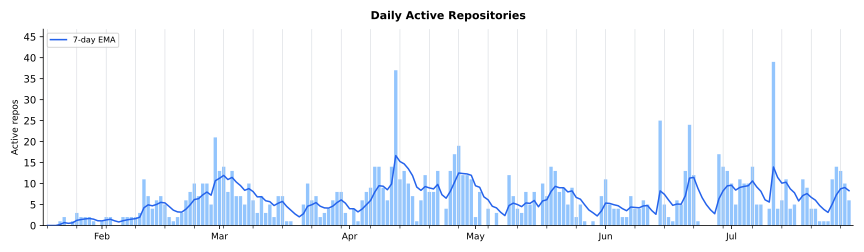

# Progress Reports

Weekly progress reports for Marcelo Cantos's AI-assisted development work.

## The Journey So Far

Thirteen weeks in. These reports began on 19 January 2026; across the 91 days since, 3,781 commits have landed in more than forty repositories, written in seventeen languages — C++, C, Go, Rust, C#, Swift, Kotlin, TypeScript, Svelte, Python, Lua, TLA+, WGSL, SQL, Ruby, Objective-C, and PlantUML. A traditional-development equivalent comes to 6.5 to 11.0 years of full-time engineering.

The volume is not the point. The nature of what shipped is.

The catalogue spans domains that ordinarily belong to separate specialists. A C++ microthreading library with M:N scheduling, demand-paged guard-page stacks, nine TLA+ specifications and a five-phase Windows port across kqueue, epoll and IOCP. A bidirectional SQLite replication protocol with a TLA+-verified convergence loop, a bytecode VM for predicate pushdown, and an Emscripten WebAssembly target. A WebTransport relay — now named pigeon — implemented in Go, Swift, Kotlin, TypeScript and pure C, with a TLA+-verified drain-window cutover model, a ngtcp2 QUIC transport vtable, and cross-language crypto-vector tests. A PlantUML clone grown from zero to 12,500 golden tests against the Java reference across eighteen diagram types. A SQL transpiler with four language bindings and XML-literal syntax. A globe renderer that became a geography game through GPU visual-parity optimisation — differential evolution over five WGSL compute shaders (Sobel, JFA, Chamfer). A full-stack health-management rewrite into C#/SvelteKit with thirty-plus screens, TOTP MFA, QR session transfer, and seven rounds of de-identification red-teaming. A 128-bit content-hashing migration that delivered a 500x speedup on set inequality. A contribution accepted into the Go compiler. An Android health tracker in Kotlin/Compose. Two research-paper series, on concurrency engineering and universal grammars.

No single person carries expert-level knowledge across that range. Traditionally the breadth requires a team of specialists and the coordination overhead that comes with them: design meetings, handoffs, skill gaps at the boundaries. Here, one person directs AI agents across the lot — moving between formal methods and bytecode design, between shader tuning and protocol verification, without context-switch penalty.

The human role has inverted. Writing code is no longer the bottleneck. Actual human effort sits at one to three hours per day, spent on architecture decisions, quality review, algorithmic insight, red-team audits and course correction. The AI handles the volume. The human holds the direction.

Shipping pace is the signature. The mk build tool went from nothing to Homebrew-installable in four days with five releases. sqldeep reached v0.18.0 through ten releases in one week. sawmill rewrote itself from Rust to Go while being open-sourced and clearing eleven frontier milestones. This past week brought two more: pageflip — a Rust meeting-capture pipeline with macOS Vision face-blur, OCR-based PII redaction, and a compile-time egress gate (a sealed `RedactedFrame` type makes raw egress a type error) — went zero-to-brew in four days; spyder, an HTTP MCP server orchestrating iOS and Android devices, reached v0.5.0 in three. Alongside that, mnemo climbed six releases to v0.21.0, gaining image indexing with Anthropic-vision descriptions, OCR, CLIP embeddings, a live compaction lifecycle driven by an LLM summariser, a connection-identity pivot that re-keyed session chains around daemon connections, and a collapse of its custom JSON-RPC-over-UDS protocol into a single HTTP MCP daemon. None of these were prototypes: each shipped with CI, documentation, test suites and versioned releases.

Every week has held a 25x-to-100x multiplier over traditional development, across wildly different domains. The multiplier is highest where the work is hardest — formal verification, novel algorithm design, cross-platform systems programming — because that is where the AI's ability to explore design spaces and hold cross-domain knowledge matters most.

Something else has emerged alongside the output. A cluster of tools built during this period — mnemo, bullseye, doit, claudia, sawmill, mcpsafe, spyder, pageflip — are themselves products of this workflow and now feed back into it as MCP servers and agent harnesses. What started in January as an experiment is operating, thirteen weeks in, as a sustained mode of production: one person directing AI to deliver years of engineering per month, across arbitrary technical domains, at shipping quality.

## Greatest Hits

The [top 50 achievements](docs/achievements.md) across all projects, ranked by meatiness.

## Reports

<a href="reports/weekly-report-2026-04-19.md"><b>2026-04-13…19</b></a> pageflip + spyder launched (2 new brew-installable products), mnemo v0.16-v0.21 (image/OCR/CLIP indexing + live compaction + connection identity + HTTP transport collapse + Windows), pigeon TLA+-verified cutover + ngtcp2 QUIC C + multi-client pairing, ge v0.1.0 with engine/render/bridge split, bullseye per-repo storage redesign

Greenfield-plus-depth week: <b>pageflip</b> shipped v0.1.0 as a Rust+Go meeting-capture pipeline with macOS Vision face-blur, OCR PII redaction, ScreenCaptureKit audio with compile-time egress gate via sealed types, WhisperX+pyannote diarisation, and a Go meetcat shell spawning 5 claudia-backed specialist agents (skeptic/constructive/neutral/dejargoniser/contradictions) with artefact writer. <b>spyder</b> shipped v0.1.0→v0.5.0 in 3 days as an HTTP MCP server for cross-platform mobile orchestration with iOS (pymobiledevice3+CoreDevice) and Android (adb) adapters, reservation system, screen recording, crash collection, network shaping, and run artefacts. <b>mnemo</b> climbed v0.16→v0.21 (6 releases) adding image/OCR/CLIP indexing via Anthropic vision API, a live compaction lifecycle with claudia.Task LLM summariser, a connection-identity pivot that re-keyed session chains around daemon connections, HTTP MCP transport collapse, and native Windows support. <b>pigeon</b> v0.17.0 added a TLA+-verified (159K states) drain-window cutover protocol, ngtcp2 QUIC C transport vtable, one-time-token multi-client pairing. <b>squz/ge</b> v0.1.0 with engine/render/bridge subsystem split, Android text rendering (SDL_ttf vendored), GPU YUV colour-space conversion, physical-device matrix cells passing on iOS+Android. <b>bullseye</b> v0.15→v0.17 redesigned storage from machine-wide to per-repo path-driven discovery. <b>doit</b> v0.6.0 added shell-script SHA-256 approval gate, process-group timeouts, and audit-log-driven duration anomaly detection. <b>jevons</b> v0.4.0 added mTLS CA + device provisioning + cross-repo active-work dashboard. <b>esfera2</b> ported sphere+pieces from Dawn/WebGPU to bgfx atop ge v0.1.0. 391 commits across 21 repos. ~5.5-9 months traditional equivalent.

<a href="reports/weekly-report-2026-04-12.md"><b>2026-04-06…12</b></a> bullseye v0.5-v0.14 (portfolio WSJF, cross-repo convergence), mnemo v0.4-v0.15 (11 new tools, session chains), pigeon pure C client library, claudia bootstrap to tmux agent pool, HMS 7-round de-identification hardening, sawmill git history indexing

MCP ecosystem maturation week: <b>bullseye</b> reached v0.14.0 with portfolio-level WSJF ranking, cross-repo dependency edges, and convergence gap analysis (75 commits, 10 releases). <b>mnemo</b> climbed from v0.4.0 to v0.15.0 with 11 new tools including session chains, CI indexing, and self-healing streams (81 commits). <b>pigeon</b> gained a pure C client library with amalgamated distribution and cross-language crypto vector tests (v0.16.0). <b>claudia</b> went from bootstrap to tmux-backed agent pool with warm spawning and session chains (v0.6.0). <b>hms</b> de-identification tool hardened through 7 red-team audits with exhaustive PII coverage manifest. <b>sawmill</b> added git history AST indexing, 7 new MCP tools, and global daemon (v0.9.0). 646 commits across 28 repos. ~6-9 months traditional equivalent.

<a href="reports/weekly-report-2026-04-05.md"><b>2026-03-30…04-05</b></a> sawmill Rust-to-Go rewrite + open-source (11 frontier milestones), pigeon session protocol with generated state machines (Go/Swift/Kotlin/TS) + TLA+, sqldeep XML literals through 10 releases, nostalgia TUI git browser, csp v0.6-v0.8

<b>sawmill</b> complete Rust-to-Go rewrite with daemon architecture, open-sourced with 11 frontier milestones (Phases 2-6, Frontiers A-E, K), binary hash handshake, zero-project-footprint state, v0.2.0-v0.6.0. <b>pigeon</b> (renamed from tern) unified session protocol in YAML with code generators producing typed state machines in Go/Swift/Kotlin/TypeScript, TLA+ generator rewritten to pure TLA+ with channel elimination (121 states, &lt;1s), path-switching with chaos tests, v0.9.0-v0.14.0. <b>sqldeep</b> XML/HTML literal syntax, BLOB protocol, JSONML, JSX, boolean semantics, interactive CLI, v0.9.0-v0.18.0. <b>nostalgia</b> new TUI git file history browser with DAG graph, syntax highlighting, go-git. <b>csp</b> fd_t, file I/O, 3 example apps, v0.6.0-v0.8.0. <b>yourworld2/ge</b> H.264 pivot, engine ownership. 432 commits across 15 repos. ~5-7 months traditional equivalent.

<a href="reports/weekly-report-2026-03-29.md"><b>2026-03-23…29</b></a> csp M:N-only scheduler (663/663 tests, quiescence scope, TLA+), rustuml 6 renderer rewrites for exact SVG parity, den Rust-to-C++ rewrite with 5 audit rounds, sqlpipe predicate VM + convergence loop, tern 97.5% protocol coverage + fault injection, ge NetworkBackend + H.264 streaming

<b>csp</b> M:N-only scheduler migration complete — 663/663 tests, quiescence scope primitive, fake_clock auto-advance, 6 TLA+ specs, 5 targets achieved, v0.5.0. <b>rustuml</b> 6 renderer rewrites for exact PlantUML SVG parity using Java AWT binary-fraction font metrics, oracle test framework, Graphviz integration, v0.3.0–v0.5.0. <b>den</b> complete Rust-to-C++ rewrite with independent package store, source builds via bundled Ruby, 5 adversarial audit rounds (100+ findings), v0.1.0–v0.3.0. <b>sqlpipe</b> relational algebra engine with predicate pushdown, bytecode VM, TLA+-verified convergence loop, v0.15.0–v0.17.0. <b>tern</b> coverage push to 97.5% protocol, faultproxy UDP fault injection, channel API, large datagram fragmentation, v0.3.0–v0.9.0. <b>yourworld2/ge</b> scene protocol E2E, NetworkBackend (bgfx RendererContextI over the wire), H.264 streaming with zero-copy IOSurface. <b>jevon</b> Grok Realtime voice bridge, desktop web UI, WKWebView native path. 574 commits across 9 repos. ~5-8 months traditional equivalent.

<a href="reports/weekly-report-2026-03-22.md"><b>2026-03-16…22</b></a> rustuml from zero to 12,500 golden tests (18 diagram types), tern extracted as standalone WebTransport relay (5-platform clients, Fly.io), HMS2 V1+V2 complete (821 swallowed exceptions fixed), cworkers C rewrite (35KB), jevon protocol state machine + TLA+, den bootstrapped

<b>rustuml</b> from initial commit to 18 diagram types with 12,500+ golden test pairs against Java PlantUML reference, TIM preprocessor, PNG/PDF/EPS output. <b>tern</b> extracted from jevon into standalone WebTransport relay with Go/Swift/Kotlin/TypeScript clients, raw QUIC + WebTransport, LAN direct upgrade, deployed to Fly.io. <b>hms</b> V1 verified + all 19 V2 sub-targets, 821 swallowed exceptions fixed, beta feature infrastructure. <b>cworkers</b> rewritten from Go to C (35KB binary) with Go TUI dashboard. <b>jevon</b> protocol state machine framework with TLA+ formal verification, research paper. <b>yourworld2/ge</b> Dawn removal complete, bgfx globe rendering, scene display list protocol, H.264 dev mode. <b>den</b> bootstrapped as Rust Homebrew reimplementation. 246 commits across 11 repos. ~6-9 months traditional equivalent.

<a href="reports/weekly-report-2026-03-15.md"><b>2026-03-09…15</b></a> GPU parity optimizer (JFA + differential evolution), server-driven iOS Lua runtime, cworkers v0.1-v0.9 in one week, HMS2 five-wave completion (50 targets), sqldeep recursive tree construction, linq v2 iter.Seq migration

<b>yourworld2</b> GPU-accelerated visual parity optimizer — 5 WGSL compute shaders (Sobel, JFA, Chamfer distance), differential evolution tuning ~17 parameters at ~50 eval/sec. Three feature waves: hints, magnification, menus, tutorials, achievements, encyclopedia. Cube map pipeline with shapefile water detection. <b>hms</b> five-wave HMS2 completion: recurrence engine, SSE multiplexer, RBAC, transport, 50 convergence targets. <b>cworkers</b> from initial commit to MCP server + Svelte dashboard across 9 releases. <b>jevon</b> server-driven Lua UI on iOS (26 SwiftUI builders, sqlpipe sync). <b>sqldeep</b> recursive tree construction via 3-CTE bracket injection (v0.6-v0.8). <b>linq</b> v2 iter.Seq migration. <b>csp</b> processor reuse fix + 3 research papers. 228 commits across 13 repos. ~5.5-9 months traditional equivalent.

<a href="reports/weekly-report-2026-03-08.md"><b>2026-03-02…08</b></a> HMS2 full-stack rewrite (C#/SvelteKit/30+ screens/MFA/QR transfer), yourworld2 wave-based game buildout, csp channel use-after-free fix + buffered channels, jevon iOS app + QR discovery, frozen zero-alloc reads

<b>hms</b> HMS2 full-stack rewrite: Go-to-C# backend migration, SvelteKit SPA, 30+ screens across 16 API domains, TOTP MFA, QR session transfer. <b>yourworld2</b> wave-based feature buildout — 5 game modes, menu/tutorial/achievement systems, audio, zoom, HUD — from globe renderer to complete game in one day. <b>csp</b> channel use-after-free fix, buffered channels, CI flake resolution, Windows port completion (v0.3.0). <b>jevon</b> renamed from dais with iOS app, QR server discovery, filesystem session discovery, trust model. <b>frozen</b> zero-alloc read path (v1.10.0, v1.11.0). <b>ge</b> protocol v4 with orientation pipeline and reconnect reliability. SQL stack: sqldeep PostgreSQL backend, sqlift C-only API, sqlpipe Go wrapper. 305 commits across 15 repos. ~5-9 months traditional equivalent.

<a href="reports/weekly-report-2026-03-01.md"><b>2026-02-23…03-01</b></a> csp 5-phase Windows port + TLA+ verification, frozen H128 500x equality speedup, sqldeep transpiler from scratch, dais + doit new Claude Code tools, stock-car-racing Unity 6 + null-ref audit

<b>csp</b> completed a full 5-phase Windows port (kqueue/epoll/Windows thread pool reactors), TLA+ formal verification for 4 concurrent protocols, and ARM64 thread-local corruption fix. <b>frozen</b> H128 128-bit content hash + recursive XOR hash (h0) delivering 500x set inequality speedup. <b>sqldeep</b> built from scratch as SQL transpiler with FK-guided join path algebra (4 releases). <b>dais</b> multi-session Claude Code orchestrator and <b>doit</b> three-level capability broker both designed and shipped. <b>sqlift</b> Go port with cross-language hash verification (6 releases). <b>stock-car-racing</b> Unity 6 upgrade with 61-finding null-ref audit. 364 commits across 13 repos. ~6-10 months traditional equivalent.

<a href="reports/weekly-report-2026-02-22.md"><b>2026-02-16…22</b></a> csp extraction-to-platform (133 commits, 100+ combinators, topology surgery, TLA+, C++23), mk build tool from scratch to Homebrew, sqlift + sqlpipe new libraries, yourworld2 state sync

<b>csp</b> went from M:N scheduler to full platform: 100+ stream combinators, channel topology surgery (swap/fuse/splice/tap), cancellation framework with cancel-aware TLS, kqueue I/O, TLA+ verification (9+ models), C++23 migration, demand-paged stacks, dynamic scoping, 6-paper engineering series. <b>mk</b> built from scratch as a modern build tool (pattern rules, parallel execution, stdlib) and shipped 5 releases to Homebrew. Two new C++ libraries: <b>sqlift</b> (declarative SQLite migration) and <b>sqlpipe</b> (streaming SQLite replication). <b>yourworld2</b> gained SQLite-backed game state with bidirectional sync via sqlpipe, carousel GPU silhouettes, and engine rebrand (sq to ge). 313 commits across 11 repos. ~10-17 months traditional equivalent.

<a href="reports/weekly-report-2026-02-15.md"><b>2026-02-09…15</b></a> csp library born (M:N threading, timers, sanitizers), multimaze2 from scratch to Box2D + live-tunable physics, gg CLI overhaul, yourworld2 carousel + audio, universal grammar research

<b>csp</b> extracted from bricabrac and rapidly expanded with timer channels, M:N scheduling, sanitizer support, and microbenchmarking. <b>multimaze2</b> built from scratch (custom physics, 72 ASCII-art levels, WebGPU renderer) then swapped to Box2D v3 with live-tunable SQLite-persisted physics. <b>gg</b> comprehensive CLI overhaul (interactive installer, shell injection elimination, 27 integration tests, CI). <b>yourworld2</b> country carousel with GPU silhouette rendering, placement mechanics, and audio. <b>wbnf</b> universal grammar research paper. <b>arrai</b> strategic analysis. 129 commits across 10 repos. ~6-11 months traditional equivalent.

<a href="reports/weekly-report-2026-02-08.md"><b>2026-02-02…08</b></a> wire-based remote rendering architecture, engine extraction completion, bgfx-to-Dawn migration, progressive mip streaming with ASTC compression, RAII live resize

<b>yourworld2</b> dominated: completed engine extraction into sq submodule, migrated from bgfx to Dawn/WebGPU, built wire-based remote rendering with headless server and mobile receivers, progressive mipmapped texture streaming with ASTC compression (4x faster startup), mip cache probe protocol. iOS and Android receiver support. 77 commits across 1 repo. ~3-5 months traditional equivalent.

<a href="reports/weekly-report-2026-02-01.md"><b>2026-01-26…02-01</b></a> yourworld2 60-commit explosion (GPU atlas, RAII architecture, constrained Delaunay, damped rotation, engine extraction begins), esfera2 geodesic chess launched

<b>yourworld2</b> exploded from 8-commit prototype to full application: GPU texture atlas generation with two-pass antimeridian handling, RAII resource architecture, Triangle-based constrained Delaunay triangulation replacing earcut, JSON manifest + binary mesh pack asset pipeline, damped globe rotation with frame-rate-independent decay, translucent bathymetry ocean, visual regression tests, and engine extraction into sq/ directory. <b>esfera2</b> launched as new geodesic chess project (Andrew Cantos). 61 commits across 2 repos. ~2-4 months traditional equivalent.

<a href="reports/weekly-report-2026-01-25.md"><b>2026-01-19…25</b></a> first week of AI-assisted development, yourworld2 globe prototype born, Android 16KB page compliance, iOS resolution fix

First week of AI-assisted development. <b>yourworld2</b> born as a globe rendering prototype with bgfx/SDL3, ESRI shapefile parsing, country outline rendering, and pImpl architecture from day one. <b>stock-car-racing</b> Android build stabilisation: Gradle cache debugging, Facebook SDK regression workaround, version code bump. <b>yourworld</b> iPhone resolution scaling fix and project documentation. 15 commits across 3 repos. ~1-2 months traditional equivalent.

## Metrics

The figures below are not derived from line counts, pull-request counts, or raw commit volume. Each weekly report begins with a per-repository reading of the actual commits — messages and diffs — to build a qualitative picture of what was built, why it matters, and where the difficulty lay.

**Scoring.** Every substantive piece of work is then scored independently on four axes:

- **Impact** — does it ship, unlock something, or fix a real problem?
- **Platform / system depth** — native APIs, kernel primitives, GPU pipelines, crypto, codecs, OS-specific lifecycle.
- **Correctness surface** — concurrency, formal verification, security hardening, transactional semantics; anywhere silent wrongness is costly.
- **Scope of change** — files touched × architectural layers crossed.

Two explicit rules guard against surface-framing bias:

- Words like *migration*, *refactor*, *cleanup* or *port* often mask significant architectural work, so the diffs are re-read whenever a repo reads as low-effort at first glance.
- Polyglot novelty (C crypto, JNI bridges, cross-language vectors) can *feel* harder than platform-deep mobile, GPU or codec work without actually being so; scoring stays on the concrete axes rather than on how exotic the description sounds.

**Traditional-development baselines.** From the per-project assessment, estimates are produced twice:

- A **single talented generalist** who must ramp up on every domain, with ramp-up costs itemised per project.
- An **idealised specialist team** who each know their area but carry coordination overhead.

A context-switching tax is added for multi-domain weeks. A *Diversity Tax* section enumerates every distinct specialism exercised that week — Rust screen-capture via objc2, pure-C QUIC with ngtcp2, TLA+ verification, pymobiledevice3 orchestration, bgfx mobile engine work, WhisperX/pyannote ML pipelines, healthcare PII compliance, and so on — because the breadth itself is load-bearing.

**Actual human hours** are estimated separately per project, with explicit description of what the human did: architecture decisions, design pivots, scope discipline, red-team review, course correction.

**Ranges, not point estimates.** Every figure below is a range — estimation uncertainty is reported honestly rather than hidden behind a single number.

**Totals.** The **Equiv.** column is the *single talented generalist* bound from each week's Effort Estimate section; the **Totals** row sums those bounds. Open any report to see the full derivation — per-project person-days with *why it's hard* rationales, the Diversity Tax list, the What-If-It-Were-One-Person ramp-up table, and the human-hours breakdown.

| Period |  | Equiv.&nbsp;(mo) | Gain | Highlights |
|--------|---|-------------|-------|------------|
| [04-13](reports/weekly-report-2026-04-19.md) | 391 | 5.5-9 | 35-55x | pageflip + spyder launched, mnemo v0.16-v0.21 (images/CLIP/compaction/connection identity/HTTP), pigeon TLA+ cutover + ngtcp2 QUIC C, ge v0.1.0 engine split, bullseye per-repo storage |
| [04-06](reports/weekly-report-2026-04-12.md) | 646 | 6-9 | 30-55x | bullseye 10 releases (portfolio WSJF, cross-repo convergence), mnemo 12 releases (11 tools, session chains), pigeon pure C client, claudia tmux pool, HMS 7 audits |
| [03-30](reports/weekly-report-2026-04-05.md) | 432 | 5-7 | 25-45x | sawmill Rust→Go + open-source (11 frontiers), pigeon session state machines (4 langs + TLA+), sqldeep XML literals (10 releases), nostalgia TUI |
| [03-23](reports/weekly-report-2026-03-29.md) | 574 | 5-8 | 25-45x | csp M:N-only (663 tests, quiescence, TLA+), rustuml SVG parity (6 renderers), den C++ rewrite + 5 audits, sqlpipe predicate VM, tern 97.5% coverage |
| [03-16](reports/weekly-report-2026-03-22.md) | 246 | 6-9 | 30-50x | rustuml 12,500 golden tests, tern 5-platform relay, HMS2 V1+V2 (821 exceptions), cworkers C rewrite, jevon TLA+ |
| [03-09](reports/weekly-report-2026-03-15.md) | 228 | 5.5-9 | 28-45x | GPU parity optimizer (JFA + Chamfer), Lua iOS runtime, cworkers v0.1-v0.9, HMS2 50 targets, sqldeep RECURSE ON, linq v2 |
| [03-02](reports/weekly-report-2026-03-08.md) | 305 | 5-9 | 25-45x | HMS2 full rewrite, yourworld2 game buildout, csp channel fix + buffered channels, jevon iOS app, frozen zero-alloc |
| [02-23](reports/weekly-report-2026-03-01.md) | 364 | 6-10 | 25-50x | csp Windows port + TLA+, frozen H128 500x speedup, sqldeep transpiler, dais + doit, Unity 6 audit |
| [02-16](reports/weekly-report-2026-02-22.md) | 313 | 10-17 | 30-60x | csp 133 commits (100+ combinators, topology surgery, TLA+, C++23), mk to Homebrew, sqlift + sqlpipe |
| [02-09](reports/weekly-report-2026-02-15.md) | 129 | 6-11 | 30-90x | csp born (M:N + timers + sanitizers), multimaze2 from scratch to Box2D, gg CLI overhaul, carousel + audio |
| [02-02](reports/weekly-report-2026-02-08.md) | 77 | 3-5 | 25-50x | Wire rendering architecture, engine extraction, bgfx-to-Dawn, progressive mip streaming + ASTC |
| [01-26](reports/weekly-report-2026-02-01.md) | 61 | 2-4 | 25-50x | yourworld2 60-commit explosion (GPU atlas, RAII, Delaunay, damped rotation), esfera2 launched |
| [01-19](reports/weekly-report-2026-01-25.md) | 15 | 1-2 | 10-25x | yourworld2 globe prototype born, Android 16KB compliance, iOS resolution fix |
| **Totals** | **3,781** | **6.5-11.0y** | | |

## Guide

See [docs/guide.md](docs/guide.md) for detailed instructions on generating these reports. Project-level directives are in [CLAUDE.md](CLAUDE.md).
