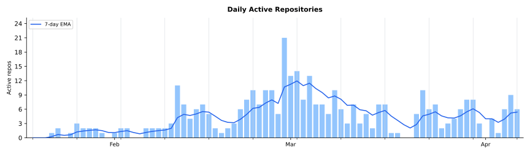

# Progress Reports

Weekly progress reports for Marcelo Cantos's AI-assisted development work.

## The Journey So Far

These reports started on 19 January 2026. In the 77 days since, the output totals 2,744 commits across 30+ repositories, spanning C++, C, Go, Rust, C#, Swift, Kotlin, TypeScript, Svelte, Python, Lua, TLA+, WGSL, SQL, Ruby, PlantUML, and assembly. The estimated traditional equivalent is 5.5 to 9.2 years of full-time work.

The numbers, whilst truly staggering, are the least interesting part.

What stands out is the nature of the work. This is not boilerplate generation. The period includes a C++ microthreading library with M:N scheduling, formal verification, and a cross-platform port across three OS-specific reactor backends. A build tool that went from nothing to Homebrew in 4 days. A persistent data structure campaign that yielded 500x speedup on set inequality through a two-level hash architecture. A SQL transpiler with FK-guided join path algebra and PostgreSQL backend. Contributions accepted into the Go compiler. A custom physics engine. Wire-based remote rendering for mobile. An AI capability broker with three-level policy escalation. ARM64 ABI debugging. Unity lifecycle audits. Programming language theory papers. A full-stack health management system rewrite (C#/SvelteKit/SQL Server with MFA, QR session transfer, 30+ screens). A geography game built from globe renderer to complete game experience in a single day. A native iOS app with QR-based server discovery.

No single person holds expert-level knowledge in all of these areas. Traditionally, this breadth would require a team of specialists with coordination overhead, handoff friction, and design meetings. Here, one person directed AI agents across all of it, moving freely between formal methods and game physics, between parser construction and mobile platform engineering, without context-switch penalty.

The human role shifted. Writing code is no longer the bottleneck. The actual human effort was roughly 100-200 hours across 77 days — about 1-3 hours per day — spent on architecture decisions, quality review, algorithmic insight, and course correction. The AI handled the volume. The human handled the direction.

Several projects went from nothing to released software in days: mk (build tool, 4 days to Homebrew with 5 releases), sqldeep (SQL transpiler to v0.5.0), doit (capability broker, MCP integration), jevon (multi-session orchestrator with iOS app). HMS2 went from vertical slice to 30+ functional screens with MFA and QR session transfer in a week. These were not prototypes. They shipped with CI, documentation, test suites, and versioned releases.

The consistency matters more than any individual result. Every week maintained a 25-100x multiplier over traditional development, across wildly different domains. The multiplier did not depend on easy problems — it held through formal verification, novel algorithm design, and cross-platform systems programming. It was highest on the hardest work, where the AI's ability to explore design spaces and handle cross-domain knowledge mattered most.

This is 77 days in. The tooling is still maturing and the workflows are still being refined. But the fundamental capability — one person directing AI to produce years of output per month, across arbitrary technical domains, at production quality — is already real and consistent.

## Reports

<a href="weekly-report-2026-04-05.md"><b>2026-03-30…04-05</b></a> sawmill Rust-to-Go rewrite + open-source (11 frontier milestones), pigeon session protocol with generated state machines (Go/Swift/Kotlin/TS) + TLA+, sqldeep XML literals through 10 releases, nostalgia TUI git browser, csp v0.6-v0.8

<b>sawmill</b> complete Rust-to-Go rewrite with daemon architecture, open-sourced with 11 frontier milestones (Phases 2-6, Frontiers A-E, K), binary hash handshake, zero-project-footprint state, v0.2.0-v0.6.0. <b>pigeon</b> (renamed from tern) unified session protocol in YAML with code generators producing typed state machines in Go/Swift/Kotlin/TypeScript, TLA+ generator rewritten to pure TLA+ with channel elimination (121 states, &lt;1s), path-switching with chaos tests, v0.9.0-v0.14.0. <b>sqldeep</b> XML/HTML literal syntax, BLOB protocol, JSONML, JSX, boolean semantics, interactive CLI, v0.9.0-v0.18.0. <b>nostalgia</b> new TUI git file history browser with DAG graph, syntax highlighting, go-git. <b>csp</b> fd_t, file I/O, 3 example apps, v0.6.0-v0.8.0. <b>yourworld2/ge</b> H.264 pivot, engine ownership. 432 commits across 15 repos. ~5-7 months traditional equivalent.

<a href="weekly-report-2026-03-29.md"><b>2026-03-23…29</b></a> csp M:N-only scheduler (663/663 tests, quiescence scope, TLA+), rustuml 6 renderer rewrites for exact SVG parity, den Rust-to-C++ rewrite with 5 audit rounds, sqlpipe predicate VM + convergence loop, tern 97.5% protocol coverage + fault injection, ge NetworkBackend + H.264 streaming

<b>csp</b> M:N-only scheduler migration complete — 663/663 tests, quiescence scope primitive, fake_clock auto-advance, 6 TLA+ specs, 5 targets achieved, v0.5.0. <b>rustuml</b> 6 renderer rewrites for exact PlantUML SVG parity using Java AWT binary-fraction font metrics, oracle test framework, Graphviz integration, v0.3.0–v0.5.0. <b>den</b> complete Rust-to-C++ rewrite with independent package store, source builds via bundled Ruby, 5 adversarial audit rounds (100+ findings), v0.1.0–v0.3.0. <b>sqlpipe</b> relational algebra engine with predicate pushdown, bytecode VM, TLA+-verified convergence loop, v0.15.0–v0.17.0. <b>tern</b> coverage push to 97.5% protocol, faultproxy UDP fault injection, channel API, large datagram fragmentation, v0.3.0–v0.9.0. <b>yourworld2/ge</b> scene protocol E2E, NetworkBackend (bgfx RendererContextI over the wire), H.264 streaming with zero-copy IOSurface. <b>jevon</b> Grok Realtime voice bridge, desktop web UI, WKWebView native path. 574 commits across 9 repos. ~5-8 months traditional equivalent.

<a href="weekly-report-2026-03-22.md"><b>2026-03-16…22</b></a> rustuml from zero to 12,500 golden tests (18 diagram types), tern extracted as standalone WebTransport relay (5-platform clients, Fly.io), HMS2 V1+V2 complete (821 swallowed exceptions fixed), cworkers C rewrite (35KB), jevon protocol state machine + TLA+, den bootstrapped

<b>rustuml</b> from initial commit to 18 diagram types with 12,500+ golden test pairs against Java PlantUML reference, TIM preprocessor, PNG/PDF/EPS output. <b>tern</b> extracted from jevon into standalone WebTransport relay with Go/Swift/Kotlin/TypeScript clients, raw QUIC + WebTransport, LAN direct upgrade, deployed to Fly.io. <b>hms</b> V1 verified + all 19 V2 sub-targets, 821 swallowed exceptions fixed, beta feature infrastructure. <b>cworkers</b> rewritten from Go to C (35KB binary) with Go TUI dashboard. <b>jevon</b> protocol state machine framework with TLA+ formal verification, research paper. <b>yourworld2/ge</b> Dawn removal complete, bgfx globe rendering, scene display list protocol, H.264 dev mode. <b>den</b> bootstrapped as Rust Homebrew reimplementation. 246 commits across 11 repos. ~6-9 months traditional equivalent.

<a href="weekly-report-2026-03-15.md"><b>2026-03-09…15</b></a> GPU parity optimizer (JFA + differential evolution), server-driven iOS Lua runtime, cworkers v0.1-v0.9 in one week, HMS2 five-wave completion (50 targets), sqldeep recursive tree construction, linq v2 iter.Seq migration

<b>yourworld2</b> GPU-accelerated visual parity optimizer — 5 WGSL compute shaders (Sobel, JFA, Chamfer distance), differential evolution tuning ~17 parameters at ~50 eval/sec. Three feature waves: hints, magnification, menus, tutorials, achievements, encyclopedia. Cube map pipeline with shapefile water detection. <b>hms</b> five-wave HMS2 completion: recurrence engine, SSE multiplexer, RBAC, transport, 50 convergence targets. <b>cworkers</b> from initial commit to MCP server + Svelte dashboard across 9 releases. <b>jevon</b> server-driven Lua UI on iOS (26 SwiftUI builders, sqlpipe sync). <b>sqldeep</b> recursive tree construction via 3-CTE bracket injection (v0.6-v0.8). <b>linq</b> v2 iter.Seq migration. <b>csp</b> processor reuse fix + 3 research papers. 228 commits across 13 repos. ~5.5-9 months traditional equivalent.

<a href="weekly-report-2026-03-08.md"><b>2026-03-02…08</b></a> HMS2 full-stack rewrite (C#/SvelteKit/30+ screens/MFA/QR transfer), yourworld2 wave-based game buildout, csp channel use-after-free fix + buffered channels, jevon iOS app + QR discovery, frozen zero-alloc reads

<b>hms</b> HMS2 full-stack rewrite: Go-to-C# backend migration, SvelteKit SPA, 30+ screens across 16 API domains, TOTP MFA, QR session transfer. <b>yourworld2</b> wave-based feature buildout — 5 game modes, menu/tutorial/achievement systems, audio, zoom, HUD — from globe renderer to complete game in one day. <b>csp</b> channel use-after-free fix, buffered channels, CI flake resolution, Windows port completion (v0.3.0). <b>jevon</b> renamed from dais with iOS app, QR server discovery, filesystem session discovery, trust model. <b>frozen</b> zero-alloc read path (v1.10.0, v1.11.0). <b>ge</b> protocol v4 with orientation pipeline and reconnect reliability. SQL stack: sqldeep PostgreSQL backend, sqlift C-only API, sqlpipe Go wrapper. 305 commits across 15 repos. ~5-9 months traditional equivalent.

<a href="weekly-report-2026-03-01.md"><b>2026-02-23…03-01</b></a> csp 5-phase Windows port + TLA+ verification, frozen H128 500x equality speedup, sqldeep transpiler from scratch, dais + doit new Claude Code tools, stock-car-racing Unity 6 + null-ref audit

<b>csp</b> completed a full 5-phase Windows port (kqueue/epoll/Windows thread pool reactors), TLA+ formal verification for 4 concurrent protocols, and ARM64 thread-local corruption fix. <b>frozen</b> H128 128-bit content hash + recursive XOR hash (h0) delivering 500x set inequality speedup. <b>sqldeep</b> built from scratch as SQL transpiler with FK-guided join path algebra (4 releases). <b>dais</b> multi-session Claude Code orchestrator and <b>doit</b> three-level capability broker both designed and shipped. <b>sqlift</b> Go port with cross-language hash verification (6 releases). <b>stock-car-racing</b> Unity 6 upgrade with 61-finding null-ref audit. 364 commits across 13 repos. ~6-10 months traditional equivalent.

<a href="weekly-report-2026-02-22.md"><b>2026-02-16…22</b></a> csp extraction-to-platform (133 commits, 100+ combinators, topology surgery, TLA+, C++23), mk build tool from scratch to Homebrew, sqlift + sqlpipe new libraries, yourworld2 state sync

<b>csp</b> went from M:N scheduler to full platform: 100+ stream combinators, channel topology surgery (swap/fuse/splice/tap), cancellation framework with cancel-aware TLS, kqueue I/O, TLA+ verification (9+ models), C++23 migration, demand-paged stacks, dynamic scoping, 6-paper engineering series. <b>mk</b> built from scratch as a modern build tool (pattern rules, parallel execution, stdlib) and shipped 5 releases to Homebrew. Two new C++ libraries: <b>sqlift</b> (declarative SQLite migration) and <b>sqlpipe</b> (streaming SQLite replication). <b>yourworld2</b> gained SQLite-backed game state with bidirectional sync via sqlpipe, carousel GPU silhouettes, and engine rebrand (sq to ge). 313 commits across 11 repos. ~10-17 months traditional equivalent.

<a href="weekly-report-2026-02-15.md"><b>2026-02-09…15</b></a> csp library born (M:N threading, timers, sanitizers), multimaze2 from scratch to Box2D + live-tunable physics, gg CLI overhaul, yourworld2 carousel + audio, universal grammar research

<b>csp</b> extracted from bricabrac and rapidly expanded with timer channels, M:N scheduling, sanitizer support, and microbenchmarking. <b>multimaze2</b> built from scratch (custom physics, 72 ASCII-art levels, WebGPU renderer) then swapped to Box2D v3 with live-tunable SQLite-persisted physics. <b>gg</b> comprehensive CLI overhaul (interactive installer, shell injection elimination, 27 integration tests, CI). <b>yourworld2</b> country carousel with GPU silhouette rendering, placement mechanics, and audio. <b>wbnf</b> universal grammar research paper. <b>arrai</b> strategic analysis. 129 commits across 10 repos. ~6-11 months traditional equivalent.

<a href="weekly-report-2026-02-08.md"><b>2026-02-02…08</b></a> wire-based remote rendering architecture, engine extraction completion, bgfx-to-Dawn migration, progressive mip streaming with ASTC compression, RAII live resize

<b>yourworld2</b> dominated: completed engine extraction into sq submodule, migrated from bgfx to Dawn/WebGPU, built wire-based remote rendering with headless server and mobile receivers, progressive mipmapped texture streaming with ASTC compression (4x faster startup), mip cache probe protocol. iOS and Android receiver support. 77 commits across 1 repo. ~3-5 months traditional equivalent.

<a href="weekly-report-2026-02-01.md"><b>2026-01-26…02-01</b></a> yourworld2 60-commit explosion (GPU atlas, RAII architecture, constrained Delaunay, damped rotation, engine extraction begins), esfera2 geodesic chess launched

<b>yourworld2</b> exploded from 8-commit prototype to full application: GPU texture atlas generation with two-pass antimeridian handling, RAII resource architecture, Triangle-based constrained Delaunay triangulation replacing earcut, JSON manifest + binary mesh pack asset pipeline, damped globe rotation with frame-rate-independent decay, translucent bathymetry ocean, visual regression tests, and engine extraction into sq/ directory. <b>esfera2</b> launched as new geodesic chess project (Andrew Cantos). 61 commits across 2 repos. ~2-4 months traditional equivalent.

<a href="weekly-report-2026-01-25.md"><b>2026-01-19…25</b></a> first week of AI-assisted development, yourworld2 globe prototype born, Android 16KB page compliance, iOS resolution fix

First week of AI-assisted development. <b>yourworld2</b> born as a globe rendering prototype with bgfx/SDL3, ESRI shapefile parsing, country outline rendering, and pImpl architecture from day one. <b>stock-car-racing</b> Android build stabilisation: Gradle cache debugging, Facebook SDK regression workaround, version code bump. <b>yourworld</b> iPhone resolution scaling fix and project documentation. 15 commits across 3 repos. ~1-2 months traditional equivalent.

## Metrics

| Period |  | Equiv.&nbsp;(mo) | Gain | Highlights |
|--------|---|-------------|-------|------------|
| [03-30](weekly-report-2026-04-05.md) | 432 | 5-7 | 25-45x | sawmill Rust→Go + open-source (11 frontiers), pigeon session state machines (4 langs + TLA+), sqldeep XML literals (10 releases), nostalgia TUI |
| [03-23](weekly-report-2026-03-29.md) | 574 | 5-8 | 25-45x | csp M:N-only (663 tests, quiescence, TLA+), rustuml SVG parity (6 renderers), den C++ rewrite + 5 audits, sqlpipe predicate VM, tern 97.5% coverage |
| [03-16](weekly-report-2026-03-22.md) | 246 | 6-9 | 30-50x | rustuml 12,500 golden tests, tern 5-platform relay, HMS2 V1+V2 (821 exceptions), cworkers C rewrite, jevon TLA+ |
| [03-09](weekly-report-2026-03-15.md) | 228 | 5.5-9 | 28-45x | GPU parity optimizer (JFA + Chamfer), Lua iOS runtime, cworkers v0.1-v0.9, HMS2 50 targets, sqldeep RECURSE ON, linq v2 |
| [03-02](weekly-report-2026-03-08.md) | 305 | 5-9 | 25-45x | HMS2 full rewrite, yourworld2 game buildout, csp channel fix + buffered channels, jevon iOS app, frozen zero-alloc |
| [02-23](weekly-report-2026-03-01.md) | 364 | 6-10 | 25-50x | csp Windows port + TLA+, frozen H128 500x speedup, sqldeep transpiler, dais + doit, Unity 6 audit |
| [02-16](weekly-report-2026-02-22.md) | 313 | 10-17 | 30-60x | csp 133 commits (100+ combinators, topology surgery, TLA+, C++23), mk to Homebrew, sqlift + sqlpipe |
| [02-09](weekly-report-2026-02-15.md) | 129 | 6-11 | 30-90x | csp born (M:N + timers + sanitizers), multimaze2 from scratch to Box2D, gg CLI overhaul, carousel + audio |
| [02-02](weekly-report-2026-02-08.md) | 77 | 3-5 | 25-50x | Wire rendering architecture, engine extraction, bgfx-to-Dawn, progressive mip streaming + ASTC |
| [01-26](weekly-report-2026-02-01.md) | 61 | 2-4 | 25-50x | yourworld2 60-commit explosion (GPU atlas, RAII, Delaunay, damped rotation), esfera2 launched |
| [01-19](weekly-report-2026-01-25.md) | 15 | 1-2 | 10-25x | yourworld2 globe prototype born, Android 16KB compliance, iOS resolution fix |
| **Totals** | **2,744** | **5.5-9.2y** | | |

## Guide

See [weekly-report-guide.md](weekly-report-guide.md) for detailed instructions on generating these reports. Project-level directives are in [CLAUDE.md](CLAUDE.md).
