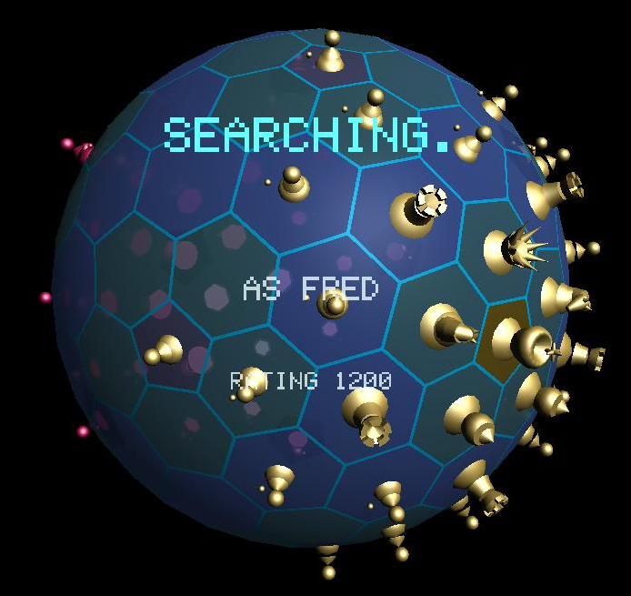
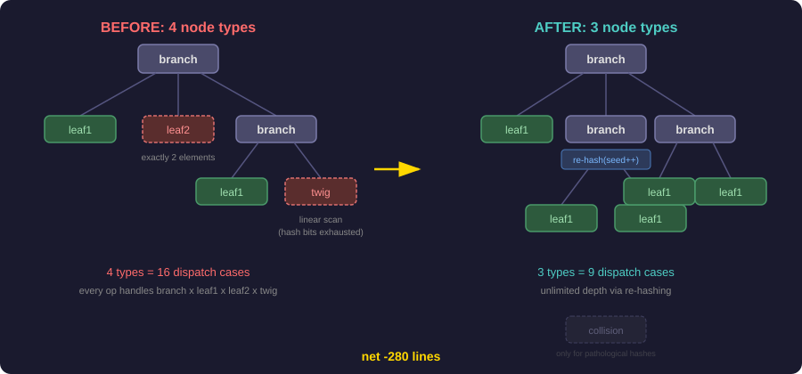
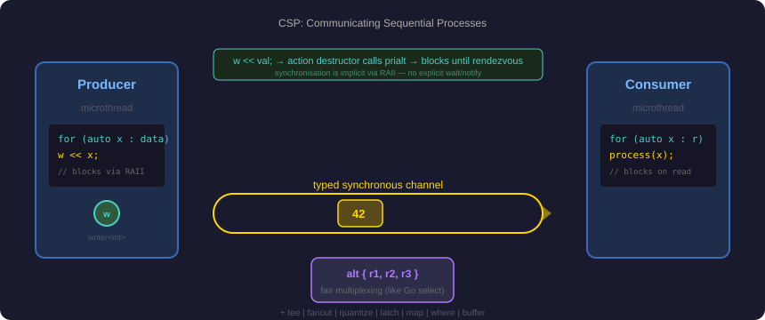

<!-- _class: lead -->

# One Week, Eleven Repos

*What happens when you stop experimenting and start shipping with agentic AI*

Marcelo Cantos

<!--
This talk is about real work, not a demo. Everything shown was produced in a single week.
-->

---

# Let me show you some work

- A spherical chess game on a geodesic board
- A physics-based maze game with 72 levels
- A microthreading library with Go-style channels in C++
- A novel HAMT simplification via multi-round hashing
- A CLI tool overhauled with an interactive installer
- A globe-based game brought to mobile with online multiplayer
- A research paper on universal grammar formalisms

<!--
No mention of AI yet. Let the audience assess the work on its own merits.
Let them mentally estimate the timeline.
-->

---

<!-- _class: visual -->

# Your World 2

Wire-based remote rendering: headless server streams WebGPU commands
to iOS, Android, desktop. Progressive mip streaming. Custom TCP relay.

---

# Spherical Chess

- Geodesic sphere board — pentagons and hexagons, not squares
- 62 chess pieces with two-pass translucency rendering
- AI opponent with alpha-beta pruning
- 10-lesson interactive tutorial
- iOS standalone app
- Online multiplayer: Go backend, WebSocket relay, matchmaking
- Deployed to OCI with reserved IP and security hardening

---

<!-- _class: visual -->

# Multi-Round Hashing

<!--
This is the slide that earns credibility with the algorithmic thinkers in the room.
Walk through the before/after. Emphasise that the net effect was LESS code, not more.
-->

---

<!-- _class: visual -->

# CSP Microthreading

<!--
Channel operations return action objects whose destructors invoke prialt,
so w << val; naturally blocks as a statement. Combined with per-endpoint
independent refcounting and a rich combinator library, this gives C++ a
concurrency model more expressive than Go's channels.
-->

---

<!-- _class: reveal -->

# One week.

# ~30 human hours.

153 commits. 11 repos. 5 languages.
C++, Go, Rust, WGSL, Shell.
+23,000 lines. 190 new tests.

<!--
Pause here. Let the dissonance between the work shown and the timeline sink in.
-->

---

# Traditional estimate

| Scenario | Time |
|----------|------|
| Specialist team (4-6 people) | **6-9 months** |
| Single talented generalist | **10-18 months** |
| What actually happened | **~1 week, ~30 hours** |

<!--
Walk through why: the diversity tax (12 distinct specialisms),
the context-switching penalty, the learning curves.
-->

---

# "But is the code any good?"

- **190 new tests** across 4 repos (310 assertions for physics alone)
- **Security fix**: shell injection eliminated *by construction*
- **Algorithmic elegance**: frozen refactor — net *negative* lines, fewer node types
- **Production deployed**: esfera2 on OCI with multiplayer

This is not "vibe coding."

---

# What did the human actually do?

| Human | AI |
|-------|-----|
| "I want chess on a sphere" | Geodesic geometry, vertex welding, winding order |
| "Use multi-round hashing" | Worked through every HAMT operation, handled edge cases |
| "The physics feel is off" | Tuned friction, repulsion, spring constants |
| "Extract csp from bricabrac" | Renamed namespace, restructured headers, verified 88 tests |
| "Survey grammar formalisms" | Synthesised 8 systems into a 717-line paper |

**Vision. Taste. Architectural judgement. Domain insight.**
The AI provides breadth, speed, and tirelessness.

---

# The 12 specialisms

| | | |
|---|---|---|
| WebGPU/Dawn + WGSL shaders | Geodesic geometry | Custom rigid-body physics |
| Go networking (TCP, WS, REST) | Rust CLI tooling | iOS + Android native |
| ASTC/ETC2 texture compression | OCI cloud deployment | HAMT algorithm design |
| C++ microthreading + ABI | PL theory + grammars | IEEE 754 arithmetic |

**One person. One week. Zero context-switch penalty.**

<!--
This is the real superpower. Not "AI writes code faster" but
"AI eliminates the cost of moving between domains."
-->

---

# It's not about speed

The multiplier isn't "do the same work faster."

It's: **projects that were never economically viable become viable.**

- The wbnf research paper would never have been written
- Spherical chess would have stayed an idea
- The csp library would have stayed buried in a monorepo
- The frozen simplification would have waited for a quiet month that never comes

---

# What this means for us

- This is not a future capability. It works **today**.
- The gap between teams using this and teams not using this will **compound**.
- The biggest risk isn't adopting too fast. It's adopting too slow while others don't.

**What would YOUR impossible project list look like with a 20-50x multiplier?**

---

# How to start

1. **Pick a real project, not a toy.**
   The gains show up at scale, not on fizzbuzz.

2. **Think in terms of direction, not dictation.**
   Describe what you want, iterate on the result.

3. **Trust but verify.**
   Write tests. Review diffs. A tireless collaborator, not an oracle.

4. **Lean into breadth.**
   The biggest wins cross domain boundaries.

---

<!-- _class: lead -->

# "The cost of not adopting this is not 'we're slower.'

# It's 'we never attempt the things that would have mattered.'"

https://gist.github.com/marcelocantos/b472a60b4734f52b3f8ea7936362e84b
