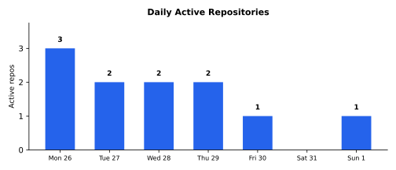

# Weekly Progress Report — 2026-01-26...02-01

> **Series restamp (2026-07-25):** Headline line stats now exclude `**/vendor/**` and `**/node_modules/**` (same rule as `gather.sh`). Figures below use remeasured excl-vendor totals from current default-branch history. Commits and effort estimates are unchanged. Excl-vendor landed lines: **+8,370/−2,913** (net **+5,457**). Commercial project detail: [private week 2026-02-01](https://github.com/marcelocantos/progress-reports-private/blob/master/reports/weekly-report-2026-02-01.md).

## Executive Summary

An explosive week across **2 repositories** dominated by game development. Commercial project detail: [private week 2026-02-01](https://github.com/marcelocantos/progress-reports-private/blob/master/reports/weekly-report-2026-02-01.md).

**61 commits** | **~+8,370 / ~−2,913** (excl. vendor) | **~40-70 person-days traditional equivalent** | **~25-50x multiplier**

### Major Achievements & Innovations

- **GPU-based texture atlas generation** — detail in [private week 2026-02-01](https://github.com/marcelocantos/progress-reports-private/blob/master/reports/weekly-report-2026-02-01.md)
- **ESRI shapefile to binary mesh pipeline** — detail in [private week 2026-02-01](https://github.com/marcelocantos/progress-reports-private/blob/master/reports/weekly-report-2026-02-01.md)
- **RAII architecture for GPU resources** — detail in [private week 2026-02-01](https://github.com/marcelocantos/progress-reports-private/blob/master/reports/weekly-report-2026-02-01.md)
- **Damped rotation with frame-rate-independent exponential decay** — detail in [private week 2026-02-01](https://github.com/marcelocantos/progress-reports-private/blob/master/reports/weekly-report-2026-02-01.md)
- **JSON manifest + binary mesh pack** — detail in [private week 2026-02-01](https://github.com/marcelocantos/progress-reports-private/blob/master/reports/weekly-report-2026-02-01.md)
### Tough Challenges Overcome

- **Triangle library replacing earcut for quality mesh generation** — detail in [private week 2026-02-01](https://github.com/marcelocantos/progress-reports-private/blob/master/reports/weekly-report-2026-02-01.md)
- **Antimeridian-crossing territories** — detail in [private week 2026-02-01](https://github.com/marcelocantos/progress-reports-private/blob/master/reports/weekly-report-2026-02-01.md)
- **Triangle winding order when splitting at prime meridian** — detail in [private week 2026-02-01](https://github.com/marcelocantos/progress-reports-private/blob/master/reports/weekly-report-2026-02-01.md)
- **bgfx Metal uniform passing** — detail in [private week 2026-02-01](https://github.com/marcelocantos/progress-reports-private/blob/master/reports/weekly-report-2026-02-01.md)
---

## Game Projects

### [squz/yourworld2](https://github.com/squz/yourworld2) -- Globe Application Buildout (60 commits)

*Detailed narrative for this commercial work is in the private sibling: [progress-reports-private — week ending 2026-02-01](https://github.com/marcelocantos/progress-reports-private/blob/master/reports/weekly-report-2026-02-01.md).*
### [squz/yourworld](https://github.com/squz/yourworld) -- Scheme Addition (1 commit)

*Detailed narrative for this commercial work is in the private sibling: [progress-reports-private — week ending 2026-02-01](https://github.com/marcelocantos/progress-reports-private/blob/master/reports/weekly-report-2026-02-01.md).*
## Other Team Work

### [squz/esfera2](https://github.com/squz/esfera2) -- Geodesic Chess (6 commits, Andrew Cantos)

*Detailed narrative for this commercial work is in the private sibling: [progress-reports-private — week ending 2026-02-01](https://github.com/marcelocantos/progress-reports-private/blob/master/reports/weekly-report-2026-02-01.md).*
## Metrics

*All metrics below reflect Marcelo Cantos's contributions only.*

### Aggregate

| Metric | Value |
|--------|-------|
| Repositories touched | 2 |
| Total commits | 61 |
| Total lines added | +8,370 |
| Total lines removed | −2,913 |
| Net new lines | +5,457 |
| File changes | 125 |
| New files created | 82 |
| Languages | C++, GLSL, Makefile, Markdown |
| Contributors | 1 (Marcelo Cantos) |

*yourworld2 line counts exclude vendored dependencies. yourworld is a trivial scheme file addition only.*

### Per-Repository Breakdown

| Repo | Commits | Files changed | Lines added | Lines removed | Net |
|------|---------|---------------|-------------|---------------|-----|
| [squz/yourworld2](https://github.com/squz/yourworld2) | 60 | 124 | +9,021 | -3,677 | +5,344 |
| [squz/yourworld](https://github.com/squz/yourworld) | 1 | 1 | +78 | -0 | +78 |

### Testing

| Repo | New tests | Notes |
|------|-----------|-------|
| [squz/yourworld2](https://github.com/squz/yourworld2) | ~10 | Visual regression tests, ImageDiff module, doctest unit tests |
| **Total** | **~10** | |

---

### Daily Activity

## Ideas & Innovations

### GPU-Based Texture Atlas Generation ([yourworld2](https://github.com/squz/yourworld2))

*Detailed narrative for this commercial work is in the private sibling: [progress-reports-private — week ending 2026-02-01](https://github.com/marcelocantos/progress-reports-private/blob/master/reports/weekly-report-2026-02-01.md).*
### JSON Manifest + Binary Mesh Pack ([yourworld2](https://github.com/squz/yourworld2))

*Detailed narrative for this commercial work is in the private sibling: [progress-reports-private — week ending 2026-02-01](https://github.com/marcelocantos/progress-reports-private/blob/master/reports/weekly-report-2026-02-01.md).*
### Damped Rotation with Exponential Decay ([yourworld2](https://github.com/squz/yourworld2))

*Detailed narrative for this commercial work is in the private sibling: [progress-reports-private — week ending 2026-02-01](https://github.com/marcelocantos/progress-reports-private/blob/master/reports/weekly-report-2026-02-01.md).*
### Visual Regression Testing for GPU Output ([yourworld2](https://github.com/squz/yourworld2))

*Detailed narrative for this commercial work is in the private sibling: [progress-reports-private — week ending 2026-02-01](https://github.com/marcelocantos/progress-reports-private/blob/master/reports/weekly-report-2026-02-01.md).*
### Constrained Delaunay Replacing Ear Clipping ([yourworld2](https://github.com/squz/yourworld2))

*Detailed narrative for this commercial work is in the private sibling: [progress-reports-private — week ending 2026-02-01](https://github.com/marcelocantos/progress-reports-private/blob/master/reports/weekly-report-2026-02-01.md).*
## Effort Estimate: Traditional vs. AI-Assisted

But those 60 commits span GPU rendering, computational geometry, resource architecture, interactive controls, asset pipeline design, test infrastructure, and engine extraction. The breadth within one project is as demanding as breadth across many. Commercial project detail: [private week 2026-02-01](https://github.com/marcelocantos/progress-reports-private/blob/master/reports/weekly-report-2026-02-01.md).

### Per-Project Estimates

| Project | Person-days | Why it's hard |
|---------|-------------|---------------|
| **yourworld2** | 25-40 | GPU atlas generation is a non-standard rendering technique requiring bgfx pipeline expertise. Constrained Delaunay triangulation with quality refinement is research-grade computational geometry. The asset pipeline redesign (monolithic binary to JSON manifest + binary mesh pack) is systems design work. RAII resource architecture in C++ requires careful lifetime reasoning. Damped rotation with frame-rate-independent decay straddles physics and UX. 60 commits of iteration implies substantial debugging and rework. |
| **yourworld** | 0.1 | Trivial scheme file addition. |

### The Diversity Tax

Despite concentrating on one repository, the specialisms exercised are diverse:

- [bgfx](https://github.com/bkaradzic/bgfx) cross-platform rendering (OpenGL + [Metal](https://developer.apple.com/metal/)) and GLSL shader authoring
- GPU-based texture compositing (non-standard atlas generation pipeline)
- [Computational geometry](https://en.wikipedia.org/wiki/Computational_geometry): constrained Delaunay triangulation, polygon-with-holes processing, mesh quality refinement
- [ESRI shapefile](https://en.wikipedia.org/wiki/Shapefile) parsing and geographic coordinate systems (antimeridian handling, hemisphere splitting)
- C++ RAII/pImpl architecture and resource lifetime management
- Physics-style interpolation (exponential decay, quaternion slerp for rotation damping)
- Asset pipeline design (binary formats, JSON manifests, incremental builds)
- Visual regression testing methodology (GPU/CPU image comparison, golden images, Git LFS)

A single developer proficient in all of these would be exceptional. Computational geometry and GPU rendering are each deep specialisms; combining them with asset pipeline design and physics-based interaction in a single week of work would typically require 2-3 people.

### Actual Human Effort This Week

| Project | Human hours | The human work |
|---------|------------|----------------|
| **yourworld2** (60 commits) | 8-15 | Architecture decisions (Triangle over earcut, JSON manifest format, RAII pattern choices), visual review of rendered globe quality, directing the engine extraction strategy, testing interactive controls |
| **yourworld** (1 commit) | 0.1 | Quick scheme file addition |
| **Total** | **~8-15 hours** | |

### What If It Were One Person?

| Project | Expert days | Generalist days | The ramp-up cost |
|---------|------------|-----------------|------------------|
| **yourworld2** | 25-40 | 35-60 | bgfx rendering pipeline and Metal backend quirks. Triangle library API and constrained Delaunay theory. Geographic coordinate systems and antimeridian geometry. Asset pipeline design with binary format versioning. Frame-rate-independent physics. All in C++ with manual memory management. |
| **yourworld** | 0.1 | 0.1 | Trivial. |
| **Subtotal** | **25-40** | **~35-60** | |

Adding a ~10-15% context-switching tax for moving between rendering, computational geometry, asset pipeline, physics, and test infrastructure -- even within one project -- brings the realistic single-person estimate to **~40-70 person-days, or roughly 2-4 months**.

### Bottom Line

| | Estimate |
|---|---|
| Single talented generalist (traditional) | **40-70 person-days (2-4 months)** |
| Specialist team (traditional) | **25-40 person-days (1-2 person-months)** |
| Actual human effort this week | **~8-15 hours (~1-2 person-days)** |
| **Multiplier vs. generalist** | **~25-50x** |
| **Multiplier vs. specialist team** | **~15-25x** |

The multiplier is highest for the computational geometry and GPU rendering work, where the AI's ability to handle Triangle library integration, antimeridian edge cases, and bgfx Metal quirks simultaneously eliminated what would traditionally be days of documentation reading and trial-and-error debugging. The human contribution concentrated on architectural judgement -- choosing the right triangulation library, designing the manifest format, directing the engine extraction -- and visual assessment of rendered output that requires seeing the globe and knowing what "correct" looks like.
