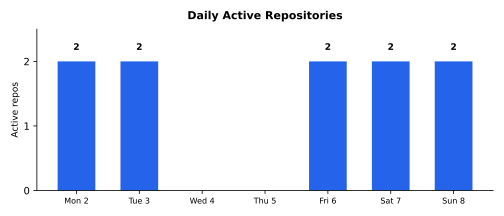

# Weekly Progress Report — 2026-02-02…08

> **Series restamp (2026-07-25):** Headline line stats now exclude `**/vendor/**` and `**/node_modules/**` (same rule as `gather.sh`). Figures below use remeasured excl-vendor totals from current default-branch history. Commits and effort estimates are unchanged. Excl-vendor landed lines: **+14,412/−8,975** (net **+5,437**). Commercial project detail: [private week 2026-02-08](https://github.com/marcelocantos/progress-reports-private/blob/master/reports/weekly-report-2026-02-08.md).

## Executive Summary

Progressive mipmapped texture streaming with ASTC compression capped the week with a high-performance mobile delivery pipeline. Commercial project detail: [private week 2026-02-08](https://github.com/marcelocantos/progress-reports-private/blob/master/reports/weekly-report-2026-02-08.md).

**77 commits** | **~+14,412 / ~−8,975** (excl. vendor) | **~55-100 person-days traditional equivalent** | **~25-50x multiplier**

### Major Achievements & Innovations

- **Wire-based remote rendering architecture** — detail in [private week 2026-02-08](https://github.com/marcelocantos/progress-reports-private/blob/master/reports/weekly-report-2026-02-08.md)
- **Progressive mipmapped texture streaming with ASTC compression** — detail in [private week 2026-02-08](https://github.com/marcelocantos/progress-reports-private/blob/master/reports/weekly-report-2026-02-08.md)
- **Engine extraction completion** (Feb 2-3): extracted `sq/` into a standalone submodule ([squz/sq](https://github.com/squz/sq)), refactored Makefile rules into `sq/Module.mk` with namespaced variables (`sq/` prefixes for all targets/sources/flags), linked against `libsq.a` instead of individual object files, moved unit tests and test shaders into the sq module. Merged `render_app` into `render_test` for in-process rendering. Multiple submodule updates integrated `BgfxResource` rename, CLAUDE.md, and a dependency graph tool
- **bgfx to Dawn/WebGPU migration** — detail in [private week 2026-02-08](https://github.com/marcelocantos/progress-reports-private/blob/master/reports/weekly-report-2026-02-08.md)
- **RAII EventWatchHandle for macOS live resize** — detail in [private week 2026-02-08](https://github.com/marcelocantos/progress-reports-private/blob/master/reports/weekly-report-2026-02-08.md)
### Tough Challenges Overcome

- **Wire protocol design with progressive texture delivery** — detail in [private week 2026-02-08](https://github.com/marcelocantos/progress-reports-private/blob/master/reports/weekly-report-2026-02-08.md)
- **bgfx-to-Dawn shader and API translation** — detail in [private week 2026-02-08](https://github.com/marcelocantos/progress-reports-private/blob/master/reports/weekly-report-2026-02-08.md)
- **Cross-platform mobile receiver** — detail in [private week 2026-02-08](https://github.com/marcelocantos/progress-reports-private/blob/master/reports/weekly-report-2026-02-08.md)
- **Live resize rendering on macOS** — detail in [private week 2026-02-08](https://github.com/marcelocantos/progress-reports-private/blob/master/reports/weekly-report-2026-02-08.md)
---

## Game Projects

### [squz/yourworld2](https://github.com/squz/yourworld2) — Wire Rendering & Engine Extraction (77 commits)

*Detailed narrative for this commercial work is in the private sibling: [progress-reports-private — week ending 2026-02-08](https://github.com/marcelocantos/progress-reports-private/blob/master/reports/weekly-report-2026-02-08.md).*
## Other Team Work

### [squz/esfera2](https://github.com/squz/esfera2) — Spherical Chess (37 commits, Andrew Cantos)

*Detailed narrative for this commercial work is in the private sibling: [progress-reports-private — week ending 2026-02-08](https://github.com/marcelocantos/progress-reports-private/blob/master/reports/weekly-report-2026-02-08.md).*
## Metrics

*All metrics below reflect Marcelo Cantos's contributions only.*

### Aggregate

| Metric | Value |
|--------|-------|
| Repositories touched | 1 |
| Total commits | 77 |
| Total lines added | +14,412 |
| Total lines removed | −8,975 |
| Net new lines | +5,437 |
| File changes | 87 |
| New files created | 22 |
| Languages | C++, WGSL, Makefile, Markdown |

*The negative net reflects heavy refactoring — engine extraction, bgfx removal, and code consolidation into the sq submodule removed more lines than the new wire rendering architecture added.*

### Per-Repository Breakdown

| Repo | Commits | Files changed | Lines added | Lines removed | Net |
|------|---------|---------------|-------------|---------------|-----|
| [squz/yourworld2](https://github.com/squz/yourworld2) | 77 | 87 | +4,594 | -6,379 | -1,785 |

### Testing

| Repo | New tests | Notes |
|------|-----------|-------|
| [squz/yourworld2](https://github.com/squz/yourworld2) | — | Regression test framework maintained; render_app merged into render_test |
| **Total** | **—** | Focus was on architecture and protocol, not new test functions |

---

### Daily Activity

## Ideas & Innovations

### Wire-Based Remote Rendering via WebGPU Wire Protocol ([yourworld2](https://github.com/squz/yourworld2))

*Detailed narrative for this commercial work is in the private sibling: [progress-reports-private — week ending 2026-02-08](https://github.com/marcelocantos/progress-reports-private/blob/master/reports/weekly-report-2026-02-08.md).*
### Progressive Mipmapped Texture Streaming ([yourworld2](https://github.com/squz/yourworld2))

*Detailed narrative for this commercial work is in the private sibling: [progress-reports-private — week ending 2026-02-08](https://github.com/marcelocantos/progress-reports-private/blob/master/reports/weekly-report-2026-02-08.md).*
### Engine Extraction via Module.mk Namespacing ([yourworld2](https://github.com/squz/yourworld2))

*Detailed narrative for this commercial work is in the private sibling: [progress-reports-private — week ending 2026-02-08](https://github.com/marcelocantos/progress-reports-private/blob/master/reports/weekly-report-2026-02-08.md).*
### RAII Event Watcher for macOS Live Resize ([yourworld2](https://github.com/squz/yourworld2))

*Detailed narrative for this commercial work is in the private sibling: [progress-reports-private — week ending 2026-02-08](https://github.com/marcelocantos/progress-reports-private/blob/master/reports/weekly-report-2026-02-08.md).*
### Exponential Backoff Reconnection for Wire Receivers ([yourworld2](https://github.com/squz/yourworld2))

*Detailed narrative for this commercial work is in the private sibling: [progress-reports-private — week ending 2026-02-08](https://github.com/marcelocantos/progress-reports-private/blob/master/reports/weekly-report-2026-02-08.md).*
## Effort Estimate: Traditional vs. AI-Assisted

A single-project week, but the work spans an unusually wide range of disciplines — from GPU rendering pipelines to network protocol design to mobile platform integration.

### Per-Project Estimates

| Project | Person-days | Why it's hard |
|---------|-------------|---------------|
| **yourworld2** (engine extraction) | 8-15 | Submodule extraction requires deep understanding of Make's evaluation model, C++ include/link semantics, and careful variable namespacing to avoid collisions. Merging render_app into render_test changes the test harness architecture. |
| **yourworld2** (Dawn migration) | 10-15 | bgfx and Dawn have fundamentally different rendering models. Every shader must be rewritten from bgfx's `sc` format to WGSL. Every rendering call changes. The dawnProcSetProcs switchable backend adds another layer. |
| **yourworld2** (wire rendering) | 15-25 | Novel architecture — not off-the-shelf. Headless server mode, wire protocol integration, receiver with reconnection, input forwarding from client to server, resize event propagation. Two mobile platforms with different texture format requirements. |
| **yourworld2** (texture pipeline) | 10-15 | Mipmapped progressive streaming with priority queues is networking/graphics crossover. ASTC compression pipeline. Wire-level mip truncation. Cache probe protocol. Idle disconnect detection. Each is a distinct sub-problem. |
| **yourworld2** (mobile/platform) | 5-10 | iOS landscape rendering, Android receiver, touch input coordinate mapping, drag inertia accumulation, platform-specific texture format selection. |

### The Diversity Tax

The specialisms exercised within this single project:

- [WebGPU](https://www.w3.org/TR/webgpu/)/[Dawn](https://dawn.googlesource.com/dawn) rendering pipeline and [WGSL](https://www.w3.org/TR/WGSL/) shader authoring
- [bgfx](https://github.com/bkaradzic/bgfx) internals (to migrate away from)
- Dawn wire protocol internals (serialisation, command buffering)
- Make build system engineering (`Module.mk`, namespaced variables, static library linking)
- Network protocol design (reconnection, backoff, idle detection, cache probing)
- [ASTC](https://en.wikipedia.org/wiki/Adaptive_scalable_texture_compression) and ETC2 texture compression formats
- iOS platform integration (landscape orientation, touch coordinates, Dawn libs)
- Android platform integration (emulator, receiver, touch input)
- [SDL3](https://github.com/libsdl-org/SDL) event system internals (event watchers, modal event loops)
- **Mipmap streaming and progressive delivery algorithms

A sing** — detail in [private week 2026-02-08](https://github.com/marcelocantos/progress-reports-private/blob/master/reports/weekly-report-2026-02-08.md)

### Actual Human Effort This Week

| Project | Human hours | The human work |
|---------|------------|----------------|
| **yourworld2** (77 commits) | 8-15 | Architecture decisions (wire protocol design, texture streaming strategy), testing on iOS/Android devices, debugging mobile-specific rendering issues, visual verification of globe rendering, interaction feel tuning |
| **Total** | **~8-15 hours** | |

### What If It Were One Person?

| Project | Expert days | Generalist days | The ramp-up cost |
|---------|------------|-----------------|------------------|
| **yourworld2** (engine extraction) | 8-15 | 12-20 | Make evaluation model subtleties, C++ include path conventions, submodule workflow |
| **yourworld2** (Dawn migration) | 10-15 | 18-25 | WebGPU spec is large. WGSL is new. Understanding dawnProcSetProcs requires reading Dawn internals. |
| **yourworld2** (wire rendering) | 15-25 | 25-40 | Wire protocol is Dawn-internal API — no tutorials exist. Reconnection strategy is protocol design from scratch. |
| **yourworld2** (texture pipeline) | 10-15 | 15-25 | ASTC format spec, mipmap math, priority queue design for streaming, cache protocol design |
| **yourworld2** (mobile/platform) | 5-10 | 10-15 | Two mobile platforms, each with their own build toolchains, texture format support, and touch input models |
| **Subtotal** | **48-80** | **~80-125** | |

Adding a ~15% context-switching tax for thrashing between GPU rendering, network protocols, build systems, and mobile platforms within a single codebase brings the realistic single-person estimate to **~55-100 person-days, or roughly 3-5 months**.

### Bottom Line

| | Estimate |
|---|---|
| Single talented generalist (traditional) | **55-100 person-days (3-5 months)** |
| Specialist team (traditional) | **48-80 person-days (2-4 person-months)** |
| Actual human effort this week | **~8-15 hours (~1-2 person-days)** |
| **Multiplier vs. generalist** | **~25-50x** |
| **Multiplier vs. specialist team** | **~25-40x** |

The multiplier is highest on the wire rendering architecture — a novel design that required synthesising knowledge of Dawn's wire protocol internals, network reconnection strategies, and progressive texture streaming into a coherent system. No existing tutorial or library covers this combination; it is pure architectural invention. The human contribution concentrated on the key design decisions: choosing the wire protocol approach over video streaming, deciding on progressive mip delivery over all-or-nothing texture transfer, and specifying the reconnection behaviour. These decisions took minutes but determined the entire week's technical direction.
