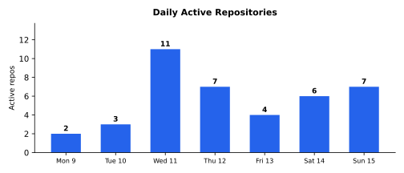

# Weekly Progress Report — 2026-02-09…15

## Executive Summary

A remarkably broad week across **10 repositories** spanning game development, library engineering, tooling, and strategic planning. The headlines: the **csp** library was born — extracted from bricabrac and rapidly expanded with timer primitives, M:N threading, sanitizer support, and microbenchmarking (24 commits). **multimaze2** was built from scratch as a physics-based maze game (20 commits), going from nothing to Box2D-integrated with live-tunable physics. **gg** received a comprehensive CLI overhaul in Rust (17 commits). **yourworld2** continued its evolution with country placement, carousel UI, and audio (59 commits). Three research/strategic documents landed across **arrai**, **wbnf**, and **hash**.

**129 commits** | **+25,690 net lines** | **~120-220 person-days traditional equivalent** | **~30-90x multiplier**

### Major Achievements & Innovations

- **Built multimaze2 from scratch** — custom physics engine (gravity, friction, collisions, springs, repulsion), 72 levels parsed from ASCII art, WebGPU renderer with sprite atlas, then swapped the hand-rolled physics for [Box2D v3](https://box2d.org/) with live-tunable parameters persisted to SQLite, all in one week
- **Extracted and expanded the csp library** — from bricabrac extraction to standalone C++ microthreading platform with timer channels, M:N scheduling with work stealing, sanitizer support with fiber annotations, [nanobench](https://nanobench.ankerl.com/) microbenchmarking, and RingBuffer rewrite fixing memory leaks and UB
- **Eliminated shell injection by construction** in gg via a key=value protocol: the Rust binary never emits executable shell code; all interpolation happens in the shell function with proper quoting
- **Live-tunable physics** in multimaze2: all physics constants converted to self-registering, atomically-read, SQLite-persisted `tweak::Float` variables adjustable via dashboard UI while the game runs
- **Carousel country selector** in yourworld2 with physics-based scrolling ported from original Obj-C GameState.mm, rendering country silhouettes directly from the globe's existing GPU buffers
- **Proposed dissolving "hard" parsing problems** in wbnf: C typedef ambiguity and C++ template brackets recast as semantic analysis problems, not parsing problems

### Tough Challenges Overcome

- **Custom rigid-body physics from scratch then replacement** (multimaze2): built a full physics engine (ball-wall, ball-ball, springs, repulsion, friction) with 52 tests and 310 assertions, then strategically replaced it with Box2D v3 when the constraint solver proved more robust — the knowledge from building the first engine was essential for correctly integrating the second
- **M:N scheduler design** (csp): building a work-stealing scheduler across OS threads with correct suspension semantics required careful reasoning about TOCTOU races between channel registration and context switching
- **Boost.Context migration** (bricabrac): replacing 4 architecture-specific hand-written assembly files (~550 lines) with Boost.Context demanded ABI and calling-convention expertise across ARM64 and x86-64
- **Box2D v3 collision geometry alignment** (multimaze2): balls were intruding into walls by one radius because `kBallRadius` was set to 0.15 instead of 16/47 (half the sprite size) — a subtle mismatch between physics and visual geometry
- **Porting carousel physics from Obj-C** (yourworld2): the original GameState.mm used a three-component force law (linear damping, smoothstep friction, magnetic snap-to-grid) with sub-stepped integration; faithfully reproducing the feel required matching the exact force coefficients and 10-iteration-per-frame symplectic Euler stepping

Contributor: Marcelo Cantos

---

## Game Projects

### [squz/multimaze2](https://github.com/squz/multimaze2) — From Scratch to Box2D (20 commits, 2 people, initial)
**A brand new rewrite** of the [MultiMaze](https://github.com/squz/multimaze) physics-based maze puzzle game on the sq engine ([Dawn](https://dawn.googlesource.com/dawn)/WebGPU + [SDL3](https://github.com/libsdl-org/SDL)).

**The biggest effort of the week.**
- **Initial implementation**: Maze model with wall bitmasks, artefacts (balls, homes, keys, switches, doors), ASCII-art level parser, 6 packs (72 levels), custom physics engine (gravity, friction, collisions, springs, repulsion), WebGPU renderer, HUD overlay, 52 tests with 310 assertions
- **Sprite rendering**: Replaced procedural geometry with textured sprite rendering from the original game's atlas, including quadrant corner system for walls, alpha-blended halos, and GL-to-WebGPU coordinate conversion
- **[Box2D v3](https://box2d.org/) integration**: Replaced hand-rolled Euler integration and single-pass collision solver with Box2D's iterative constraint solver. Walls as capsule shapes, balls as dynamic circles, bonds as rigid distance joints, repulsion as pre-step force application. Ball radius corrected from 0.15 to 16/47 (exact sprite boundary match)
- **Live-tunable tweaks system**: All physics constants (`kBallRadius`, `kGravityScale`, `kBallDensity`, `kBallFriction`, `kBallRestitution`, `kBallDamping`, `kWallFriction`, `kBondLength`, `kRepulsionForce`, etc.) converted from `constexpr` to `tweak::Float` with [SQLite](https://www.sqlite.org/) persistence (`tweaks.db`), atomic values, and self-registering registry. Dashboard integration via GET/POST `/api/tweaks`. Box2D world auto-rebuilds when tweak generation advances
- **Server lifecycle**: Fix player crash on disconnect, stop server when dashboard tab closes
- **sq submodule updates**: sqd daemon mode, iOS TestFlight CI, shared mobile playerLoop, live 3D phone preview in dashboard, Android SIGSEGV fix

### [squz/yourworld2](https://github.com/squz/yourworld2) — Carousel, Placement & Audio (59 commits)
Continuation — massive feature push across game mechanics, UI, and audio:
- **Country placement mechanics**: Magnetic snap placement with detection and tracking, mouse + finger input with first-wins deduplication, drag inertia fix
- **Carousel country selector**: Horizontally scrollable strip at screen bottom showing unplaced countries with physics-based scrolling ported from original GameState.mm — snap-to-grid, velocity accumulation with 5/6 boost decay, sub-stepped symplectic Euler integration (10 iterations/frame). 584-line Carousel.cpp with pImpl pattern
- **Country silhouettes**: Initially loaded meshes.bin on CPU and projected to 2D; refactored to render directly from the globe's existing GPU mesh buffers using the atlas pipeline and per-cell orthographic viewProj. Size scaled by country radius with smootherstep curve; orientation rotated in globe-local space to match country position as globe spins
- **Audio**: Background music (`blue_planet_full_loop.mp3`, 0.5 volume, looped) and placement sound effect (`distant_explosion03.wav`) via sq::Audio interface, assets from original yourworld tracked with Git LFS
- **Carousel shader**: New `carousel.wgsl` for 2D UI rendering with per-vertex colour tinting
- **Wire rendering continuation**: iOS and Android direct mode builds, touch input, QR code discovery
- **Engine integration**: Simplified Application API (separate update/render), engine-managed resize, globe controller via sq::GlobeController
- **Infrastructure**: Visual regression tests, offscreen render capture, migrated to GitHub Issues

---

## Libraries & Infrastructure

### [marcelocantos/csp](https://github.com/marcelocantos/csp) — New CSP Library (24 commits, initial)
**Brand new library.** A C++ microthreading library extracted from [squz/bricabrac](https://github.com/squz/bricabrac) and rapidly expanded:
- **Initial extraction**: Cooperative microthreads with [Boost.Context](https://www.boost.org/doc/libs/release/libs/context/), typed synchronous channels, `alt`/`prialt` multiplexing (like Go's `select`). Rich stream combinators: `buffer`, `map`, `where`, `tee`, `fanout`, `chain`, `quantize`, `latch`, `killswitch`, `rpc`. Namespace renamed from `brac` to `csp`, headers restructured to `include/csp/`. 88 tests passing, standalone Makefile with Clang C++17
- **Timer primitives**: `sleep`, `after`, `tick` implemented as channels — timers compose naturally with `alt` for timeouts and periodic processing
- **M:N threading**: [GMP model](https://en.wikipedia.org/wiki/Green_thread) scheduler for multi-core scheduling with work stealing across OS threads via `init_runtime(n)`
- **RingBuffer rewrite**: Fixed memory leak and undefined behaviour, added comprehensive tests
- **Sanitizer support**: Full [ASan](https://clang.llvm.org/docs/AddressSanitizer.html), [UBSan](https://clang.llvm.org/docs/UndefinedBehaviorSanitizer.html), [TSan](https://clang.llvm.org/docs/ThreadSanitizer.html) build targets with Boost.Context fiber annotations for correct stack reporting
- **Microbenchmarking**: [nanobench](https://nanobench.ankerl.com/) infrastructure for channel throughput baselines
- **Channel memory leak fix**: Channels now correctly delete when both endpoints close, tracked via independent endpoint refcounting
- **Build system**: Automatic header dependency tracking in Makefile, optimised `alt()` with random offset instead of shuffle

### [squz/bricabrac](https://github.com/squz/bricabrac) — Thread Module Evolution (3 commits)
- **Test coverage**: 23 new test cases covering channels (move-only types, N-writers/N-readers, alt fairness, prialt priority), channel utilities (where, tee, latch, sinkhole), buffer edge cases, and volume stress tests (10K channel lifecycle, 2K microthreads)
- **Boost.Context migration**: Replaced 4 architecture-specific hand-written .s files (~550 lines) with [Boost.Context](https://www.boost.org/doc/libs/release/libs/context/) for cross-platform fiber support
- **csp submodule adoption**: Replaced entire Thread module with csp git submodule dependency; thin adapter headers forward `brac::Thread::*` to `csp::*`. Net **-5,556 lines** as channel, microthread, and combinator code is now consumed from csp

### [anz-bank/decimal](https://github.com/marcelocantos/decimal) — Bug Fix (1 commit)
Fixed `Context.Sub()` silently ignoring the receiver context's rounding mode — it was calling `Decimal.Add` (which hardcodes HalfUp) instead of `ctx.Add`. Important for [IEEE 754-2019](https://en.wikipedia.org/wiki/IEEE_754) compliance.

### [arr-ai/hash](https://github.com/arr-ai/hash) — Benchmarking (2 commits)
- Added CLAUDE.md with project guidance
- **Comprehensive hash function benchmarks**: 21 benchmark cases covering all supported types (int8-64, uint8-64, float32/64, string, byte slices, struct, pointer, slice, map, Hashable interface)

---

## Tooling

### [marcelocantos/gg](https://github.com/marcelocantos/gg) — CLI Overhaul (17 commits, initial)
**Brand new public presence** for the `gg` git shorthand tool (Rust) — comprehensive modernisation and first release:
- **Interactive installer**: Running `gg` with no args now walks through setup (GGROOT, git protocol, directory viewer, aliases), writes config to `~/.zshrc`
- **SSH URLs by default**: Shorthand URLs now default to SSH; `GGHTTP=1` for HTTPS. Smart host directory creation with `git ls-remote` verification
- **Security**: Shell injection fix via `shell::escape()`, replaced `panic!()` with `bail!()`, removed `process::exit(1)` in favour of Result propagation
- **Code quality**: [clap](https://github.com/clap-rs/clap) v3 -> v4 upgrade, clippy fixes, LazyLock regex, key=value protocol replacing shell command output, descriptive CLI args
- **Testing**: 27 integration tests (14 for the installer alone), plus shell integration tests via real zsh + local bare repos
- **CI/CD**: New GitHub Actions CI workflow (clippy + tests + fmt), fixed release workflow for cross-compilation from macos-14 (arm64) since macos-13 runners are gone

---

## Strategic Planning & Documentation

### [arr-ai/arrai](https://github.com/arr-ai/arrai) — State of the Language (1 commit)
Added a 161-line research document analysing arr.ai's current state and future directions:
- Project health: peaked at 182 commits in 2021, effectively dormant since 2024, 146 open issues
- Proposes performance quick wins (object pooling, fast-path function application), medium-term work (bytecode compilation, lazy enumerators), and language evolution (gradual typing, deterministic parallelism)
- Strategic recommendation: position as an embeddable data transformation engine for Go

### [arr-ai/wbnf](https://github.com/arr-ai/wbnf) — Universal Grammar Research (1 commit)
Added a 717-line research paper "Toward a Universal Grammar" exploring wbnf's evolution:
- Proposes regex/grammar unification, integrated tokenization via labeled alternatives, generalised positional constraints (for indentation-sensitive parsing), and algebraic grammar composition
- Argues that "hard" parsing problems (C typedef ambiguity, C++ template brackets) dissolve when grammars describe only surface syntax
- Includes related work survey ([SDF](https://www.syntax-definition.org/), Rascal, PEG/OMeta/Ohm, [LPEG](http://www.inf.puc-rio.br/~roberto/lpeg/)) and implementation roadmap

### [squz/multimaze](https://github.com/squz/multimaze) — Documentation (1 commit)
Added CLAUDE.md documenting the legacy iOS game architecture for AI-assisted development.

---

## Other Team Work

### [squz/esfera2](https://github.com/squz/esfera2) — Spherical Chess (54 commits, Andrew Cantos)
Andrew delivered a massive feature push: online multiplayer (Go server with WebSocket relay and matchmaking), standalone iOS app with touch coordinate handling, 10-lesson interactive tutorial, OCI cloud deployment with security hardening, cinematic intro with phased animations, ELO rating system with variable K-factors, global and country-specific leaderboards, player profiles with 193-country selection, menu system with pixel-art icons, animation system refactor (4 extracted helpers replacing 3x duplication), and App Store deployment pipeline. 54 commits, +10,092/-2,569 lines.

---

## Metrics

*All metrics below reflect Marcelo Cantos's contributions only.*

### Aggregate

| Metric | Value |
|--------|-------|
| Repositories touched | 10 |
| Total commits | 129 |
| Total lines added | +33,461 |
| Total lines removed | -7,771 |
| Net new lines | +25,690 |
| File changes | 356 |
| New files created | 136 |
| Languages | C++, Go, Rust, Markdown, WGSL, YAML, Shell, SQL, Python |
| Contributors | 2 (Marcelo Cantos, Andrew Cantos) |

*The csp lines include code extracted from bricabrac, not all written from scratch this week. The bricabrac removal (-5,556 lines) mirrors code now consumed from the csp submodule.*

### Per-Repository Breakdown

| Repo | Commits | Files changed | Lines added | Lines removed | Net |
|------|---------|---------------|-------------|---------------|-----|
| [squz/yourworld2](https://github.com/squz/yourworld2) | 59 | 55 | +2,492 | -1,031 | +1,461 |
| [marcelocantos/csp](https://github.com/marcelocantos/csp) | 24 | 80 | +24,881 | -2,767 | +22,114* |
| [squz/multimaze2](https://github.com/squz/multimaze2) | 19 | 30 | +6,439 | -840 | +5,599 |
| [marcelocantos/gg](https://github.com/marcelocantos/gg) | 17 | 18 | +1,625 | -551 | +1,074 |
| [squz/bricabrac](https://github.com/squz/bricabrac) | 3 | 48 | +783 | -5,906 | -5,123** |
| [arr-ai/hash](https://github.com/arr-ai/hash) | 2 | 2 | +214 | -9 | +205 |
| [arr-ai/wbnf](https://github.com/arr-ai/wbnf) | 1 | 2 | +789 | -0 | +789 |
| [arr-ai/arrai](https://github.com/arr-ai/arrai) | 1 | 2 | +234 | -0 | +234 |
| [anz-bank/decimal](https://github.com/marcelocantos/decimal) | 1 | 1 | +2 | -2 | 0 |
| [squz/multimaze](https://github.com/squz/multimaze) | 1 | 1 | +74 | -0 | +74 |
| [squz/esfera2](https://github.com/squz/esfera2) | 7 | 4 | +48 | -54 | -6*** |

*\*Includes code extracted from bricabrac; not all written from scratch this week.*
*\*\*Thread module replaced by csp submodule dependency.*
*\*\*\*sq submodule pointer updates only.*

### Testing

| Repo | New tests | Notes |
|------|-----------|-------|
| [marcelocantos/csp](https://github.com/marcelocantos/csp) | 88 | Full suite extracted with library, plus timer, scheduler, and RingBuffer tests |
| [squz/multimaze2](https://github.com/squz/multimaze2) | 52 | 310 assertions; physics, levels, rendering |
| [marcelocantos/gg](https://github.com/marcelocantos/gg) | 27 | Rust integration tests + shell tests |
| [squz/bricabrac](https://github.com/squz/bricabrac) | 23 | Channels, alt fairness, volume stress |
| [arr-ai/hash](https://github.com/arr-ai/hash) | 21 | Benchmark suite covering all hashable types |
| **Total** | **211** | |

---

### Daily Activity

## Ideas & Innovations

### CSP Microthreading with Action RAII ([csp](https://github.com/marcelocantos/csp))
The csp library implements Go-style channel semantics in C++ with an elegant twist: channel operations return `action` objects whose **destructors invoke `prialt`**, so `w << val;` naturally blocks as a statement. Combined with per-endpoint independent refcounting (either end of a channel can close independently) and a rich combinator library (`tee`, `fanout`, `quantize`, `latch`, `killswitch`), this gives C++ a concurrency model that is arguably more expressive than Go's channels while remaining idiomatic C++.

### Timer Channels as First-Class Primitives ([csp](https://github.com/marcelocantos/csp))
Rather than providing timer callbacks or separate timeout APIs, csp implements `sleep`, `after`, and `tick` as **channels that produce values at scheduled times**. This means timers compose naturally with `alt` for timeouts ("read from data or timeout after 5s") and periodic processing ("tick every 100ms, merge with input"). The uniformity eliminates an entire category of API surface — there is no separate timer subsystem, just channels that happen to be time-driven.

### ASCII-Art Level Encoding ([multimaze2](https://github.com/squz/multimaze2))
The MultiMaze 2 level parser reads maze definitions from **ASCII art** — 72 levels across 6 packs are encoded as human-readable text art with wall bitmasks, artefact placement (balls, keys, switches, doors), and colour coding. This makes level design and debugging trivially visual while also serving as a compact, diff-friendly serialisation format.

### Live-Tunable Physics via Dashboard ([multimaze2](https://github.com/squz/multimaze2))
All of multimaze2's physics constants (gravity, ball density, friction, restitution, damping, bond parameters, repulsion forces) were converted from `constexpr` to `tweak::Float` — **self-registering, atomically read, SQLite-persisted, and adjustable via the dashboard UI** while the game runs. When the tweak generation counter advances, the Box2D world auto-rebuilds with new parameters. The Tweak.h system was then extracted to the sq submodule for cross-project reuse.

### GPU Mesh Reuse for 2D Silhouettes ([yourworld2](https://github.com/squz/yourworld2))
The country carousel initially loaded 3D mesh data from `meshes.bin` on the CPU, projected each country to 2D orthographically, and uploaded separate silhouette buffers. The refactored version **renders silhouettes directly from the globe's existing GPU mesh buffers** using the same atlas pipeline and texture bind groups — each carousel cell just gets a different orthographic viewProj matrix looking head-on at the country's centroid. This eliminates the second mesh load, the CPU projection, and the duplicate GPU uploads, while producing identical visual output.

### Structured Binary/Shell Boundary ([gg](https://github.com/marcelocantos/gg))
The `gg` refactor introduced a clean separation: the Rust binary outputs **structured key=value data** (`action`, `git_dir`, `git_url`, `cd_dir`) instead of shell commands, and the generated shell function parses this data to perform git/cd/viewer operations with proper `"$var"` quoting. This eliminates shell injection **by construction** — the binary never produces executable shell code, and all interpolation happens in the shell function using properly quoted variables.

### Dissolving "Hard" Parsing Problems ([wbnf](https://github.com/arr-ai/wbnf))
The wbnf research paper argues that notorious parsing difficulties — C's typedef ambiguity, C++'s template angle brackets — are **not parsing problems at all** but semantic analysis problems. By constraining grammars to describe only surface syntax, these ambiguities dissolve. The paper proposes concrete mechanisms: regex/grammar unification (character classes as native grammar primitives), positional constraints (`@col`, `@line` predicates for indentation-sensitive languages), and algebraic grammar composition for clean sublanguage embedding.

---

## Effort Estimate: Traditional vs. AI-Assisted

### Per-Project Estimates

| Project | Person-days | Why it's hard |
|---------|-------------|---------------|
| **yourworld2** | 20-35 | Country placement mechanics, carousel physics ported from Obj-C with sub-stepped symplectic Euler, GPU silhouette rendering from existing mesh buffers (spatial reasoning), audio integration, wire rendering continuation with iOS/Android direct mode, 59 commits of iteration. |
| **multimaze2** | 18-30 | Custom physics engine from scratch (ball-wall, ball-ball, springs, repulsion, friction — 52 tests, 310 assertions), then strategic replacement with Box2D v3 (constraint solver, shape types, joint system). Live-tunable tweaks system (self-registering, atomic, SQLite-persisted, dashboard-integrated, auto-rebuilding Box2D world). ASCII-art level parser for 72 levels. WebGPU sprite renderer with atlas UV mapping. |
| **csp** | 15-25 | Library extraction with namespace refactoring is mechanical but large. Timer primitives as channels require scheduler integration. M:N threading with work stealing is a PhD-level concurrency problem. Sanitizer support with fiber annotations requires deep understanding of ASan/TSan internals. RingBuffer rewrite fixing memory leaks and UB. nanobench integration. |
| **gg** | 8-12 | 17 commits of steady refinement. Interactive installer wizard, SSH/HTTPS URL handling with remote verification, shell injection fix (requires understanding the attack surface), clap v3 -> v4 migration, key=value protocol redesign, 27 integration tests, CI + release workflows, cross-compilation fix. |
| **wbnf** | 5-10 | A 717-line research paper with formal PL proposals, a related work survey spanning SDF/Rascal/PEG/OMeta/Ohm/LPEG/attribute grammars, and a concrete implementation roadmap. Academic-grade design work. |
| **bricabrac** | 3-5 | Test-first approach (23 new tests for concurrency correctness), assembly-to-Boost.Context migration (ABI expertise), then full module replacement with csp submodule (adapter header design). |
| **arrai** | 2-3 | Strategic analysis requiring deep codebase familiarity. |
| **hash** | 0.5 | Benchmark scaffolding. |
| **decimal** | 0.5 | Small fix, but requires understanding IEEE 754 rounding semantics to even spot the bug. |
| **multimaze** | 0.25 | Documentation. |

### The Diversity Tax

These estimates assume a developer who is already expert in the relevant domain. Specialisms exercised in a single week:

- WebGPU/Dawn rendering pipelines and WGSL shaders
- Custom rigid-body physics and Box2D v3 integration
- C++ microthreading, context switching, M:N scheduling
- C++ ABI and Boost.Context fiber annotations
- Rust CLI tooling (clap, shell code generation, cross-compilation)
- Go networking (TCP relay, WebSocket, REST)
- iOS and Android native development
- SQLite-backed live parameter tuning
- GPU orthographic projection and globe-space geometry
- Programming language theory and grammar formalisms
- IEEE 754 decimal arithmetic
- Hash function benchmarking and Go performance profiling

No single person holds all these at expert level. In a traditional team, this would involve 4-6 specialists with coordination overhead, design review meetings, and handoff friction.

### Actual Human Effort This Week

| Project | Human hours | The human work |
|---------|------------|----------------|
| **yourworld2** (59 commits) | 6-12 | Architecture decisions, carousel UX, visual comparison with original game, audio selection, testing on devices |
| **multimaze2** (19 commits) | 3-6 | Design intent, level verification, visual comparison with original, physics parameter tuning via tweaks UI, Box2D selection |
| **csp** (24 commits) | 3-6 | Deciding to extract, namespace/API design, M:N scheduler architecture, reviewing sanitizer integration |
| **gg** (17 commits) | 2-4 | Deciding the UX flow, testing shell integration, verifying CI |
| **bricabrac** (3 commits) | 1-2 | Directing test coverage, verifying Boost.Context migration, approving csp submodule switch |
| **wbnf** (research paper) | 1-3 | The PL ideas are human; the AI elaborated and surveyed related work |
| **arrai** (planning doc) | 0.5-1 | Strategic direction |
| **hash** (2 commits) | 0.25 | Quick benchmark pass |
| **decimal** | 0.25 | Spotting or reviewing the bug fix |
| **multimaze** | 0.15 | Quick doc pass |
| **Total** | **~17-35 hours** | |

### What If It Were One Person?

| Project | Expert days | Generalist days | The ramp-up cost |
|---------|------------|-----------------|------------------|
| **yourworld2** | 20-35 | 35-60 | Carousel physics porting from Obj-C requires matching exact force coefficients. GPU silhouette rendering straddles graphics and spatial math. Two mobile platforms. |
| **multimaze2** | 18-30 | 30-50 | Custom physics is trial-and-error-heavy. Box2D v3 integration. WebGPU pipeline setup. Atlas UV mapping with coordinate system quirks. SQLite-backed live tuning. |
| **csp** | 15-25 | 25-40 | M:N scheduling and work stealing are niche. Sanitizer fiber annotations require toolchain internals knowledge. |
| **gg** | 8-12 | 12-20 | Rust proficiency if not already there. Shell codegen subtleties. GitHub Actions. |
| **wbnf** | 5-10 | 10-20 | PL theory and grammar formalisms. The related work survey alone requires familiarity with the field. |
| **bricabrac** | 3-5 | 6-10 | C++ context switching, ABI details, Boost.Context API. Concurrency testing is subtle. |
| **arrai** | 2-3 | 5-8 | Requires deep codebase familiarity that a newcomer would need to build through extensive reading. |
| **hash** | 0.5 | 1 | Minor. |
| **decimal** | 0.5 | 1-2 | Understanding IEEE 754 rounding modes. |
| **multimaze** | 0.25 | 0.5-1 | Need to understand the legacy codebase to document it. |
| **Subtotal** | **73-126** | **~125-210** | |

Adding a ~15-25% context-switching tax for thrashing between C++/Go/Rust/iOS/PL-theory/physics/data-structures in a single week brings the realistic single-person estimate to **~145-260 person-days, or roughly 7-13 months**.

### Bottom Line

| | Estimate |
|---|---|
| Single talented generalist (traditional) | **120-220 person-days (6-11 months)** |
| Specialist team (traditional) | **73-126 person-days (4-7 person-months)** |
| Actual human effort this week | **~17-35 hours (~2-5 person-days)** |
| **Multiplier vs. generalist** | **~30-90x** |
| **Multiplier vs. specialist team** | **~15-50x** |

The multiplier is highest for cross-domain work (multimaze2 going from custom physics to Box2D integration in the same week, yourworld2 moving between GPU rendering and Obj-C physics porting) and for research/design work (wbnf paper, arrai strategic analysis) where the AI can explore design spaces and survey related work far faster than a human. The human contribution concentrates on vision, taste, architectural judgement, and the strategic decision-making that determines what gets built and how the pieces fit together.
