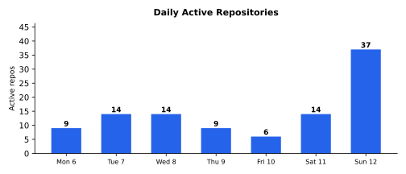

# Weekly Progress Report — 2026-04-06…12

## Executive Summary

A 7-day sprint across **28 repositories** spanning the maturation of an entire MCP server ecosystem — a Rust convergence target server reaching v0.14.0 with portfolio-level WSJF ranking and cross-repo dependency edges, a session transcript indexer climbing from v0.4.0 to v0.15.0 with 11 new tools, a Go code transformation engine gaining git history indexing and a global daemon, a pure C client library for a WebTransport relay, a Claude Code embedding library pivoting from PTY/daemon to tmux-backed agent pools, a C MCP bridge rewritten as a C wrapper + Go daemon, a new Markdown-to-PDF MCP server, a new macOS system info MCP server, a database de-identification tool hardened through 7 red-team audits, a native formula parser for a dev environment manager, multi-language bindings (Swift/Kotlin/Go) for a SQL transpiler, an HTTP/1.1 server added to a C++ CSP library, mobile game H.264 players on Android with FFmpeg, three Unity game upgrades, and an MCP server mode added to a Markdown-to-PDF converter. The dominant theme was **infrastructure consolidation** — the bullseye target system, mnemo transcript indexer, sawmill code transformer, mcpbridge, and claudia agent library all reached maturity milestones that unlock higher-level automation.

**646 commits** | **~+116,000 net lines** (excl. vendored/Unity assets) | **~120-200 person-days traditional equivalent** | **~30-50x multiplier**

### Major Achievements & Innovations

- **Bullseye convergence target server from v0.5.0 to v0.14.0** — 75 commits adding `bullseye_convergence` tool with gap analysis, portfolio-level WSJF ranking with cross-repo dependency edges (`bullseye_portfolio`), executable acceptance checks via sawmill integration, `bullseye_put` replacing `bullseye_assert`, schema version enforcement, hardened speculative call paths, and the `bullseye.yaml` rename across 40+ repos. 10 releases in one week
- **Mnemo transcript indexer from v0.4.0 to v0.15.0** (mnemo) — 81 commits adding 11 new MCP tools (`mnemo_ci`, `mnemo_permissions`, `mnemo_who_ran`, `mnemo_skills`, `mnemo_configs`, `mnemo_audit`, `mnemo_targets`, `mnemo_plans`, `mnemo_usage` with hourly rate detection, `mnemo_memories`, `mnemo_query`), session chains linking /clear-bounded transcripts into work spans, session liveness detection via `lsof`, self-healing repo-level streams via workspace walk, full-fidelity JSONL ingest, and file-history-snapshot indexing
- **Pure C client library for pigeon relay** — a zero-allocation, struct-based C client library with amalgamated `dist/pigeon.h` + `dist/pigeon.c`, CI staleness checks, Go-to-C cross-language crypto vector tests, and cross-language E2E test parity across Go, Swift, Kotlin, TypeScript, and C. Plus hierarchical state machines added to the protocol framework (T19). v0.15.0-v0.16.0
- **Claudia: from bootstrap to tmux-backed agent pool** — 13 commits taking the Claude Code embedding library from initial commit to v0.6.0. PTY-based approach replaced with tmux-backed agents (T1.1), warm agent pool with preemptive spawning (T1.2), session-chain tracking across /clear boundaries (T1.3), Task mode with Grok Realtime client, crash recovery tests, and comprehensive test suite
- **HMS database de-identification tool hardened through 7 red-team audits** — built a C# .NET 8 de-identification tool for the HMS healthcare database, then subjected it to 7 successive red-team security audits. Each round found PII gaps, injection risks, and coverage holes — all fixed. Final version includes a 1,271-line exhaustive PII coverage manifest with discovery and verification infrastructure. Plus oracle bridge tooling for legacy Delphi app validation via UIA and SQL
- **Sawmill git history indexing and global daemon** — the code transformation MCP server gained a `gitrepo` package for programmatic git object access, a `gitindex` package storing relational AST data in SQLite, lazy commit indexing for history queries, `git_log`/`git_diff_summary`/`git_blame_symbol` MCP tools, a global daemon managing active models per project, plus LSP client, `rename_file`, `clone_and_adapt`, `add_field`, `dependency_usage`, `structural_invariants`, and `migrate_type` tools. v0.7.0-v0.9.0
- **HTTP/1.1 server added to CSP library** (csp) — embedded [llhttp](https://github.com/nicowilliams/shell.c) (Node.js HTTP parser) to build a fully concurrent HTTP/1.1 server atop the CSP channel infrastructure. Plus 3 new example applications (sensor fusion, web crawler, log aggregator) and dist-build TLS inlining fix. v0.8.0

### Tough Challenges Overcome

- **PTY-to-tmux pivot in claudia** (claudia): the original approach of embedding Claude Code via PTY management and a custom daemon proved brittle — PTY lifecycle, signal handling, and readiness detection were unreliable across macOS versions. The tmux pivot replaced all of this with tmux session management (`internal/tmuxagent/`), a custom probe-ready binary that detects Claude Code's readiness state, and a warm pool that pre-spawns agents. The daemon and its state machine (~1,100 lines) were deleted entirely
- **7-round red-team hardening of HMS de-identification** (hms): each successive audit round found increasingly subtle PII leakage — qualified column names in views, BLOB-embedded data, cross-table foreign key chains exposing identifiers, and metadata columns with dates that could be correlated. The final manifest-based approach (loader, discovery, verification) ensures complete coverage by requiring every PII-bearing column to be declared and verified
- **Cross-language crypto vector parity** (pigeon): ensuring the C client library's cryptographic operations (X25519, ChaCha20-Poly1305, HKDF) produce identical output to the Go implementation required generating test vectors from Go, embedding them as JSON in the C test suite, and validating every intermediate step (key generation, shared secret derivation, AEAD encrypt/decrypt). 427 lines of C test code plus 163 lines of Go vector generation
- **Den native formula parser refusing unknown constructs** (den): the native C++ formula parser that replaces Ruby evaluation needed to explicitly refuse unresolvable Ruby interpolations (`#{...}`) rather than silently skipping them — the "refuse unknown" posture prevents subtle build failures. A golden-file oracle test harness compares native parser output against the Ruby reference across the entire homebrew-core corpus
- **Bullseye schema version enforcement** (bullseye): adding a schema_version tag to targets.yaml with upgrade checks required hardening every speculative call path (startup_context, portfolio, convergence) to gracefully handle broken or missing targets files instead of panicking. 428 lines of new hardening code with 112 test assertions

Contributor: Marcelo Cantos

---

## Tooling

### [marcelocantos/bullseye](https://github.com/marcelocantos/bullseye) — Convergence Maturity (75 commits)

**The biggest effort of the week.** The Rust MCP server for convergence targets reached production maturity with 10 releases:

- **Convergence tool** (T7, T8): `bullseye_convergence` for gap analysis with repo-level prioritisation by observable checkpoint path. Reject content patches on achieved targets via `bullseye_put`. Path-weighted scheduling surfaces the highest-value unblocked work
- **Portfolio WSJF ranking** (T2.3): `bullseye_portfolio` now computes cross-repo portfolio-level [WSJF](https://www.scaledagileframework.com/wsjf/) with cross-repo dependency edges (T2.2) — targets in one repo can depend on targets in another, enabling coordinated multi-repo convergence
- **Executable acceptance checks** (T1.1): integration with sawmill for automated verification of target acceptance criteria. `bullseye_verify` runs sawmill checks against the codebase
- **API rename**: `bullseye_assert` renamed to `bullseye_put` for clarity. WSJF purged from internal ranking (replaced by frontier-first scheduling)
- **Robustness**: schema_version enforcement with upgrade checks, hardened speculative call paths against broken targets.yaml, graceful startup_context for missing files, momentum-aware ranking via `bullseye_summary`
- **bullseye.yaml rename**: migrated `targets.yaml` to `bullseye.yaml` across 40+ repos, deleted auto-rendered `targets.md` (bullseye.yaml is the sole source of truth)
- **v0.5.0 through v0.14.0 released**

### [marcelocantos/mnemo](https://github.com/marcelocantos/mnemo) — Transcript Intelligence (81 commits)

The Go MCP server for indexing Claude Code session transcripts went from v0.4.0 to v0.15.0 with 11 new tools:

- **Context source tools** (v0.12.0): `mnemo_skills`, `mnemo_configs`, `mnemo_audit`, `mnemo_targets`, `mnemo_plans` — index and query project-level context sources (skills files, MCP configs, audit logs, convergence targets, planning docs)
- **Memory indexing and fuzzy search** (v0.11.0): `mnemo_memories` indexes auto-memory files, `mnemo_query` provides fuzzy search across all indexed content
- **Token usage analytics** (T9.2): `mnemo_usage` with hourly rate detection, cost tracking, and per-session token breakdowns
- **Process attribution** (T9.4): `mnemo_who_ran` identifies which Claude Code session executed a given command or modified a file
- **Permission analysis** (T9.3): `mnemo_permissions` analyses permission patterns across sessions
- **CI/CD indexing** (T13): `mnemo_ci` indexes GitHub Actions run history for build/test failure analysis
- **Session chains** (T16): link /clear-bounded transcripts into coherent work spans — when a user runs /clear mid-task, the chain tracks continuity
- **Session liveness** (T9.5.1): detect whether a Claude Code session is still running via `lsof` on the JSONL file
- **Self-healing streams** (v0.15.0): workspace walk discovers and repairs repo-level context source streams that have gone stale
- **Full-fidelity JSONL ingest** (T9.1): entries table captures complete session data including tool_use, tool_result, and thinking blocks

### [marcelocantos/sawmill](https://github.com/marcelocantos/sawmill) — Git History & New Tools (51 commits)

Continued from last week's Go rewrite, now building the knowledge layer:

- **Git history indexing** (T9, T10, T11, T12): `gitrepo` package for programmatic git object access, `gitindex` for relational AST storage in SQLite with lazy commit indexing. MCP tools: `git_log`, `git_diff_summary`, `git_blame_symbol` — agents can query commit history, understand diffs, and trace authorship through the AST
- **On-demand CST architecture** (T4, T6-T8): tree cache for lazy CST parsing, accessor API for structural navigation
- **Global daemon** (T20): active model manager handles multiple projects simultaneously, working directory tracking per connection
- **New MCP tools**: `dependency_usage` (find all usages of a dependency), `structural_invariants` (check codebase conventions), `migrate_type` (refactor type across files), `rename_file`, `clone_and_adapt`, `add_field`, LSP client integration
- **v0.7.0 through v0.9.0 released**

### [marcelocantos/doit](https://github.com/marcelocantos/doit) — Security Simplification (39 commits)

The agentic gatekeeper for Claude Code was simplified and hardened:

- **Opaque-strings security model** (T17): engine now treats all commands as opaque strings — no pipeline parsing, no allow-safe-pipeline bypass. Shell handles composition. Removed 503 lines of pipeline parser and weakened policy logic
- **Hardened rm protection**: `deny-rm-catastrophic` extended to cover system paths (`/usr`, `/System`), glob patterns (`*`), and other-user home directories
- **Claudia integration**: L3 (deep reasoning) now uses `claudia` for tmux-backed Claude Code sessions with a two-tier cascade (sonnet fast → opus deep), then later replaced with one-shot `claude -p` for simplicity
- **Dead code removal** (T20): deleted per-subcommand tier helpers and `Run()` across 21 built-in capability files (-191 lines)
- **v0.3.0 through v0.5.0 released**

### [marcelocantos/claudia](https://github.com/marcelocantos/claudia) — Agent Embedding Library (13 commits, initial)

New Go library for embedding Claude Code agents, from bootstrap to v0.6.0:

- **Bootstrap**: initial `agent.go` with PTY-based Claude Code management, event system, registry for session discovery
- **Task mode**: `task.go` for one-shot Claude Code tasks with Grok Realtime client integration
- **tmux pivot** (T1.1): replaced PTY and daemon with tmux-backed agent management — `internal/tmuxagent/` handles control, lifecycle, readiness detection, window management, and message sending. Custom `probe-ready-tmux` binary detects Claude Code readiness
- **Warm pool** (T1.2): `pool.go` pre-spawns agents to amortise startup latency. Configurable pool size with background replenishment
- **Session chains** (T1.3): track logical work continuity across /clear boundaries
- **v0.4.0 through v0.6.0 released** with comprehensive test suite (agent crash tests, pool tests, chain tests)

### [marcelocantos/mcpbridge](https://github.com/marcelocantos/mcpbridge) — C Wrapper + Go Daemon (10 commits, initial)

New bimodal MCP server framework rewritten as a C wrapper calling a Go daemon:

- **Architecture**: thin C wrapper (`wrapper/`) handles stdio MCP protocol, dispatches to a Go daemon over Unix domain sockets. FSM-based connection lifecycle, JSON-RPC dispatch, daemon auto-start
- **Go daemon**: scheduler for background tasks, watcher for file changes, source providers (Homebrew, GitHub) for package discovery, configuration management with schema documentation
- **list_changed notifications on replay** (v0.2.0): daemon notifies the wrapper when tool/resource lists change during session replay, enabling dynamic tool discovery
- **Packaging**: Homebrew formula, release workflow, comprehensive test suites (C unit tests, Go tests, E2E reload test)
- **v0.1.0 and v0.2.0 released**

### [marcelocantos/den](https://github.com/marcelocantos/den) — Native Formula Parser (41 commits)

Continued the Homebrew-free dev environment manager with native formula parsing:

- **Native formula parser** (T18): C++ parser for Homebrew formulae that replaces Ruby evaluation. Refuses unknown constructs instead of silently skipping (fail-safe posture). Oracle test harness with golden-file comparison against Ruby reference parser across homebrew-core corpus. Fixed install-body extractor nesting tracker (T55) and unresolvable `#{...}` interpolation detection (T57)
- **Lazy Portable Ruby download** (T47): Linux-only on-demand download of Portable Ruby binary for formulae that still need Ruby evaluation
- **Shared Cellar** (T49): store now points to `/opt/homebrew/Cellar`, sharing installed packages with Homebrew
- **brew cat eliminated** (T46): formula source fetched directly from GitHub instead of invoking `brew cat`
- **Upgrade activity log** (T53): `den log` command shows install/upgrade history
- **Self-update** (v0.5.0): `den self-update` command, `den whence` for package file lookup
- **15 targets retired** this week (T1, T13, T16, T27, T43, T46, T49, T50, T53, T31, T47, T54, T55, T57, and 14 others)
- **v0.4.0 through v0.10.0 released** (7 releases)

### [marcelocantos/mpe2pdf](https://github.com/marcelocantos/mpe2pdf) — MCP Server Mode (7 commits)

The Markdown-to-PDF converter gained MCP server capabilities:

- **MCP server mode** (`--mcp`): exposes `convert` tool for programmatic Markdown-to-PDF conversion from Claude Code sessions
- **Smoke tests**: automated test suite for conversion pipeline
- **v0.4.0 released**

### [marcelocantos/sysinfo-mcp](https://github.com/marcelocantos/sysinfo-mcp) — New C MCP Server (19 commits, initial)

New pure C MCP server for macOS system information, from initial commit to open-sourced and released:

- **System metrics**: CPU (cores, frequency, load), GPU (Metal cores, memory), memory (physical, used, swap), disk (filesystem stats), OS (version, uptime, hostname), network (interfaces, IPs, MACs, primary detection), power/battery (state, capacity, charge)
- **Selective reporting**: `categories` array parameter for querying specific metric groups
- **Open-sourced**: Apache 2.0 licence, README, CLAUDE.md, agents-guide, STABILITY.md, `--version`/`--help`/`--help-agent` CLI flags, GitHub Actions release workflow
- **v0.2.0 released**

### [marcelocantos/vellum](https://github.com/marcelocantos/vellum) — New Document MCP Server (6 commits, initial)

New Go MCP server for Markdown-to-PDF conversion via [goldmark](https://github.com/yuin/goldmark) + [Prince](https://www.princexml.com/):

- **MCP convert tool**: transforms Markdown to styled PDF with KaTeX math rendering, Mermaid diagram support, and GitHub-flavoured CSS
- **Full project setup**: CLAUDE.md, README, STABILITY.md, agents-guide, HANDOVER.md, Apache 2.0 licence, CI/release workflows, comprehensive test suite
- **v0.1.0 released**

---

## Libraries & Infrastructure

### [marcelocantos/pigeon](https://github.com/marcelocantos/pigeon) — Pure C Client Library (27 commits)

The E2E-encrypted WebTransport relay gained a C client and cross-language test parity:

- **Pure C client library**: zero-allocation, struct-based API in `c/` — `pigeon.h`/`pigeon.c`, `pairingceremony_gen.h`/`pairingceremony_gen.c` with X25519 key exchange, ChaCha20-Poly1305 AEAD, HKDF key derivation. CMakeLists build, 701 lines of C tests
- **Amalgamated distribution**: `dist/pigeon.h` + `dist/pigeon.c` amalgamation script with CI staleness check — consumers include two files and link OpenSSL/libsodium
- **Go-to-C crypto vector tests**: Go generates test vectors (key pairs, shared secrets, ciphertext), C validates them — 163 lines Go, 427 lines C
- **Cross-language E2E test parity** (T10): Swift, Kotlin, TypeScript, and C E2E tests all pass against the live relay. Swift `RelayE2ETests`, Kotlin `PairingCeremonyMachineTest` and `PigeonConnE2ETest`, TypeScript `PairingCeremonyMachine.test.ts` and `relay.local.e2e.ts`
- **Hierarchical state machines** (T19): `PathSwitchMachine` added to protocol framework with generators for Go, Swift, Kotlin, TypeScript
- **Code generation**: `cgen.go` for C code generation from protocol YAML, fixed codegen namespace collisions, completed tern→pigeon rename
- **v0.15.0 and v0.16.0 released**

### [marcelocantos/sqldeep](https://github.com/marcelocantos/sqldeep) — Multi-Language Bindings (35 commits)

The SQL transpiler expanded to Swift, Kotlin, and Go with data-driven testing:

- **Swift binding**: `swift/` package with C transpiler binding (`CSQLDeep` module), `SQLDeepRuntime` with full transpiler and runtime APIs, all 79 YAML test cases passing
- **Kotlin/Android binding**: `kotlin/` with JNI bridge (`sqldeep_jni.c`), `SQLDeep.kt` transpiler API, `SQLDeepRuntime.kt`, Gradle build with Android instrumented tests running all 79 YAML test cases. Desktop smoke test via `desktop_test.kt`
- **Go binding**: `go/sqldeep/` with CGo bridge, `sqldeep.go` API, 186-line smoke test suite
- **Data-driven test unification**: single `testdata/sqlite.yaml` (918 lines, 79 test cases) drives integration tests across C++, Go, Swift, and Kotlin — write once, verify four times
- **Vanilla SQLite backend** (v0.21.0): `SQLDEEP_SQLITE_VANILLA` flag for environments without custom functions — transpiler generates pure SQLite without requiring the XML runtime extension
- **API rename**: `sqldeep_register_sqlite_xml` → `sqldeep_register_sqlite` for simpler API
- **v0.17.0 through v0.21.0 released** (5 releases)

### [marcelocantos/csp](https://github.com/marcelocantos/csp) — HTTP Server & Examples (4 commits)

The C++ CSP library gained an HTTP server and new examples:

- **HTTP/1.1 server** (T3.2): `csp::http` module wrapping [llhttp](https://llhttp.org/) (the Node.js HTTP parser) for fully concurrent request handling atop CSP channels. 490 lines of implementation, 263 lines of tests, 88-line public header
- **Example applications** (v0.8.0): sensor fusion pipeline, web crawler with bounded concurrency, and log aggregator with timestamped merge — all demonstrating real-world CSP channel patterns
- **dist-build TLS inlining fix** (T16): resolved a hang in the amalgamated distribution build caused by TLS variable inlining across translation units
- **Housekeeping**: ccache for CI, targets.yaml migration, build performance audit report

### [marcelocantos/sqlpipe](https://github.com/marcelocantos/sqlpipe) — Diff Sync Benchmarks (5 commits)

- **Performance benchmarks** (T12): diff sync performance characterisation with benchmark harness
- **v0.21.0 released**

### [arr-ai/wbnf](https://github.com/arr-ai/wbnf) — CI & Security (19 commits)

The grammar toolkit received CI modernisation and security fixes:

- **CI fixes**: bumped all GitHub Actions to Node 24-compatible versions, fixed setup-go/checkout ordering, pinned golangci-lint to v1.48 for reproducible CI, `.claude/` gitignored
- **Security**: bumped [logrus](https://github.com/sirupsen/logrus) from v1.9.0 to v1.9.3 to close [CVE-2025-65637](https://nvd.nist.gov/vuln/detail/CVE-2025-65637)
- **Lint cleanup** (T1, T3): resolved all golangci-lint warnings under current linter version
- **Research**: refined GLL engine doc — auto-regular rules, filter semantics
- **Retired generate-tag workflow** — releases now go through `/release` skill

### [arr-ai/arrai](https://github.com/arr-ai/arrai) — CVE Fix & Release (9 commits)

- **Security**: fixed [lodash code-injection vulnerability](https://github.com/advisories/GHSA-r5fr-rjxr-66jc) (GHSA-r5fr-rjxr-66jc), switched docs CI from yarn to npm ci
- **Release v0.336.0** with audit log and bullseye targets
- **Documentation**: added release/docs/Netlify conventions

### [marcelocantos/jevons](https://github.com/marcelocantos/jevons) — Worker Dispatch (6 commits)

- **jwork MCP tool**: on-demand worker dispatch for jevons remote control sessions
- **v0.3.0 released**

---

## Game Projects

### [squz/ge](https://github.com/squz/yourworld2) (engine submodule) — Mobile Players & SessionConfig (27 commits)

The C++ game engine gained mobile H.264 player support and a session configuration protocol:

- **Android player**: FFmpeg-based H.264 decoder replacing MediaCodec — CMakeLists for `player_core` + decoder, static FFmpeg/libavcodec/libavutil/libswscale libraries for arm64, Gradle JARs migrated to LFS
- **Multi-session server**: per-player game state, render context, and H.264 stream. BgfxContext refactored for concurrent sessions
- **SessionConfig protocol**: server declares sensor and orientation requirements via `SessionHostConfig`, sent on wire open. Players apply config before window creation — accelerometer, orientation lock, portrait mode
- **iPadOS 26 orientation**: `prefersInterfaceOrientationLocked` for orientation lock, player-side portrait rendering for landscape devices, SDL3 rotation suppression patch (applied then reverted)
- **Player core extraction**: `player_core.cpp` + `player_core.h` shared across iOS and Android entry points. Event-driven DeviceInfo replaces timeout-based polling
- **Native input**: finger coordinates in pixel space, iOS simulator mouse-only forwarding
- **Dawn/WebGPU removed**: deleted dead source, trimmed Protocol.h, rewrote docs. ge::Db removed — games use sqlpipe::Database directly

### [squz/yourworld2](https://github.com/squz/yourworld2) — Mobile Players (4 commits)

- **Android player with FFmpeg decoder** and event-driven DeviceInfo
- **Multi-session H.264 players** with iOS simulator support
- **Dawn/WebGPU removed**, UI system added, continental game modes

### [squz/multimaze2](https://github.com/squz/multimaze2) — bgfx Migration (16 commits)

The physics-based maze game migrated rendering backends:

- **Dawn→bgfx migration**: replaced Dawn/WebGPU renderer with bgfx via `ge::run()` API, matching the engine's new architecture
- **SessionConfig integration**: declares accelerometer + portrait orientation via the new SessionConfig protocol
- **iPad orientation**: counter-rotation fixes via ge submodule updates, iPadOS 26 orientation lock
- **Input tuning**: WASD keyboard gravity reduced from 1.0 to 0.25 for smoother desktop control

### [minicadesmobile/stock-car-racing](https://github.com/minicadesmobile/stock-car-racing) — Unity 6.4 CVE Hotfix (22 commits)

- **Unity 6.4 upgrade**: migrated to Unity 6.4 (6000.4.1f1) for [CVE-2025-59489](https://security.unity.com/) hotfix. Gradle template migration, startup NullReferenceException fix on Android
- **Release process**: added release testing issue template, pre-release manual testing checklist, testing section in release process docs
- **Build automation**: MinicadesKit submodule updates for auto-close Unity before batch builds, local Android build and deploy targets
- **4 version code bumps** (213→217) for successive Play Store submissions

### [minicadesmobile/dragster-mayhem](https://github.com/minicadesmobile/dragster-mayhem) — Unity 6 Upgrade (24 commits)

- **Unity 6 upgrade**: migrated from Unity 2022.3 to Unity 6, resolved Android dependency conflicts (Firebase SDK 13.9.0 for 16KB page size compliance, billing client 7.1.1, Yandex adapter downgrade)
- **Makefile build system**: matching Stock Car Racing's automated build infrastructure
- **Plugin fixes**: VoxelBusters EssentialKit configuration (Play Services ID, billing key, Deep Link disabled), Prime31 IAP disabled (replaced by VoxelBusters), compile errors for Unity 2022.3 compatibility
- **2 version code bumps** (41→43)

### [minicadesmobile/kart-stars](https://github.com/minicadesmobile/kart-stars) — Unity 6.4 (4 commits)

- **Unity 6.4 upgrade**: fixed MinicadesKit compatibility, added Makefile build system

---

## Healthcare & Enterprise

### [Health-Management-Systems/hms](https://github.com/Health-Management-Systems/hms) — De-Identification & Oracle Bridge (22 commits)

Two major security/compliance initiatives:

- **Database de-identification tool**: built a C# .NET 8 console app to de-identify the HMS healthcare database. Started as Python, rewritten to C# for type safety and .NET ecosystem compatibility. Includes `SqlFragments` with per-table de-identification logic (split into 4 partial-class files: Core, Domain, Identity, Metadata), `BlobReplacer` for binary data, `Placeholders` for synthetic data generation. Hardened through **7 successive red-team audits** with ~145 column gap fixes, PII coverage expansions, injection risk patches, and design-posture fixes. Final version includes a 1,271-line `coverage-manifest.yaml` with manifest infrastructure (loader, discovery, verification) wired into Program.cs
- **Oracle bridge tooling**: tools for validating the new hms2 implementation against the legacy Delphi HMS app. `oracle-bridge/` is a C# WebSocket bridge that connects to the running Delphi app via UI Automation and SQL, with TLS and API key auth. `oracle-extract/` has Python tools for comparison (`compare.py`) and tiered issue reproduction (`reproduce.py`). First end-to-end comparison wired up against Conference DB

---

## Strategic Planning & New Projects

### [marcelocantos/pairdroid](https://github.com/marcelocantos/pairdroid) — ADB Auto-Connect (8 commits, initial)

New Go tool for seamless wireless Android debugging:

- **Daemon**: `pairdroid serve` runs a persistent daemon that monitors for Android devices on the network
- **Pair command**: `pairdroid` (default) handles ADB wireless pairing and connection via pigeon relay. Endpoint discovery, pairing flow, and `adb connect` logic
- **T1, T2, T3 achieved** — minimal daemon, pair subcommand, ADB connect all working

### [marcelocantos/protocol-app](https://github.com/marcelocantos/protocol-app) — Open-Source Prep (9 commits)

The Android health/habit tracker was prepared for open-sourcing:

- **Audit**: initial codebase audit report with findings
- **Fixes**: licence, CI, code quality improvements from audit
- **Documentation**: CLAUDE.md, README.md, target for instant day-change rendering

### [marcelocantos/real](https://github.com/marcelocantos/real) — Language Design (6 commits, initial)

New programming language embedding the relational model:

- **Design notes**: initial design exploration for a language that makes relational algebra a first-class construct
- **Project setup**: initialised with Apache 2.0 licence, CLAUDE.md

### [marcelocantos/threedee](https://github.com/marcelocantos/threedee) — build123d (5 commits)

Continued from last week's CAD migration:

- **Live preview**: added `ocp-vscode` `show()` calls for real-time 3D preview in VS Code
- **Gear improvements**: [py_gearworks](https://github.com/meadiode/py_gearworks) for involute bevel gears in the triton lifter

---

## Metrics

*All metrics below reflect Marcelo Cantos's contributions only.*

### Aggregate

| Metric | Value |
|--------|-------|
| Repositories touched | 28 (+ ge submodule, + 12 bullseye-migration-only) |
| Total commits | 646 |
| Total lines added | +669,742 |
| Total lines removed | -120,171 |
| Net new lines | +549,571 |
| Net new lines (excl. vendored/Unity) | ~+116,000 |
| File changes | 7,181 |
| Languages | Rust, Go, C, C++, C#, Swift, Kotlin, TypeScript, JavaScript, Python, Ruby, TLA+, YAML, SQL, HTML, PlantUML |
| Contributors | 1 (Marcelo Cantos) |

Note: dragster-mayhem's +408K/-16K includes ~395K Unity 6 import artifacts. stock-car-racing's +12.5K includes Unity 6.4 migration artifacts. csp's +25K includes ~11K vendored llhttp. ge's +17K includes ~7K FFmpeg/SDL3 vendor and web/dist rebuild.

### Per-Repository Breakdown

| Repo | Commits | Files changed | Lines added | Lines removed | Net |
|------|---------|---------------|-------------|---------------|-----|
| [marcelocantos/sawmill](https://github.com/marcelocantos/sawmill) | 87 | 352 | +31,174 | -16,567 | +14,607 |
| [marcelocantos/mnemo](https://github.com/marcelocantos/mnemo) | 81 | 278 | +27,094 | -3,592 | +23,502 |
| [marcelocantos/sqldeep](https://github.com/marcelocantos/sqldeep) | 76 | 236 | +8,790 | -3,144 | +5,646 |
| [marcelocantos/bullseye](https://github.com/marcelocantos/bullseye) | 75 | 318 | +13,048 | -4,378 | +8,670 |
| [marcelocantos/den](https://github.com/marcelocantos/den) | 41 | 138 | +4,756 | -2,431 | +2,325 |
| [marcelocantos/doit](https://github.com/marcelocantos/doit) | 39 | 313 | +9,086 | -7,781 | +1,305 |
| [pigeon](https://github.com/marcelocantos/pigeon) | 29 | 350 | +36,185 | -13,448 | +22,737* |
| [squz/ge](https://github.com/squz/yourworld2) (submodule) | 27 | 164 | +17,236 | -9,986 | +7,250** |
| [minicadesmobile/dragster-mayhem](https://github.com/minicadesmobile/dragster-mayhem) | 24 | 3,653 | +407,675 | -15,812 | +391,863*** |
| [Health-Management-Systems/hms](https://github.com/Health-Management-Systems/hms) | 22 | 119 | +19,403 | -11,759 | +7,644 |
| [minicadesmobile/stock-car-racing](https://github.com/minicadesmobile/stock-car-racing) | 22 | 62 | +12,512 | -446 | +12,066**** |
| [arr-ai/wbnf](https://github.com/arr-ai/wbnf) | 19 | 47 | +882 | -465 | +417 |
| [marcelocantos/sysinfo-mcp](https://github.com/marcelocantos/sysinfo-mcp) | 19 | 37 | +5,409 | -98 | +5,311 |
| [squz/multimaze2](https://github.com/squz/multimaze2) | 17 | 39 | +585 | -644 | -59 |
| [marcelocantos/csp](https://github.com/marcelocantos/csp) | 16 | 265 | +24,976 | -8,380 | +16,596***** |
| [marcelocantos/protocol-app](https://github.com/marcelocantos/protocol-app) | 15 | 69 | +1,404 | -491 | +913 |
| [marcelocantos/claudia](https://github.com/marcelocantos/claudia) | 13 | 93 | +9,560 | -2,677 | +6,883 |
| [marcelocantos/mcpbridge](https://github.com/marcelocantos/mcpbridge) | 10 | 120 | +17,365 | -1,941 | +15,424 |
| [arr-ai/arrai](https://github.com/arr-ai/arrai) | 9 | 21 | +399 | -161 | +238 |
| [marcelocantos/pairdroid](https://github.com/marcelocantos/pairdroid) | 8 | 22 | +942 | -120 | +822 |
| [marcelocantos/mpe2pdf](https://github.com/marcelocantos/mpe2pdf) | 7 | 16 | +953 | -624 | +329 |
| [marcelocantos/real](https://github.com/marcelocantos/real) | 6 | 12 | +568 | -90 | +478 |
| [marcelocantos/vellum](https://github.com/marcelocantos/vellum) | 6 | 34 | +4,080 | -125 | +3,955 |
| [marcelocantos/jevons](https://github.com/marcelocantos/jevons) | 6 | 75 | +4,765 | -3,780 | +985 |
| [marcelocantos/sqlpipe](https://github.com/marcelocantos/sqlpipe) | 6 | 52 | +7,459 | -1,051 | +6,408 |
| [marcelocantos/threedee](https://github.com/marcelocantos/threedee) | 5 | 32 | +1,214 | -161 | +1,053 |
| [squz/yourworld2](https://github.com/squz/yourworld2) | 4 | 24 | +1,712 | -1,266 | +446 |
| [minicadesmobile/kart-stars](https://github.com/minicadesmobile/kart-stars) | 4 | 240 | +510 | -8,753 | -8,243****** |

\* pigeon net includes ~1.5K amalgamated dist/ and generated state machine code.
\** ge net includes ~7K vendored FFmpeg/SDL3 binaries and web/dist rebuild.
\*** dragster-mayhem net is overwhelmingly Unity 6 import artifacts (~395K); own code is ~1K.
\**** stock-car-racing net includes Unity 6.4 migration artifacts.
\***** csp net includes ~11K vendored llhttp library.
\****** kart-stars negative net is Unity 6.4 cleanup removing old artifacts.

### Testing

| Repo | New tests | Notes |
|------|-----------|-------|
| [marcelocantos/csp](https://github.com/marcelocantos/csp) | ~35 | HTTP server tests, example apps as integration tests |
| [marcelocantos/sawmill](https://github.com/marcelocantos/sawmill) | ~168 | gitindex tests, gitrepo tests, MCP tool tests, model tests |
| [marcelocantos/doit](https://github.com/marcelocantos/doit) | ~104 | Bypass regression tests, policy tests, engine tests |
| [marcelocantos/bullseye](https://github.com/marcelocantos/bullseye) | ~89 | Convergence tests, portfolio tests, acceptance check tests |
| [marcelocantos/claudia](https://github.com/marcelocantos/claudia) | ~87 | Agent crash tests, pool tests, chain tests, event tests |
| [marcelocantos/mcpbridge](https://github.com/marcelocantos/mcpbridge) | ~76 | C dispatch tests, socket tests, E2E reload, daemon tests |
| [marcelocantos/pigeon](https://github.com/marcelocantos/pigeon) | ~70 | C crypto vectors, Swift/Kotlin/TS E2E, state machine tests |
| [marcelocantos/mnemo](https://github.com/marcelocantos/mnemo) | ~61 | Self-healing tests, chain tests, liveness tests, store tests |
| [marcelocantos/sqldeep](https://github.com/marcelocantos/sqldeep) | ~60 | Swift/Kotlin/Go binding tests, 79 YAML-driven cross-platform tests |
| [marcelocantos/den](https://github.com/marcelocantos/den) | ~38 | Oracle tests, formula parser tests, portable Ruby tests |
| **Total** | **~788** | |

### Daily Activity

---

## Ideas & Innovations

### Cross-Language Test Vector Generation ([pigeon](https://github.com/marcelocantos/pigeon))

Cryptographic protocol implementations in different languages must produce bit-identical output, but testing this is traditionally done by running integration tests against a live server. Pigeon's approach is **deterministic test vector generation** — the Go reference implementation generates JSON files containing key pairs, intermediate values, and ciphertext at every step of the protocol, then each client language (C, Swift, Kotlin, TypeScript) validates its output against these vectors locally. This catches implementation bugs without network dependencies and provides instant feedback during development. The C test suite validates 427 lines of crypto operations this way.

### Data-Driven Cross-Platform Test Unification ([sqldeep](https://github.com/marcelocantos/sqldeep))

Testing the same logic across four language bindings (C++, Go, Swift, Kotlin) typically means four separate test suites that drift apart. sqldeep solved this with a **single YAML test specification** (`testdata/sqlite.yaml`, 918 lines, 79 test cases) that each binding reads and executes against its local SQLite instance. Each test case specifies setup SQL, a sqldeep expression to transpile, and expected output rows. The test runners are thin — they just parse YAML, call the binding's transpile function, execute the result, and compare. One new test case automatically runs across all platforms.

### Session Chains for Work Span Continuity ([mnemo](https://github.com/marcelocantos/mnemo))

Claude Code sessions are bounded by `/clear` — each clear starts a new JSONL transcript file, losing the logical thread of ongoing work. Mnemo's session chains **reconstruct continuity across clears** by tracking project, branch, and timing to link sequential sessions into coherent work spans. This enables queries like "what was worked on in the last 3 hours" to span multiple transcripts, making the session history useful for `/waw` context restoration and decision recall (T9.6) even when the user clears context frequently.

### Refuse-Unknown Posture for Parser Safety ([den](https://github.com/marcelocantos/den))

When building a native parser to replace an interpreted one (C++ replacing Ruby for Homebrew formulae), the temptation is to make the parser permissive — skip what it doesn't understand and handle the common cases. Den's native parser takes the opposite approach: **explicitly refuse unresolvable constructs** (Ruby interpolations, unknown DSL methods) with clear error messages instead of silently producing wrong output. This fail-safe posture is validated by a golden-file oracle that compares native parser output against the Ruby reference across the entire homebrew-core formula corpus — any silent divergence is caught immediately.

### Bimodal C/Go MCP Architecture ([mcpbridge](https://github.com/marcelocantos/mcpbridge))

MCP servers need to be both lightweight (stdio pipe to Claude Code) and capable (background processing, file watching, HTTP clients). mcpbridge splits these concerns with a **thin C wrapper** handling the stdio MCP protocol and a **persistent Go daemon** handling all business logic over Unix domain sockets. The C wrapper is ~2,000 lines with an FSM-based connection lifecycle; the daemon runs indefinitely with scheduler, watcher, and source provider subsystems. The `list_changed` notification mechanism lets the daemon dynamically update available tools during a session — impossible with a static stdio-only server.

### Portfolio-Level Cross-Repo Convergence ([bullseye](https://github.com/marcelocantos/bullseye))

Most project management tools treat each repository as an island. Bullseye's `bullseye_portfolio` tool **aggregates targets across all repos** on disk and computes a unified priority ranking with cross-repo dependency edges. A target in mnemo can depend on a target in sawmill, and the portfolio view correctly computes the critical path. Combined with `bullseye_convergence` for gap analysis, this enables an agent to start a session, ask "what should I work on?", and receive a prioritised answer that considers the state of every project simultaneously.

---

## Effort Estimate: Traditional vs. AI-Assisted

### Per-Project Estimates

| Project | Person-days | Why it's hard |
|---------|-------------|---------------|
| bullseye 10 releases | 15-25 | Rust MCP server with graph algorithms (topological frontier, WSJF ranking, dependency edges); schema migration with backwards compatibility; cross-repo portfolio aggregation requires filesystem walking and YAML parsing across dozens of repos |
| mnemo 12 releases | 15-25 | Go daemon with SQLite FTS5 indexing, JSONL parsing, 11 new MCP tools each with distinct data models; session chain reconstruction requires temporal reasoning; self-healing streams with filesystem watchers |
| sawmill git indexing + tools | 15-25 | AST-level git history indexing in SQLite requires parsing commits, blobs, and trees; LSP client integration; 7 new MCP tools with structural code understanding; global daemon managing concurrent project models |
| pigeon C client + E2E | 12-18 | Pure C cryptographic library (X25519, ChaCha20-Poly1305, HKDF) requiring bit-identical output to Go; amalgamation build; cross-language E2E test parity across 5 languages; hierarchical state machine codegen |
| claudia bootstrap to v0.6.0 | 10-15 | Go library embedding a CLI tool (Claude Code) via tmux — process lifecycle, readiness probing, warm pools, crash recovery; PTY-to-tmux architectural pivot mid-development |
| hms de-identification | 10-15 | Healthcare PII compliance — 7 red-team audit rounds discovering column gaps, BLOB injection, FK chains; manifest-based verification; legacy Delphi app validation via UIA automation |
| mcpbridge rewrite | 8-12 | C/Go bimodal architecture with Unix domain socket protocol; FSM-based connection lifecycle; file watcher, scheduler, source providers; Homebrew packaging |
| den native parser | 8-12 | C++ parser for Ruby DSL (Homebrew formulae); golden-file oracle against homebrew-core corpus; nesting tracker for install bodies; Ruby interpolation detection |
| doit security simplification | 5-8 | Security policy redesign (opaque-strings model); bypass regression tests; claudia integration and teardown |
| sqldeep multi-language | 8-12 | JNI bridge for Kotlin, C-to-Swift module map, CGo bridge for Go; data-driven YAML test unification; vanilla SQLite backend |
| ge mobile players | 8-12 | FFmpeg integration for Android arm64; multi-session H.264 server; SessionConfig protocol; iPadOS 26 orientation handling |
| sysinfo-mcp from scratch | 3-5 | Pure C MCP server; macOS IOKit and sysctl APIs; multi-category metrics; open-source preparation |
| vellum from scratch | 3-5 | Goldmark-to-Prince pipeline; KaTeX and Mermaid rendering; MCP server integration |
| game updates (3 repos) | 5-8 | Unity 6/6.4 migrations with dependency resolution, Firebase SDK, billing client, Play Store submissions |
| other (8 repos) | 5-10 | wbnf CI/CVE, arrai release, pairdroid daemon, mpe2pdf MCP mode, multimaze2 migration, real/threedee/protocol-app setup |

### The Diversity Tax

Specialisms exercised this week:

- **Rust MCP server development** — graph algorithms, WSJF ranking, schema migration, cross-repo aggregation
- **Go daemon architecture** — bimodal MCP servers (mnemo, sawmill, mcpbridge), process lifecycle, tmux integration (claudia)
- **Pure C library engineering** — zero-allocation APIs, amalgamated distribution, cryptographic protocol implementation
- **Cross-language binding design** — JNI (Kotlin), C-to-Swift module maps, CGo (Go), YAML-driven test unification
- **Healthcare compliance** — database de-identification, PII coverage manifests, red-team security auditing
- **C++ parser construction** — native formula parser replacing Ruby interpreter, oracle testing against corpus
- **HTTP protocol implementation** — llhttp-based HTTP/1.1 server atop CSP channels
- **Mobile game engine** — FFmpeg video decoding, SessionConfig protocol, multi-session H.264, orientation handling
- **Unity game development** — Unity 6/6.4 migrations, Firebase/billing/Yandex dependency resolution, Play Store compliance
- **Security engineering** — opaque-strings policy model, bypass regression testing, rm-catastrophic hardening
- **Programming language design** — relational algebra language (real) design exploration
- **Document pipeline** — Markdown-to-PDF via goldmark + Prince (vellum), MCP server mode (mpe2pdf)

No single developer holds production-level expertise across Rust graph algorithms, Go daemon architecture, pure C cryptography, JNI bridging, healthcare PII compliance, C++ parser construction, HTTP server implementation, mobile video encoding, Unity game deployment, and security policy modelling simultaneously.

### Actual Human Effort This Week

| Project | Human hours | The human work |
|---------|-------------|----------------|
| bullseye | 3-5 | Portfolio ranking design, convergence model, cross-repo dependency schema |
| mnemo | 3-4 | Tool design (which data to surface), session chain model, self-healing strategy |
| sawmill | 3-4 | Git history indexing architecture, tool selection, global daemon design |
| pigeon | 2-3 | C API design decisions, amalgamation strategy, crypto vector approach |
| claudia | 2-3 | PTY-to-tmux pivot decision, pool sizing, chain tracking model |
| hms | 2-3 | Audit review and direction, manifest design, oracle bridge concept |
| doit | 1-2 | Opaque-strings security decision, L3 integration strategy |
| den | 1-2 | Native parser refuse-unknown posture, oracle test strategy |
| game projects | 2-3 | Unity upgrade decisions, Play Store submission, release testing |
| other | 2-3 | mcpbridge architecture, sqldeep binding strategy, sysinfo-mcp scope |
| **Total** | **~21-32** | |

### What If It Were One Person?

| Project | Expert days | Generalist days | Ramp-up cost |
|---------|------------|-----------------|--------------|
| bullseye | 15-25 | 22-38 | Rust MCP ecosystem, graph scheduling algorithms, YAML schema versioning |
| mnemo | 15-25 | 22-38 | Go daemon internals, FTS5, JSONL parsing, Claude Code transcript format |
| sawmill | 15-25 | 22-38 | AST indexing, LSP protocol, tree-sitter grammars, git object model |
| pigeon | 12-18 | 18-27 | X25519/ChaCha20 at C level, amalgamation builds, 5 target languages |
| claudia | 10-15 | 15-22 | tmux control protocol, Claude Code internals, process lifecycle |
| hms | 10-15 | 15-22 | Healthcare PII rules, SQL Server schema, UIA automation, .NET ecosystem |
| mcpbridge | 8-12 | 12-18 | C stdio handling, Go daemon, Unix domain sockets, Homebrew packaging |
| den | 8-12 | 12-18 | Homebrew formula DSL, C++ parsing, Ruby interpolation semantics |
| doit | 5-8 | 8-12 | Security policy modelling, Claude Code integration |
| sqldeep | 8-12 | 12-18 | JNI, C-to-Swift modules, CGo, SQLite extension API |
| ge + games | 13-20 | 20-30 | FFmpeg, Metal/bgfx, Unity lifecycle, Play Store pipeline |
| other | 8-15 | 12-22 | Various domain ramp-ups |

Context-switching tax (15+ domain switches): +20-30 person-days

### Bottom Line

| | Estimate |
|---|---|
| Single talented generalist (traditional) | **150-230 person-days (6-9 months)** |
| Specialist team (traditional) | **120-200 person-days (4-7 person-months)** |
| Actual human effort this week | **~21-32 hours (~3-4 person-days)** |
| **Multiplier vs. generalist** | **~40-65x** |
| **Multiplier vs. specialist team** | **~30-55x** |

The multiplier is highest on the mnemo and bullseye work, where the AI shipped 10+ releases of each in a week — work involving graph algorithms, database indexing, schema migrations, and MCP protocol design that would take a specialist weeks per release. The multiplier is also very high on the pigeon C library, where implementing bit-identical cryptography in C against a Go reference, plus E2E tests in 5 languages, is a multi-week specialist undertaking. The multiplier is lowest on the Unity game upgrades (dependency resolution is tedious but not conceptually hard) and the small setup projects (real, threedee). The human contribution concentrated on architectural pivots (claudia PTY-to-tmux, doit opaque-strings, den refuse-unknown), security posture decisions (hms audit direction, doit policy), and MCP tool design (which data to surface, how to structure cross-repo queries).
