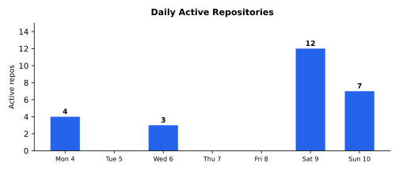

# Weekly Progress Report — 2026-05-04…10

> **Series restamp (2026-07-25):** Headline line stats now exclude `**/vendor/**` and `**/node_modules/**` (same rule as `gather.sh`). Figures below use remeasured excl-vendor totals from current default-branch history. Commits and effort estimates are unchanged. Excl-vendor landed lines: **+27,635/−17,608** (net **+10,027**).

## Executive Summary

Sixteen repositories saw activity with three runaway releases storms. **ge** shipped **eighteen consecutive minor releases (v0.5.0 → v0.22.0)** that turned the engine from a 2D-rectangles-and-cutouts API into a full canonical 2D/UI surface — `Context::pixelsPerPt()` / `deviceUiScale()` for physical-size sizing on phone vs tablet, device-tilt parallax via iOS `CMMotionManager` + Android `GAME_ROTATION_VECTOR`, the canonical `ge.GeActivity` that ends per-app Activity drift, back-press + memory-pressure `RunConfig` callbacks, [lunasvg](https://github.com/sammycage/lunasvg) as the canonical SVG rasteriser with lazy default-font registration, `ge::loadTexture2D` + `ge::rasterizeText` + `ge::SpriteBatch` as the canonical asset/sprite pipeline, a one-source-SVG `ge-icon-gen` that emits both platforms' app-icon layouts, a `ge::Sprite` consolidation across rasteriser outputs, `ge::frame(Rect)` + `ge::ortho::letterbox` + `ge::gesture` + grid layout helpers — plus a constexpr audit across the entire public surface with a compile-time regression TU. **spyder** v0.31.0 → v0.34.0 plus the 🎯T56 follow-through **decommissions pmd3-bridge / pmd3-tunneld / xcrun-devicectl entirely** in favour of go-ios bound directly into the daemon (-12,592 deletions, +2,725 insertions); autoawake gets a foreground-app probe so spyder-deployed apps no longer get kicked out within 15 s; the iostunnel pins `cwd` to a writable directory so the tunnel survives under launchd; and the go-ios fork moves from `/tmp/go-ios-src` to a published `marcelocantos/go-ios` branch so release CI actually builds. **sawmill** v0.13.0 ships **three-tier scope classification** (owned / library / ignored) that fixes a 6.3 GB Unity-project store down to a sane size — 99.8% of files were build artefacts, 77% of symbol rows were call references — with a unified `scope.Classifier` consulting `.sawmill/scopes.yaml` overrides, hardcoded library and ignored basenames, and top-level `.gitignore` consultation; `find_references` now restricts to owned-scope files by default. **bullseye** v0.27.0 **removes the showcase construct entirely** (schema 3 → 4 with one-shot migration), making `is_checkpoint == (kind == Verify)` and refusing mutation in submodule replicas or detached HEAD. **csp** crosses to 🎯T19/T20 with a buffered-channel **move-before-commit fix** that introduces a `Mode::WriteRef` non-owning write mode in `chan_op<T>`, plus six CI-runnable examples with timeout wrappers, plus design paper 22 diagnosing a runtime main-loop busy-spin. **crosshair v0.1.0** ships as a public release — the convergence-executor daemon for bullseye targets with a YAML loader, SQLite-backed state, backoff ladder (30m → 2h → 6h → 24h), per-attempt command timeout, `crosshair status` CLI, embedded agent-guide, and release CI publishing to the Homebrew tap. **sqlift** v0.13.0 / v0.14.0 land the **strict-by-default apply policy** with a flag bitmask (`SQLIFT_ALLOW_REBUILD` / `_DESTRUCTIVE` / `_LOOSEN` / `_DATA_DEPENDENT`) replacing the boolean `allow_destructive`, plus a behaviour change moving `BreakingChangeError` from diff-time to apply-time. **sqlpipe** v0.22.0 / v0.23.0 follow the sqlift bumps through the bundled C API. **mnemo** lands the **path-exclusion registry** so ingest walkers can't recurse into their own vault output; **🎯T48** widens docs ingest from a fixed whitelist to a full recursive walk gated on `.gitignore` + junk-dir skip list. **jevons** clusters a clean-up sweep that bumps claudia to v0.11, deletes the SQLite database layer + the legacy `jevons` Go package + the embedded Lua interpreter (JSONL becomes the canonical source of truth), fixes a Grok-session zombie on client disconnect, lands push-to-talk keep-alive via `ManualCommit` + `OnResponseDone` + `CommitAndRespond` + a 30 s idle timer, and converts the chat input to an auto-growing textarea. **claudia** opens the Grok API for the PTT use-case (`ManualCommit` + `CommitAndRespond` + `OnResponseDone`) and adds `SendSystemNote` + per-call modality selection. Commercial project detail: [private week 2026-05-10](https://github.com/marcelocantos/progress-reports-private/blob/master/reports/weekly-report-2026-05-10.md).

**158 commits** | **~+27,635 / ~−17,608** (excl. vendor) | **~95-160 person-days traditional equivalent** | **~30-55x multiplier**

### Major Achievements & Innovations

- **ge sustained-release sprint — eighteen minor releases of canonical 2D/UI surface** ([squz/ge](https://github.com/squz/ge)) — v0.5.0 → v0.22.0 in seven days. Major arcs: (i) **Context rect API** (v0.5.0) with `drawSafeRect()` / `uiSafeRect()` / `fullRect()` replacing `width()`/`height()`/`safeArea()`, `RunConfig::onRender` taking `const ge::Context&` instead of `(w, h)`, Android cutout-only inset reporting via `WindowInsets.Type.displayCutout()`, runtime immersive mode via `WindowInsetsController`. (ii) **`ge::Rect` becomes float** (v0.6.0) with corner accessors `tl()`/`tr()`/`bl()`/`br()` and the `ge::la` sub-namespace re-exporting 96 [linalg](https://github.com/sgorsten/linalg) aliases from every public header. (iii) **Physical-size sizing** (v0.7.0): `pixelsPerPt()` returns 3.0/2.0/1.0 for `@3x`/`@2x`/desktop so 44 pt → ~44 pt physical; `deviceUiScale()` = `sqrt(short_side_mm / 65mm)` for sublinear form-factor chrome (~1.55 on 11" iPad), motivated by an empirical Monument Valley gear-icon measurement (6.5 mm iPhone vs 10.0 mm iPad, ratio 1.538). (iv) **Rect math** (v0.8.0): `contains`/`intersects`/`intersection`/`unioned`/`inset`/`translated`/`empty`/`center`/`size` with half-open `[x,x+w) × [y,y+h)` hit-test conventions matching SDL/bgfx. (v) **Device-tilt parallax** (v0.9.0, 🎯T9): `SessionHostConfig.parallaxFactor > 0` opts in **and** scales the result; iOS via `CMMotionManager.deviceMotion.attitude` (sensor-fused gyro + accel), Android via `Sensor.TYPE_GAME_ROTATION_VECTOR` (skips magnetometer — EMA baseline absorbs the heading reference, indoor magnetic interference can't muddy the signal). Reproduces the Apple Spatial Scenes effect without the tilt becoming a steering input. (vi) **Canonical `ge.GeActivity`** (v0.10.0, 🎯T41): consumer apps reference the engine-owned Activity from their `AndroidManifest` directly — bumping the ge submodule is now sufficient to pick up new engine-side Java hooks; filed after multimaze2 crashed because its `MultiMazeActivity` was 2-3 ge versions behind. (vii) **Back-press + memory-warning callbacks** (v0.11.0, 🎯T44/T45): `RunConfig::onBackPressed` consumes Android Back / predictive-back; `RunConfig::onMemoryWarning(MemoryPressureLevel)` fires on iOS / Android memory pressure; both drained from a static atomic in `pumpEvents` so they fire on the game thread without racing the SDL event drain. (viii) **Canonical SVG rendering** (v0.12.0, 🎯T42): ge ships lunasvg + plutovg as the canonical SVG rasteriser, replacing SDL_image's nanosvg path (which can't render `<text>` or `clipPath`); lazy default-font registration for `sans-serif`/`serif`/`monospace`; `ge::registerSvgFontFace` for custom typography. (ix) **Canonical asset & sprite pipeline** (v0.13.0, 🎯T47-T49): `ge::loadTexture2D(path, *outW, *outH)` (PNG/JPEG/etc. via SDL3_image, alpha premultiplied, RGBA8 upload); `ge::rasterizeText(string, FontRef, sizePt, color)` (FreeType-backed, system:sans-serif / file:/path/Roboto-Bold.ttf naming); `ge::SpriteBatch` (accumulating textured-quad batcher with same-texture run flushing into one transient-vertex-buffer draw per (texture, view), public `SpriteVertex` layout, premultiplied-alpha blend default, configurable via `setBlendState`). (x) **Cross-platform app-icon expander** (v0.14.0, 🎯T50): `bin/ge-icon-gen` + `make ge/app-icons` take one source SVG and emit both `Contents.json`-driven iOS appiconset (Xcode 15+ single-source mode at 1024×1024) and Android adaptive icons (`mipmap-{m,h,xh,xxh,xxxh}dpi/ic_launcher{,_round}.png` legacy + `drawable/ic_launcher_foreground.png` 432×432 full-bleed + adaptive manifests). SVG → PNG via `ge::rasterizeSvgToPixels` so every pixel size is sharp; rejects raster inputs with a clear error. (xi) **Sprite + frame(Rect) consolidation** (v0.15.0, 🎯T51): five thematic headers (`<ge/sprite.h>`, `<ge/svg.h>`, `<ge/png.h>`, `<ge/text.h>`, `<ge/transform.h>`) replace the older splat; `ge::Sprite` becomes the unified return type from every "X to texture" factory; `ge::frame(Rect)` returns the rect's coordinate frame as `la::float4x4` (negative `h` flips y for y-up); `ge::renderSvgDocument(lunasvg::Document&, w, h) → Sprite` exposes lunasvg's CSS / hit-test / DOM-mutation surface; `<ge/svg.h>` re-exports `<lunasvg.h>` so the full interactive surface is one include. (xii) **British → US spelling sweep + Rect enrichments** (v0.16.0, v0.17.0): `aspect`/`withOrigin`/`withSize`/`inset(float4)`/`adjusted`/`scaled`; `intersect`/`bbox` renames. (xiii) **Rect direction-agnostic corners + sign-honest formulas** (v0.18.0, v0.19.0): `area`/`normalized`/`originSize`; pure-ctor `Rect`; drop `inset`/`outset`/`between`/`originSize`. (xiv) **constexpr audit** (v0.20.0, 🎯T52): every constexpr-able function in ge's public API is now `constexpr`; a regression TU pins the property so drift fails to compile. (xv) **Font handling polish** (v0.21.0): `resolveFont` cached; loud Core Text fallback; FreeType include fix. (xvi) **Multimaze→ge audit lift** (v0.22.0): six general-purpose APIs lifted out of inline call sites — `Rect::fitInside`/`fillInside` (CSS `object-fit: contain`/`cover` on Rect); `ge::ortho::letterbox(content, screen)` + `screenToContent`; `ge::gesture::isHorizontalSwipe`/`isVerticalSwipe` pure-math swipe predicates; `ge::frameCentered`/`frameRotated` sister builders; `ge::imageFromSurface(SDL_Surface*)` taking ownership; `ge::layout::gridY`/`gridX`. ~143 new test assertions across the eighteen releases. The discipline is unusual: every release ships with CI-green builds across all platforms, STABILITY.md updates, and audited migration notes
- **spyder pmd3-bridge → go-ios decommissioning** ([spyder](https://github.com/marcelocantos/spyder)) — 🎯T56 lands the **complete removal** of pmd3-bridge (Python `pymobiledevice3` bundled via PyInstaller as a Go-supervised subprocess), pmd3-tunneld, and the per-call `xcrun devicectl` shell-out. In their place: `github.com/danielpaulus/go-ios` as a Go module dependency, with `internal/goios/` as a thin per-UDID session helper that walks the tunnel-info → RSD-handshake → enriched-DeviceEntry sequence once and caches the `DeviceEntry` for ~60 s (without amortising, every autoawake convergence tick would pay a 150-300 ms RSD handshake); per-UDID resolution serialised so concurrent goroutines pay one handshake; `IOSAdapter.ForegroundApp` rewritten to use `goios.Resolver + instruments.ListenAppStateNotifications` directly (no bridge, no HTTP, no JSON, 750 ms BackBoard burst drain matching pmd3's window with slack); `internal/iostunnel/supervisor.go` runs the go-ios CLI's `tunnel start` and pins `Cmd.Dir = ~/.spyder/iostunnel/` so `selfIdentity.plist` lands on a writable path under launchd (`cwd=/` is read-only). Pure deletions: `internal/pmd3bridge/{client,supervisor,parse,restart,stream,fdcount,integration,lifecycle_integration,screenshot_ios17plus,schemas,errors,doc,timeouts}*.go` and tests — 6,151 deletions in pmd3bridge alone. Net: **-12,592 deletions / +2,725 insertions across 122 files**. v0.32.0 (🎯T55) refactored autoawake before T56 to probe **foreground app** rather than KeepAwake's lifecycle state, so the supervisor asks "is anything foregrounded right now?" instead of inferring from KA backgrounding alone — fixes the v0.31.0 regression where spyder-deployed apps were getting kicked out within 15 s when KA went backgrounded. v0.31.0 itself gates passive-arm on `optedOut` so a fresh attach with `state=Backgrounded` still launches KeepAwake (the previous heuristic latched opt-out on any current `AppStateBackgrounded`, defeating the unplug-replug reset). v0.33.0 then moves the go-ios fork from a `/tmp/go-ios-src` `replace` directive to the published `marcelocantos/go-ios @ 15d4eb19a94b` branch so release CI builds (the `/tmp` path only existed on the laptop). v0.34.0 pins the tunnel `cwd` to `~/.spyder/iostunnel/`. Plus: scrub-personal-device-names sweep across docs/code/tests, replacing aliases with generic iPad/iPhone names and UDIDs with placeholders
- **multimaze2 faithful-to-the-2010-original physics + audio + level-picker UI** — detail in [private week 2026-05-10](https://github.com/marcelocantos/progress-reports-private/blob/master/reports/weekly-report-2026-05-10.md)
- **HMS oracle cool_jessie parity diff: 0 unaccepted differences** — detail in [private week 2026-05-10](https://github.com/marcelocantos/progress-reports-private/blob/master/reports/weekly-report-2026-05-10.md)
- **HMS2 patient navigation + Personal landing rewrite** — detail in [private week 2026-05-10](https://github.com/marcelocantos/progress-reports-private/blob/master/reports/weekly-report-2026-05-10.md)
- **sawmill v0.13.0 — three-tier scope classification (owned / library / ignored)** ([sawmill](https://github.com/marcelocantos/sawmill)) — fixes a 6.3 GB Unity-project sawmill store because the walker descended into IL2CPP build output and indexed every call expression in 5,800+ generated C++ files. **99.8% of files were build artefacts and 77% of symbol rows were `call` references.** The three duplicate `skipDirs` lists across `forest/`, `model/`, `watcher/` were out of sync, missed vendor and Unity build dirs, and ignored `.gitignore` entirely. New unified `scope.Classifier` assigns each path one of three scopes: **owned** (full index — decls + calls, source cached), **library** (public API only — decls + types + methods + fields, no calls, source not cached, re-read from disk on demand), **ignored** (not walked). Classification consults, in priority order: project `.sawmill/scopes.yaml`, hardcoded library basenames (`node_modules`, `vendor`, `third_party`, `external`, `Pods`, `deps`, `site-packages`), hardcoded ignored basenames (`Library`, `Builds`, `Build`, `Logs`, `obj`, `Temp`, `MemoryCaptures`, `il2cppOutput`, `Il2CppBackup`, `Bee`, `target`, `dist`, `build`, `__pycache__`, `.next`), and finally top-level `.gitignore` + `.git/info/exclude`. **Library beats gitignore** — `node_modules` is typically gitignored but still classifies as library so its public API is indexed. `find_references` gains an `include_libraries` parameter (default `false`); results restrict to owned-scope files by default. v0.13.0 polish: STABILITY.md snapshot bump + scope-classifier gap entry; agents-guide grows an "Indexing scopes" gotcha. **Post-release fix (v0.13.0 → v0.14.0)**: the first cut of `scope.New` used go-git's `gitignore.ReadPatterns` which recursively descends the entire tree to collect every nested `.gitignore` — on a Unity-sized project (5,800+ files, thousands of directories under `Assets/`) this blocks `model.Load` for tens of minutes before indexing begins, the precise opposite of the size-fixing intent. Switch to reading only top-level `.gitignore` + `.git/info/exclude`; per-directory control via `.sawmill/scopes.yaml`; regression test builds a 1000-dir tree with a `.gitignore` at every leaf and asserts `scope.New` completes in under 500 ms
- **bullseye v0.27.0 — showcase construct removed entirely + submodule/detached-HEAD guards** ([bullseye](https://github.com/marcelocantos/bullseye)) — 🎯T23 + 🎯T24. **Schema bumps `3 → 4` (breaking)**: the `showcase` field (and its legacy `observable` alias), the `demonstration` field, the `showcase` parameter on `bullseye_put`, and the `demonstration` parameter on `bullseye_retire` are all gone. `is_checkpoint` returns true only for verify-kind targets — the only way to add a checkpoint now is to add a verify target above the work. Tunnel-warning text and the convergence reshape recommendation describe "add a verify target above this candidate" rather than "flip showcase: true". Pre-v4 yaml files continue to load — `showcase`, `demonstration`, and `observable` keys are silently dropped on parse and stripped on the next save (one-shot migration). Older binaries reading a v4 file fail loudly via the existing schema-version check. Six showcase-specific tests retired; replaced with `legacy_showcase_demonstration_keys_load_and_strip_on_save` pinning the migration behaviour. **🎯T24 — refuse mutation in submodule replicas and detached HEAD**: `bullseye_put`/`retire`/`set_aside`/`rework`/`init`/`import` now run `git rev-parse --show-superproject-working-tree` and `git symbolic-ref -q HEAD` against the repo containing the discovered `bullseye.yaml` before any read or write. Inside a submodule replica the call is refused with an error naming the superproject path and the suggested canonical clone location; under detached HEAD the call is refused with an explanation that auto-committing would land on a dangling local branch; read-only operations unaffected
- **crosshair v0.1.0 — first public release** ([crosshair](https://github.com/marcelocantos/crosshair)) — convergence-executor daemon for bullseye targets goes from skeleton to working v0.1.0. **Implements the convergence loop** (🎯T1): YAML loader for `bullseye.yaml`, satisfaction check, command runner with per-attempt timeout, [SQLite](https://www.sqlite.org/)-backed state, tick loop with backoff ladder (30m → 2h → 6h → 24h), `crosshair status` CLI subcommand. Each tick is independent — *is the target satisfied? If not, run the strategy. Note the outcome. Wait for the next tick.* — so stranded work, missed runs, and transient failures all converge automatically without a separate retry state machine. Documented `--help-agent` flag (clap help text + embedded `agents-guide.md`); CHANGELOG.md seeded; `.github/workflows/release.yml` builds macOS arm64 + Linux amd64 + Linux arm64 binaries on tag push, uploads to the release, then runs `homebrew-releaser` to update `marcelocantos/homebrew-tap`. `bullseye` Makefile rule wired to fmt / clippy / test / clean-tree so `/cv` has a standing-invariants hook. README rewritten from "skeleton — no functionality yet" stub to a concise account of capabilities and CLI usage
- **sqlift v0.13.0 + v0.14.0 — strict-by-default apply policy with bitmask flags** ([sqlift](https://github.com/marcelocantos/sqlift)) — replaces the boolean `allow_destructive` with a `sqlift_apply_options` struct carrying an `allow` bitmask: `SQLIFT_ALLOW_REBUILD` (SQLite's 12-step table rebuild for column-type changes, drop CHECK/FK, reorder columns), `SQLIFT_ALLOW_DESTRUCTIVE` (drops), and themed combinations `SQLIFT_ALLOW_NONE` / `SQLIFT_ALLOW_ALL`. Default policy is **strict**: only pure additive changes (`CREATE TABLE`, `ADD COLUMN`, …) succeed; callers opt into more invasive operations explicitly. New error code `SQLIFT_REBUILD_ERROR`. v0.14.0 adds two more flags: `SQLIFT_ALLOW_LOOSEN` (rebuilds whose only changes are strict relaxations of existing constraints — drop a CHECK/FK, NOT NULL → nullable — independent of `_REBUILD` so a pure-loosening rebuild passes either gate; lets callers express a backwards-compatible-only policy) and `SQLIFT_ALLOW_DATA_DEPENDENT` (changes whose success depends on existing data — nullable → NOT NULL, new FK/CHECK on existing table, new NOT NULL column without DEFAULT; combines with `_REBUILD`). **`BreakingChangeError` moves from a diff-time throw to an apply-time policy gate**: `Diff` now produces a plan whose `RebuildTable` ops carry `data_dependent: true`; `Apply` rejects unless `SQLIFT_ALLOW_DATA_DEPENDENT` is set. The error type and code are unchanged — only the call site differs. STABILITY.md re-annotated **Fluid** and the 1.0 settling clock reset
- **sqlpipe v0.22.0 + v0.23.0 — sqlift bumps through the bundled C API** ([sqlpipe](https://github.com/marcelocantos/sqlpipe)) — propagates the sqlift v0.13.0 strict-by-default policy + the v0.14.0 allow-loosen / allow-data-dependent flags through sqlpipe's bundled C surface. Re-annotated **Fluid** in STABILITY.md; 1.0 settling clock reset to 2026-08-09
- **jevons cleanup sweep — JSONL canonical, SQLite + Lua deleted** ([jevons](https://github.com/marcelocantos/jevons)) — 8 commits, +979 / -3,331. Three entangled workstreams folded together: (i) **claudia v0.11 bump**: 10 minor versions of API churn — `OnEvent → SubscribeEvents`, `RunTask → Run`, `TaskStatus → Status`, `TaskName → Name`, `StopTask → Stop`, `TaskID → ID`, `TaskWorkDir → WorkDir`, `Registry.Start → Registry.Launch`; `AgentDef.DisallowTools` flipped from comma-string to `[]string`; legacy `agents.json` migrated in place via `jq`. (ii) **Collapse parallel state stores — JSONL is canonical**: drops the entire SQLite database layer and the legacy `jevons` Go package. `transcript` and `raw_log` tables had only writers; nothing read them — mnemo indexes the JSONL session files at `~/.claude/projects/*` and is the canonical search/replay layer. `kv` table's two users (`jevons_claude_id` replaced by claudia's `AgentDef.SessionID` in `agents.json`; Lua-scratchpad `get`/`set`) deleted alongside the Lua interpreter entirely. (iii) **Browser resilience + voice PTT + drop Lua** packaged with the v0.11 bump. **Push-to-talk keep-alive** (🎯new): jevons switches claudia/grok to `ManualCommit` mode so mid-phrase pauses no longer trigger spurious commits; adds a `{type:"commit"}` WebSocket message calling `CommitAndRespond`; `OnResponseDone` callback resets the idle timer and pings `status=ready` to the browser; 30 s idle timer (reset on audio frame, commit, or `response.done`) closes the Grok session for abandoned tabs without paying the 1.2 s handshake on every Ctrl press. **Zombie Grok session fix**: the bridge held onto a Grok client whose read loop had died (context cancelled when the request returned), so the next `/ws/voice` connection short-circuited the reconnect path and shipped audio to a closed WebSocket; make Grok session lifetime equal client-connection lifetime — fresh session per connection, best-effort `Commit + Close` on the way out, clear `vb.client` on both client-disconnect and Grok read-error paths; bridge-owned context for Grok so commit-on-release doesn't race the request-context cancellation. **Auto-growing chat textarea** (🎯T21): swap single-line `<input>` for `<textarea>` (Enter submits, Shift-Enter inserts newline); ARIA labelling, spellcheck, autocapitalize hints so STT tools see a document-style composer. Wispr Flow auto-punctuation half unresolved — Wispr classifies by app/URL whitelist not DOM attributes, so server-side hints don't help
- **claudia grok PTT primitives — ManualCommit + CommitAndRespond + OnResponseDone + SendSystemNote + per-call modality** ([claudia](https://github.com/marcelocantos/claudia)) — push-to-talk callers (jevons voice bridge) need three things server-VAD doesn't give them: (1) `ManualCommit` suppresses the default `server_vad` turn-detection block so mid-phrase pauses don't auto-commit half the utterance; (2) `CommitAndRespond` combines `input_audio_buffer.commit` with an explicit `response.create` — in `ManualCommit` mode the server no longer auto-generates a response after a commit, so the client must request one; (3) `OnResponseDone` surfaces `response.done` events to the caller so the bridge knows when the full turn (audio + transcript + tool calls) has wrapped — useful for idle-timer reset, status updates, end-of-turn UX. Plus `SendSystemNote` inserts a system-role conversation item and triggers a response, for the case where the caller wants to notify the model of an out-of-band event (worker completion, status change) that the conversation should react to; distinct from `InjectAssistantText` which inserts an assistant-role item and asks the model to read it verbatim (kept and marked deprecated). `SendText` grows `ResponseModalities` so callers can request text-only replies (e.g. typed input, no audio billed) or text+audio (voice); helpers `ModalitiesText` / `ModalitiesTextAudio` cover the common cases; nil falls back to text+audio for backwards compatibility

### Significant Progress

- **csp main-loop busy-spin diagnosis + buffered-channel move-before-commit fix** ([csp](https://github.com/marcelocantos/csp)) — 🎯T20 fixes a corruption hazard in the buffered channel: `write_op_for` called `out << std::move(slot.value)`, which constructs a `chan_op<T>` by moving the value out of the ring-buffer slot into the chan_op's internal `buf_` storage **at construction time** — before `prialt_begin` determines which alt arm fires. If the other arm (a new incoming write, case 0) won the race, `buf.front().value` was left moved-from (empty). The next iteration then delivered an empty `T` to downstream, silently losing the original data. Fix adds `chan_op<T>::Mode::WriteRef` — a non-owning write mode where the chan_op holds a pointer to the slot rather than moving the value, only completing the move when its arm wins. **🎯T19 fix broken examples + add CI coverage**: `pipeline.cc` and `rate_limiter.cc` used `buffer<T>(N).spawn(...)`, a combinator that no longer exists; replaced with `reader | chan<T>(N`, the current idiom. Audited all 18 examples; added a `run-examples-ci` Makefile target running all finite examples (excluding `chat_server` which is long-running) wired into the CI test job's macOS + Linux x86_64 + Linux arm64 matrix; added `<csignal>` include to `chat_server.cc` (macOS libc++ pulls SIGINT/SIGTERM transitively, Linux libc++ doesn't); `timeout`/`gtimeout` detection in the Makefile with macOS `brew install coreutils` added to the CI workflow; per-example 60 s timeout wrapper so a future bug can't wedge CI for hours. **🎯T26 + 🎯T27 main-loop busy-spin paper 22**: documents a busy-spin in `Runtime::main_loop` when a CSP program reaches quiescent-but-not-done state without a registered hook (web_crawler deterministically hangs at 99 % CPU in `csp::detail::Runtime::main_loop()` with no output; the same binary completes cleanly under `make run-examples-ci`). Two distinct bugs identified: 🎯T27 (clean fix recipe in paper §"Fix candidates") and 🎯T26 (web_crawler-level deadlock — HTTP server fails to close the connection cleanly under certain conditions, leaving a worker imp suspended in `conn.input >> chunk` forever); per-fetch `cancellation(2s)` tried, didn't help. `web_crawler` and `task_scheduler` excluded from `run-examples-ci` pending follow-up
- **mnemo path-exclusion registry + recursive docs ingest** ([mnemo](https://github.com/marcelocantos/mnemo)) — 14 commits. **🎯T52 path-exclusion registry** (PR #78): small in-memory registry of canonicalised path subtrees that ingest walkers must skip; `vault_path` registers itself at user init, before any `Ingest*` call runs, so mnemo's own generated output is never re-ingested. `internal/store/exclusions.go` uses `filepath.Abs + filepath.EvalSymlinks` canonicalisation (Clean fallback when path doesn't exist), is-under matching via `filepath.Rel`, lazy re-canonicalisation at check time; hooks into `docs.go` / `synthesis.go` / `workspace.go` walkers; 11 tests including symlink resolution both ways, idempotent registration, sibling-not-confused. Supersedes the fence protocol that was the original T52 plan. **🎯T48 docs ingest walks entire repo recursively** (replaces the fixed docDirs whitelist `["."`, `"docs"`, `"design"`, `"notes"`, `"papers"]` and the `docRootFiles` top-level whitelist with a single recursive walk from the repo root). Same junk-dir skip list and `.gitignore` filter applied uniformly at every depth, so module-local READMEs, design notes next to code, and ad-hoc `.txt`/`.pdf` assets anywhere in the tree are now picked up; stem-based dedup (md > txt > pdf), incremental re-index via `content_hash`, and watcher behaviour unchanged. **🎯T46 emit freshness from group_by=block path** (PR #72): `usageByBlock` writes block rows but never set `result.Freshness`, so a broker calling `group_by="block"` could not bound indexer lag — defeating the realtime-spend-signal contract. Track the latest message timestamp during the per-message scan and surface as RFC3339Nano on the result. **CI green fix**: five `TestUsage*` tests in `internal/store` had been silently rotting since 2026-04-09 — they query `s.Usage(UsageParams{Days: 30, ...})` filtering to "last 30 days from time.Now()" but the fixtures hardcoded 2026-04-08/09/10 timestamps that fell outside the window once the calendar advanced. The misnamed `now()` helper returned a stable `"2026-04-09T10:00:00Z"` string instead of an actual `time.Now()`-derived value, hiding the bug at compile time and guaranteeing it would surface roughly a month later. Replaced with a per-process `testAnchor` anchored to today (UTC, minus 3 days for headroom) + `nowAt(dayOffset, h, m, s)` / `nowDate(dayOffset)` helpers; legacy `now()`/`nowPlus()` delegate
- **pigeon session machine end-to-end + C activation handshake driver** ([pigeon](https://github.com/marcelocantos/pigeon)) — 3 commits, +5,202 / -3,710. **🎯T39 session machine end-to-end through the modern API; `pigeon.Conn` deleted** (PR #31): the legacy `Conn` shim is gone; sessions flow through `pigeon.Register` → `Listener` → `Session` as the only path. ngtcp2 transport gains a `register-mux` handshake variant via a `pigeon_role` enum (`CONNECT` / `REGISTER_MUX`) and optional `token` in `pigeon_ngtcp2_config`; wire forms `connect:<instance_id>` for CONNECT and four register-mux shapes (`register-mux`, `register-mux::<instance_id>`, `register-mux:<token>:`, `register-mux:<token>:<instance_id>`) mirror `transport.go`'s `dialAcceptorQUIC` / `dialClientQUIC`. Top-level `DESIGN.md` maps to the existing deep specs (`session-protocol.md`, `pairing-lifecycle.md`, …). **🎯T32.1 C activation handshake driver**: `c/src/activation.c` implements the `auth_request` / `auth_ok` wire handshake byte-for-byte matching Go's `activation.go` — tag-0x01 `auth_request` with uvarint-prefixed device-id, tag-0x02 `auth_ok` with 0x01-accepted or 0x00-rejected + uvarint-prefixed reason. Per-side drivers `pigeon_run_backend_activation`/`pigeon_run_client_activation` drive the protogen-generated `SessionMachine` through Paired → AuthCheck → SessionActive (backend) or Reconnect → SendAuth → SessionActive (client) with a tri-valued backend return that distinguishes wire-decode failure from device-rejected. Three new C tests exercise the driver against the in-test loopback transport: known-device happy path (both sides reach SessionActive), unknown-device path (backend ends in Idle, client sees the reason), wire roundtrip locking the byte format against Go-side `TestActivation_WireRoundtrip` vectors. **protogen C generator namespace-collision fix**: per-protocol enums (msg, guard, action, event, command) shared a `PIGEON_<KIND>_<NAME>` prefix, so `pairingceremony_gen.h` and `session_gen.h` couldn't coexist in one TU (T32.1 was the first consumer needing both). Mechanical fix: prefix every generated enumerator with the protocol name (`PIGEON_<PROTOCOL>_<KIND>_<NAME>` — e.g. `PIGEON_SESSION_MSG_AUTH_REQUEST`, `PIGEON_PAIRINGCEREMONY_EVENT_PAIR_BEGIN`)
- **Unity mobile-games release-prep sweep** — detail in [private week 2026-05-10](https://github.com/marcelocantos/progress-reports-private/blob/master/reports/weekly-report-2026-05-10.md)
### Tough Challenges Overcome

- **Spyder pmd3-bridge subprocess was the architectural mistake — 12 K lines deleted to fix it** ([spyder](https://github.com/marcelocantos/spyder)): pmd3-bridge was the Python `pymobiledevice3` library bundled via PyInstaller as a Go-supervised subprocess. Last week's report described eleven minor releases hardening the bridge against transport panics, launchd-`PATH` traps, `os._exit` audits, and the daemon-panic-every-30-minutes wedge — work made necessary by the architecture itself. The pmd3-bridge layer existed because the Go ecosystem's iOS-control story (xcrun devicectl shell-out, fragile RSD handshake, no instruments service) was worse than the Python one. `go-ios` has been quietly catching up; the `marcelocantos/go-ios` fork (with the iOS-17+ RSD-notifications-dispatch fix on a `backboard-notifications-rsd-fix` branch) crosses the bar. Net: 6,151 lines of pmd3bridge code + tests deleted; per-call `xcrun devicectl` shell-out gone; pmd3-tunneld replaced by a Go-supervised invocation of `go-ios tunnel start`; an in-process `internal/goios/` session helper amortises the RSD handshake across a ~60 s cache so autoawake's 2 s convergence ticks don't pay 150-300 ms per probe. The bridge-supervisor-restart-on-health-probe-failure / RSD-context-propagation / syslog-drain / bulkhead-policy investments from last week are all *deleted*, not preserved
- **iostunnel exits immediately under launchd because go-ios writes to cwd** ([spyder](https://github.com/marcelocantos/spyder)): under `launchctl` / `brew services` the cwd is `/` which is read-only. go-ios writes `selfIdentity.plist` (and per-device pair records) to its cwd, so the tunnel exits immediately with `open selfIdentity.plist: read-only file system`. Discovered while smoke-testing the v0.33.0 brew install; this was the gating bug for "spyder serve under launchd actually works". Fix pins `Cmd.Dir` to `~/.spyder/iostunnel/` before exec so pair records have a stable, writable home that survives across spyder restarts
- **autoawake re-foregrounds KeepAwake even after honouring user opt-out, kicking spyder-deployed apps within 15 s** ([spyder](https://github.com/marcelocantos/spyder)): the v0.31.0 supervisor probed KeepAwake's lifecycle state and treated `state == Backgrounded` as "no foreground app, re-launch KA". When spyder itself launched a different app on the user's behalf (via `launch_app` / `deploy_app`), the next convergence tick saw KA backgrounded, suppressed opt-out via the recent-launch marker, and then **still** re-foregrounded KeepAwake at the next tick — clobbering the user's app within ~15 s. Fix in v0.32.0 (🎯T55) replaces the KA-state probe with a foreground-app probe so the supervisor asks "is anything foregrounded right now?" rather than inferring from KA's state alone: `foreground == KeepAwake` → converged + opt-out cleared proactively; `foreground == any other bundle` → passive (a spyder-deployed app under test, or anything the user task-switched to, stays foregrounded until they close it); `foreground == ""` (SpringBoard) → existing opt-out / staleness / install + launch logic. Bridge gains `/v1/foreground_app`, refactored out of `app_state`'s existing DVT subscription
- **autoawake opt-out latched on fresh observation, defeating the unplug-replug reset** ([spyder](https://github.com/marcelocantos/spyder)): v0.31.0's heuristic classified any current `AppStateBackgrounded` as `classUserOptOut`, regardless of whether `userOptOut` was actually captured by a Running → Backgrounded transition. After device unplug-replug (which clears the per-device observation) autoawake would re-poll, see "backgrounded", and immediately stay passive — defeating the whole point of the unplug-replug reset. Fix gates the passive arm on `optedOut`. Fresh observations (no captured transition) fall through to install/launch and foreground KeepAwake; steady-state Running → Backgrounded behaviour unchanged
- **multimaze2 doors as soft-limit-driven dynamic bodies fights motor-vs-limit drift** — detail in [private week 2026-05-10](https://github.com/marcelocantos/progress-reports-private/blob/master/reports/weekly-report-2026-05-10.md)
- **HMS oracle Cool → Ool OCR jitter dropped the leading 'C' on the patient banner** — detail in [private week 2026-05-10](https://github.com/marcelocantos/progress-reports-private/blob/master/reports/weekly-report-2026-05-10.md)
- **sawmill scope.New blocks for tens of minutes on Unity-sized projects because go-git recursively walks every .gitignore** ([sawmill](https://github.com/marcelocantos/sawmill)): v0.13.0's first cut of `scope.New` used go-git's `gitignore.ReadPatterns` to consult per-directory `.gitignore` files. The function recursively descends the *entire* tree to collect every nested `.gitignore`, treating each as additive context for its subtree. On a Unity-sized project (5,800+ files, thousands of directories under `Assets/`), this blocks `model.Load` for tens of minutes before the indexing walker even starts — the precise opposite of the size-fixing change v0.13.0 was meant to ship. Switch to reading only top-level `.gitignore` + `.git/info/exclude`; most real-world projects have a single top-level `.gitignore` that suffices to identify ignored build dirs; projects needing finer per-directory control use `.sawmill/scopes.yaml`. Regression test builds a 1000-dir tree with a `.gitignore` at every leaf and asserts `scope.New` completes in under 500 ms
- **csp buffered-channel move-before-commit corrupts in-flight values under alt-arm contention** ([csp](https://github.com/marcelocantos/csp)): `write_op_for` called `out << std::move(slot.value)`, constructing a `chan_op<T>` by moving the value out of the ring-buffer slot into the chan_op's internal `buf_` storage **at construction time** — before `prialt_begin` determined which alt arm fires. If the other arm (a new incoming write, case 0) won the race, `buf.front().value` was left in a moved-from (empty) state; the next iteration then delivered an empty `T` to downstream, silently losing the original data. Fix adds `chan_op<T>::Mode::WriteRef` — a non-owning write mode where the chan_op holds a pointer to the slot rather than moving the value; only the winning arm completes the move
- **csp `Runtime::main_loop` busy-spins when a CSP program reaches quiescent-but-not-done with no hook** ([csp](https://github.com/marcelocantos/csp)): web_crawler timed out at 60 s on Linux arm64 and x86_64 CI; direct local repro deterministically hangs at 99 % CPU in `csp::detail::Runtime::main_loop()` with no output; the same binary completes cleanly under `make run-examples-ci`. Diagnosed as two distinct bugs: 🎯T27 (runtime-level busy-spin — when no events are ready and no imp has a registered hook, the main loop polls in a tight loop rather than blocking on the reactor; clean fix recipe in paper 22 §"Fix candidates") and 🎯T26 (web_crawler-level deadlock — the in-process HTTP server fails to close the connection cleanly under certain conditions, leaving a worker imp suspended in `conn.input >> chunk` forever; tried per-fetch `cancellation(2s)`, didn't help). Documented in paper 22; web_crawler and task_scheduler excluded from `run-examples-ci` pending fixes
- **HMS2 PanelTree triggers Svelte 5 effect_update_depth_exceeded, layout stuck at "** — detail in [private week 2026-05-10](https://github.com/marcelocantos/progress-reports-private/blob/master/reports/weekly-report-2026-05-10.md)
- **HMS2 Find Client live-search spawns a new tab on every keystroke** — detail in [private week 2026-05-10](https://github.com/marcelocantos/progress-reports-private/blob/master/reports/weekly-report-2026-05-10.md)
- **jevons voice bridge ships audio to a closed Grok session that never reconnects** ([jevons](https://github.com/marcelocantos/jevons)): the bridge held onto a Grok client whose read loop had died (the per-request context was cancelled when the HTTP request returned), so the next `/ws/voice` connection short-circuited the reconnect path (`vb.client != nil` was still true) and shipped audio to a closed WebSocket; every frame failed with "use of closed network connection" and the user heard nothing back. Make Grok session lifetime equal client-connection lifetime: open a fresh session per connection, run a best-effort `Commit + Close` on the way out, clear `vb.client` on both client-disconnect and Grok-read-error paths; use a bridge-owned context for Grok so `commit-on-release` doesn't race the request-context cancellation
- **mnemo TestUsage* silently rotted for a month because `now()` returned a string literal** ([mnemo](https://github.com/marcelocantos/mnemo)): five `TestUsage*` tests in `internal/store` had been failing since the calendar advanced past their fixture timestamps — they query `s.Usage(UsageParams{Days: 30, ...})` filtering to "last 30 days from time.Now()", but the fixtures hardcoded 2026-04-08/09/10 timestamps. The misnamed `now()` helper returned a stable `"2026-04-09T10:00:00Z"` string instead of an actual `time.Now()`-derived value, hiding the bug at compile time and guaranteeing it would surface roughly a month later. Replaced with a per-process `testAnchor` anchored to today (UTC, minus 3 days for headroom) and `nowAt(dayOffset, h, m, s)` / `nowDate(dayOffset)` helpers; legacy `now()` / `nowPlus()` keep their signatures and delegate to `nowAt` for backwards compatibility
- **protogen C generator namespace collision: per-protocol enums share the same prefix, can't coexist in one TU** ([pigeon](https://github.com/marcelocantos/pigeon)): the per-protocol enums (msg, guard, action, event, command) all used a shared `PIGEON_<KIND>_<NAME>` prefix, so `pairingceremony_gen.h` and `session_gen.h` couldn't coexist in one translation unit; T32.1 (the C activation handshake driver) was the first consumer that needed both. Mechanical fix prefixes every generated enumerator with the protocol name — `PIGEON_<PROTOCOL>_<KIND>_<NAME>` (e.g. `PIGEON_SESSION_MSG_AUTH_REQUEST`, `PIGEON_PAIRINGCEREMONY_EVENT_PAIR_BEGIN`). All three protogen-emitted languages (Go, C, TypeScript) regenerate to the new shape

Contributor: Marcelo Cantos

---

## Game Projects

### [squz/ge](https://github.com/squz/ge) — Eighteen Releases: Canonical 2D/UI Surface (24 commits)

**The biggest single effort of the week.** v0.5.0 → v0.22.0 — eighteen minor releases in five days. The arc takes ge from a small handful of public APIs (Rect, safe-area, accelerometer-rotation, orientation-lock) to a complete canonical 2D/UI surface — text, sprites, batching, SVG, app icons, sizing helpers, layout maths, gesture predicates, parallax, lifecycle callbacks — with every public function `constexpr` where it can be and a regression TU that fails compile on drift.

- **v0.5.0 — Context rect API + Android cutout + immersive**: `drawSafeRect()` / `uiSafeRect()` / `fullRect()` replace `width()`/`height()`/`safeArea()`; `onRender(const Context&)` replaces `onRender(int w, int h)`; Android `WindowInsets.Type.displayCutout()` populates `drawSafeRect` distinct from `uiSafeRect`; `SessionHostConfig.immersive` hides Android system bars at runtime via `WindowInsetsController`; iOS template no longer hard-codes `UIRequiresFullScreen` (apps opt in alongside `immersive`)
- **v0.6.0 — Rect becomes float + corner accessors + `ge::la` namespace**: `tl()`/`tr()`/`bl()`/`br()` returning `ge::la::float2`; `ge/Linalg.h` re-exports `linalg::aliases` into `ge::la` (96 vector + matrix aliases reachable from every public ge header); engine boundary conversion happens once inside `Context.cpp`
- **v0.7.0 — `pixelsPerPt()` + `deviceUiScale()`**: Apple-style points for physical-size sizing (iPhone @3x → 3.0, iPad @2x → 2.0, desktop → 1.0); sublinear form-factor multiplier `sqrt(short_side_mm / 65mm)` for chrome (1.0 on iPhone-Pro-Max reference, ~1.55 on 11" iPad); `DirectRenderHost::deviceClass()` actually detects Phone vs Tablet on iOS/Android via `SDL_IsTablet()` (previously hardcoded to Desktop); motivated by Monument Valley gear-icon measurement (6.5 mm iPhone vs 10.0 mm iPad)
- **v0.8.0 — Rect math (🎯T40) + Android density fold-in**: `size`/`center`/`empty`/`contains(float2)`/`contains(Rect)`/`intersects`/`intersection`/`unioned`/`inset`/`translated`/`==`/`!=` with half-open `[x,x+w) × [y,y+h)` hit-test conventions; `DirectRenderHost` folds Android density bucket into `pixelsPerPt`
- **v0.9.0 — Device-tilt parallax** (🎯T9): `SessionHostConfig.parallaxFactor > 0` opts in and scales; `Context::parallax()` returns `ge::la::float2{rotX, rotY}` screen-local radians; iOS via `CMMotionManager.deviceMotion.attitude` (sensor-fused gyro + accel for vertical-axis twist), Android via `Sensor.TYPE_GAME_ROTATION_VECTOR` (skips magnetometer — indoor magnetic interference can't muddy the signal); `Activity.java.in` registers in `onResume` (`SENSOR_DELAY_GAME`, ~50 Hz), unregisters in `onPause` (zero battery cost backgrounded); EMA baseline so sustained tilt settles to new neutral
- **v0.10.0 — Canonical `ge.GeActivity`** (🎯T41): engine-owned Activity carrying every hook (`getLibraries()`, display-cutout listener, sensor-fused attitude listener, `applyImmersive()`); consumer apps reference it directly from their `AndroidManifest`; no more per-app `Activity.java` to copy and drift; subclass escape hatch documented
- **v0.11.0 — Back-press + memory-warning callbacks** (🎯T44/T45): `RunConfig::onBackPressed` consumes Android Back / predictive-back; `RunConfig::onMemoryWarning(MemoryPressureLevel)` for iOS/Android pressure; both drained from a static atomic in `pumpEvents` so they fire on the game thread
- **v0.12.0 — Canonical SVG rendering surface** (🎯T42): ge ships lunasvg + plutovg as the canonical SVG rasteriser, replacing SDL_image's nanosvg (which can't render `<text>` or `clipPath`); cross-platform build wiring; `ge::registerSvgFontFace`; lazy default-font registration via `std::call_once`; `ge/CLAUDE.md` SVG section documents the Apple TTC-bold limitation (lunasvg's public C API drops the TTC face index, faux-bold result) with the 5-line upgrade path
- **v0.13.0 — Canonical asset & sprite pipeline** (🎯T47-T49): `ge::loadTexture2D(path, *outW, *outH)` (PNG/JPEG via SDL3_image, premul, RGBA8); `ge::rasterizeText(string, FontRef, sizePt, color)` (FreeType-backed; system:sans-serif-bold / file:/path/Roboto-Bold.ttf naming); `ge::SpriteBatch` (accumulating textured-quad batcher with same-texture run flush, public `SpriteVertex` layout — position float3, texcoord float2, color uint32 ABGR — premul-alpha blend default, configurable via `setBlendState`); 42 cases / 5,749 assertions
- **v0.14.0 — Cross-platform app-icon expander** (🎯T50): `bin/ge-icon-gen --svg <path> --ios-out <appiconset> --android-res-out <res> --bg-color <RRGGBB>`; one source SVG → iOS `Contents.json`-driven single-source mode (1024×1024) + Android legacy `mipmap-{m,h,xh,xxh,xxxh}dpi/ic_launcher{,_round}.png` (48/72/96/144/192 px) + adaptive `drawable/ic_launcher_foreground.png` (432×432) + `ic_launcher_background.xml` + `mipmap-anydpi-v26/ic_launcher{,_round}.xml`; `make ge/app-icons` runs against `icons/icon.svg`; `tiltbuggy/icons/icon.svg` dogfooded as an authored TiltBuggy icon (brown ground, icy pond with bezier border + sheen + cracks, yellow buggy at -12° tilt with windshield/headlights/wheels/drop shadow); deliberately SVG → PNG rather than native vector (iOS PDF / Android VectorDrawable both lossy for designer-grade gradients/masks/filters/text; rasterising once per platform-required pixel grid is predictable, lossless from the SVG, costs only ~10-50 KB per app)
- **v0.15.0 — Sprite + frame(Rect) consolidation + interactive lunasvg** (🎯T51): five thematic headers (`<ge/sprite.h>`, `<ge/svg.h>`, `<ge/png.h>`, `<ge/text.h>`, `<ge/transform.h>`) replace the older splat; `ge::Sprite` is the unified return type from every "X to texture" factory (`rasterizeSvg`, `loadImage`, `rasterizeText`, `renderSvgDocument`); model space is the unit square `(0..1)²`; `ge::frame(Rect)` returns rect's coordinate frame as `la::float4x4` (origin in translation column, `Rect.w`/`Rect.h` as x/y basis, identity z; negative `h` flips y); rect-to-rect mapping via composition `la::mul(frame(b), la::inverse(frame(a)))`; `ge::renderSvgDocument(lunasvg::Document&, w, h)` returns Sprite — hold a Document, mutate via lunasvg API (`applyStyleSheet`, `getElementById`, `setAttribute`, `elementFromPoint`, `querySelectorAll`), re-render after each change; `<ge/svg.h>` re-exports `<lunasvg.h>` so consumers get the full interactive surface from one include; pre-1.0, no compat shims for the rename
- **v0.16.0 — British → US spelling sweep + Rect enrichments**: `colour → color`, `behaviour → behavior` etc. across the public API; new `aspect`/`withOrigin`/`withSize`/`inset(float4)`/`adjusted`/`scaled`; `intersect`/`bbox` renames
- **v0.17.0 — Rect enrichments**: `aspect/withOrigin/withSize/inset(float4)/adjusted/scaled`
- **v0.18.0 — direction-agnostic Rect corners + area/normalized/originSize**: `area()`, `normalized()`, `originSize()`; v0.17.0 cleanup
- **v0.19.0 — pure-ctor Rect; drop inset/outset/between/originSize; sign-honest formulas**: legacy ctors removed; redundant helpers pruned; formulas now sign-honest with negative dimensions
- **v0.20.0 — constexpr audit** (🎯T52): every constexpr-able function in the public API is now `constexpr`; a regression TU pins the property so accidental non-constexpr drift fails compile
- **v0.21.0 — Font handling polish**: cache `resolveFont`; loud Core Text fallback; FreeType include fix
- **v0.22.0 — Multimaze→ge audit lift** — detail in [private week 2026-05-10](https://github.com/marcelocantos/progress-reports-private/blob/master/reports/weekly-report-2026-05-10.md)
### [squz/multimaze2](https://github.com/squz/multimaze2) — Faithful-to-the-2010-Original Physics + Audio + Level Picker (12 commits)

*Detailed narrative for this commercial work is in the private sibling: [progress-reports-private — week ending 2026-05-10](https://github.com/marcelocantos/progress-reports-private/blob/master/reports/weekly-report-2026-05-10.md).*
### [minicadesmobile/kart-stars](https://github.com/minicadesmobile/kart-stars) — Play Store Compliance + Firebase Upgrade (6 commits)

*Detailed narrative for this commercial work is in the private sibling: [progress-reports-private — week ending 2026-05-10](https://github.com/marcelocantos/progress-reports-private/blob/master/reports/weekly-report-2026-05-10.md).*
### [minicadesmobile/mopar-drag-n-brag](https://github.com/minicadesmobile/mopar-drag-n-brag) — Unity 6.4 Upgrade for CVE-2025-59489 (6 commits)

*Detailed narrative for this commercial work is in the private sibling: [progress-reports-private — week ending 2026-05-10](https://github.com/marcelocantos/progress-reports-private/blob/master/reports/weekly-report-2026-05-10.md).*
### [minicadesmobile/dragster-mayhem](https://github.com/minicadesmobile/dragster-mayhem) — Android Bundle Bump (1 commit)

*Detailed narrative for this commercial work is in the private sibling: [progress-reports-private — week ending 2026-05-10](https://github.com/marcelocantos/progress-reports-private/blob/master/reports/weekly-report-2026-05-10.md).*
### [minicadesmobile/stock-car-racing](https://github.com/minicadesmobile/stock-car-racing) — Bullseye Refresh (1 commit)

*Detailed narrative for this commercial work is in the private sibling: [progress-reports-private — week ending 2026-05-10](https://github.com/marcelocantos/progress-reports-private/blob/master/reports/weekly-report-2026-05-10.md).*
## Libraries & Infrastructure

### [marcelocantos/csp](https://github.com/marcelocantos/csp) — Move-Before-Commit Fix + Busy-Spin Diagnosis (4 commits)

- **🎯T20 buffered-channel move-before-commit fix**: `chan_op<T>::Mode::WriteRef` non-owning write mode; reproducer test added; `dist/csp_net.cpp` regenerated to pick up the fix (the bundle branch's pre-commit hook hadn't fired on the cherry-pick)
- **🎯T19 fix broken examples + CI coverage**: `pipeline.cc` and `rate_limiter.cc` move from the removed `buffer<T>(N).spawn(...)` to `reader | chan<T>(N)`; all 18 examples audited for further drift; `run-examples-ci` Makefile target + macOS / Linux x86_64 / Linux arm64 CI integration; `<csignal>` include in `chat_server.cc` for Linux libc++; `timeout`/`gtimeout` portability shim; macOS CI gains `brew install coreutils`; per-example 60 s timeout wrapper
- **🎯T26 + 🎯T27 paper 22 — main-loop busy-spin diagnosis**: distinguishes runtime busy-spin (T27, clean recipe documented) from web_crawler-level deadlock (T26, HTTP-server-close failure leaving a worker imp suspended in `conn.input >> chunk` forever; per-fetch `cancellation(2s)` doesn't help)
- `task_scheduler` and `web_crawler` excluded from `run-examples-ci` pending T26/T27 fixes

### [marcelocantos/sawmill](https://github.com/marcelocantos/sawmill) — v0.13.0 Three-Tier Scope Classification (3 commits)

- **Three-tier scope classification** (#24): unified `scope.Classifier` consulting (in priority order) project `.sawmill/scopes.yaml`, hardcoded library basenames (`node_modules`, `vendor`, `third_party`, `external`, `Pods`, `deps`, `site-packages`), hardcoded ignored basenames (`Library`, `Builds`, `Build`, `Logs`, `obj`, `Temp`, `MemoryCaptures`, `il2cppOutput`, `Il2CppBackup`, `Bee`, `target`, `dist`, `build`, `__pycache__`, `.next`), and top-level `.gitignore` + `.git/info/exclude`. Library beats gitignore — `node_modules` is gitignored but still classifies as library for API-level indexing. `find_references` gains `include_libraries` (default `false`); results restrict to owned-scope files by default. Replaces three out-of-sync `skipDirs` lists in `forest/`, `model/`, `watcher/`. Filed after a Unity-project sawmill store grew to 6.3 GB (99.8% build artefacts, 77% call-reference rows)
- **v0.13.0 release prep** (#25): STABILITY.md snapshot v0.12.0 → v0.13.0 + `find_references.include_libraries` surface entry + scope-classifier gap; agents-guide "Indexing scopes" gotcha
- **scope.New blocking on recursive gitignore walk fix** (#26): switch from go-git's `gitignore.ReadPatterns` (recursive descent) to top-level `.gitignore` + `.git/info/exclude` only; 1000-dir regression test asserts `scope.New` completes under 500 ms

### [marcelocantos/bullseye](https://github.com/marcelocantos/bullseye) — v0.27.0 Showcase Removal + Submodule Guards (1 commit)

- **🎯T23 — remove the showcase construct** (PR #97): schema bumps `3 → 4` (breaking); `showcase`/`observable` field, `demonstration` field, `bullseye_put.showcase` param, `bullseye_retire.demonstration` param all gone; `is_checkpoint` returns true only for verify-kind targets; tunnels recommendation text simplifies to "add a verify target above this candidate"; pre-v4 yaml files load and the keys disappear on next save (one-shot migration); six showcase-specific tests retired, replaced with `legacy_showcase_demonstration_keys_load_and_strip_on_save`
- **🎯T24 — refuse mutation in submodule replicas and detached HEAD** (PR #97): every mutating tool calls `git rev-parse --show-superproject-working-tree` + `git symbolic-ref -q HEAD` before any read or write; refused with a structured error naming the superproject path / canonical clone location (submodule case) or explaining the dangling-local-branch risk (detached HEAD case); read-only operations unaffected

### [marcelocantos/mnemo](https://github.com/marcelocantos/mnemo) — Path-Exclusion Registry + Recursive Docs Ingest (14 commits)

- **🎯T52 path-exclusion registry** (PRs #78, #79): canonicalised path-subtree registry (`filepath.Abs` + `filepath.EvalSymlinks`, Clean fallback, is-under via `filepath.Rel`, lazy re-canonicalisation); `vault_path` registers itself at user init before any `Ingest*` call; hooks into `internal/store/{docs,synthesis,workspace}.go` walkers; 11 tests
- **🎯T48 docs ingest walks entire repo recursively**: replaces the `docDirs` whitelist + `docRootFiles` top-level whitelist with a single recursive walk from the repo root; same junk-dir skip list + `.gitignore` filter at every depth; stem-based dedup (md > txt > pdf), incremental re-index via `content_hash`, watcher behaviour unchanged
- **🎯T46 emit freshness from `group_by=block` path** (PR #72): `usageByBlock` now sets `result.Freshness` via the latest message timestamp on the per-message scan, RFC3339Nano — brokers calling `group_by=block` can bound indexer lag
- **CI green fix** (PR #75): `TestUsage*` time-rot fix via per-process `testAnchor` + `nowAt(dayOffset, h, m, s)` / `nowDate(dayOffset)`; vault-path assertions on Windows fixed
- **CLAUDE.md Schema policy section** documents schema-bump conventions

### [marcelocantos/pigeon](https://github.com/marcelocantos/pigeon) — Session Machine End-to-End + C Activation Driver (3 commits)

- **🎯T39 session machine end-to-end through the modern API; `pigeon.Conn` deleted** (PR #31): the legacy `Conn` shim is gone; ngtcp2 transport gains the `register-mux` handshake variant (`pigeon_role` enum CONNECT / REGISTER_MUX + optional `token`); four register-mux wire forms; top-level `DESIGN.md` for architecture orientation
- **🎯T32.1 C activation handshake driver**: byte-for-byte parity with Go's `activation.go` — tag-0x01 `auth_request` + tag-0x02 `auth_ok` over `cgo.Handle` callback trampolines; `pigeon_run_backend_activation`/`pigeon_run_client_activation` drive the protogen `SessionMachine` through Paired → AuthCheck → SessionActive / Reconnect → SendAuth → SessionActive; tri-valued backend return distinguishes wire-decode failure from device-rejected; three new tests against `chanTransport` (known-device, unknown-device, wire-roundtrip locked against `TestActivation_WireRoundtrip` vectors)
- **protogen C enum collision fix**: per-protocol enums now prefixed `PIGEON_<PROTOCOL>_<KIND>_<NAME>` so `pairingceremony_gen.h` and `session_gen.h` coexist in one TU

### [marcelocantos/sqlift](https://github.com/marcelocantos/sqlift) — v0.13.0 + v0.14.0 Strict-By-Default Apply Policy (2 commits)

- **v0.13.0 strict-by-default**: `sqlift_apply_options.allow` bitmask replaces boolean `allow_destructive`; `SQLIFT_ALLOW_REBUILD` (12-step table rebuild) + `SQLIFT_ALLOW_DESTRUCTIVE` (drops) + themed `SQLIFT_ALLOW_NONE` / `SQLIFT_ALLOW_ALL`; default policy is strict (only pure additive changes succeed); new error code `SQLIFT_REBUILD_ERROR`
- **v0.14.0 allow-loosen + allow-data-dependent**: `SQLIFT_ALLOW_LOOSEN` (rebuilds whose only changes are strict relaxations of existing constraints — drop CHECK/FK, NOT NULL → nullable — passes either gate independent of `_REBUILD`); `SQLIFT_ALLOW_DATA_DEPENDENT` (changes whose success depends on existing data — nullable → NOT NULL, new FK/CHECK, new NOT NULL column without DEFAULT; combines with `_REBUILD`); `SQLIFT_ALLOW_ALL` now includes both new bits; `BreakingChangeError` moves from diff-time throw to apply-time policy gate — `Diff` produces a plan with `data_dependent: true` on rebuild ops, `Apply` rejects unless the bit is set

### [marcelocantos/sqlpipe](https://github.com/marcelocantos/sqlpipe) — Bundled sqlift Bumps (3 commits)

- **v0.22.0**: bundled sqlift v0.13.0 — strict-by-default apply policy propagated through sqlpipe's C surface; `sqlift_apply_options` struct + `SQLIFT_REBUILD_ERROR` error code; pre-1.0 conventions ship the breaking surface change as a normal minor release; STABILITY.md re-annotated **Fluid**; 1.0 settling clock reset
- **v0.23.0**: bundled sqlift v0.14.0 — `SQLIFT_ALLOW_LOOSEN` + `SQLIFT_ALLOW_DATA_DEPENDENT` flags + apply-time `BreakingChangeError` propagation; `SQLIFT_ALLOW_ALL` updated

### [marcelocantos/claudia](https://github.com/marcelocantos/claudia) — Grok PTT Primitives + SendSystemNote (2 commits)

- **`ManualCommit` + `CommitAndRespond` + `OnResponseDone`**: PTT callers (jevons voice bridge) need `ManualCommit` to suppress default server-VAD turn-detection so mid-phrase pauses don't auto-commit; `CommitAndRespond` combines `input_audio_buffer.commit` with explicit `response.create` (in `ManualCommit` mode the server no longer auto-generates a response after commit); `OnResponseDone` surfaces `response.done` events so the bridge knows when audio + transcript + tool calls have wrapped
- **`SendSystemNote` + per-call modality selection**: `SendSystemNote` inserts a system-role conversation item + triggers a response — distinct from `InjectAssistantText` (which inserts an assistant-role item + asks the model to read it verbatim, now deprecated); `SendText` takes `ResponseModalities` so callers can request text-only replies (typed input, no audio billed) or text+audio (voice); helpers `ModalitiesText` / `ModalitiesTextAudio`; nil falls back to text+audio

---

## Tooling

### [marcelocantos/spyder](https://github.com/marcelocantos/spyder) — Four Releases: go-ios Decommissioning + Tunnel Hardening (10 commits)

**The second-biggest single effort of the week.** v0.31.0 → v0.34.0 plus the 🎯T56 follow-through:

- **v0.31.0 — autoawake opt-out fix + spyder daemon docs**: gate passive arm on `optedOut` so fresh attach with `state=Backgrounded` calls `LaunchKeepAwake`; previously the heuristic latched opt-out on any current `AppStateBackgrounded` regardless of whether `userOptOut` was actually captured by a Running → Backgrounded transition, defeating the unplug-replug reset
- **v0.32.0 — autoawake re-foregrounds only when nothing else is foregrounded** (🎯T55): replace KA-state probe with foreground-app probe via new `/v1/foreground_app` (refactored out of `/v1/app_state`'s DVT subscription); fixes the v0.31.0 regression where spyder-deployed apps were getting kicked out within 15 s when KA was backgrounded
- **🎯T56 — spyder runs entirely on go-ios; pmd3-bridge / pmd3-tunneld / xcrun devicectl decommissioned** (PR #92): `github.com/danielpaulus/go-ios` becomes the iOS-control surface; `internal/goios/` thin session helper amortises the RSD handshake across a ~60 s `DeviceEntry` cache (without amortising, every autoawake convergence tick would pay 150-300 ms); per-UDID resolution serialised so concurrent goroutines pay one handshake; `IOSAdapter.ForegroundApp` rewritten to use `goios.Resolver + instruments.ListenAppStateNotifications` directly (no bridge, no HTTP round-trip, no JSON; 750 ms BackBoard burst drain matching pmd3's window); `internal/iostunnel/supervisor.go` runs the go-ios CLI's `tunnel start`; per-call `xcrun devicectl` shell-out deleted; the entire `internal/pmd3bridge/` subtree (client, supervisor, parse, restart, stream, fdcount, integration, lifecycle_integration, screenshot_ios17plus, schemas, errors, doc, timeouts + tests) — 6,151 lines — deleted; net -12,592 / +2,725 across 122 files
- **v0.33.0 — go-ios fork via GitHub, not /tmp** (PR #93): the `/tmp/go-ios-src` `replace` directive only worked on the laptop; CI failed with `replacement directory /tmp/go-ios-src does not exist`; switch to `github.com/marcelocantos/go-ios @ 15d4eb19a94b` (branch `backboard-notifications-rsd-fix`); upstream PR pending, replace stays until merged
- **go.sum: include go-ios CLI transitive deps for bin/ios build**: missing transitive deps blocked the bundled `bin/ios` build
- **v0.34.0 — iostunnel pin cwd to ~/.spyder/iostunnel** (PR #94): go-ios writes `selfIdentity.plist` (and per-device pair records) to its cwd; under launchctl / `brew services` the cwd is `/` which is read-only; tunnel exits immediately with `open selfIdentity.plist: read-only file system`; pin `Cmd.Dir` before exec so pair records have a stable, writable home across spyder restarts; verified `spyder run` from `cwd=/` now spawns the tunnel cleanly, `selfIdentity.plist` lands in `~/.spyder/iostunnel/`, port 60105 listening, tunnel connected to both attached iOS devices
- **Scrub personal device names** from public docs, code, and tests; replace aliases with generic `iPad`/`iPad-mini`/`iPhone` names and UDIDs / CoreDevice UUIDs with placeholders; inventory schema and behaviour unchanged

### [marcelocantos/crosshair](https://github.com/marcelocantos/crosshair) — v0.1.0 First Public Release (1 commit, PR #1)

- **🎯T1 v0.1 convergence loop**: YAML loader for `bullseye.yaml`; per-target satisfaction check; command runner with per-attempt timeout; SQLite-backed state; tick loop with backoff ladder (30 m → 2 h → 6 h → 24 h); `crosshair status` CLI subcommand; each tick is independent — *is the target satisfied? If not, run the strategy. Note the outcome. Wait for the next tick.* — so stranded work, missed runs, and transient failures all converge automatically without a separate retry state machine
- **`agents-guide.md` + `crosshair --help-agent`** (clap help + embedded guide); README rewrites the "skeleton — no functionality yet" stub into a concise account of capabilities + CLI usage; CHANGELOG.md seeded
- **`.github/workflows/release.yml`** builds macOS arm64 + Linux amd64 + Linux arm64 binaries on tag push, uploads them to the release, then `homebrew-releaser` updates `marcelocantos/homebrew-tap`
- **`bullseye` Makefile rule** wired to fmt / clippy / test / clean-tree so `/cv` has a standing-invariants hook

### [marcelocantos/jevons](https://github.com/marcelocantos/jevons) — Cleanup Sweep + Voice PTT (8 commits)

- **claudia v0.11 bump**: 10 minor versions of API churn — every method rename + `DisallowTools` flip from comma-string to `[]string`; legacy `agents.json` migrated in place via `jq` so the registry loads
- **Collapse parallel state stores — JSONL is canonical**: drops the entire SQLite database layer (`internal/db/`) and the legacy `jevons` Go package; `transcript` and `raw_log` tables had only writers (mnemo is the canonical search/replay layer over `~/.claude/projects/*` JSONL); `kv` table's two users replaced by claudia's `AgentDef.SessionID` and the Lua scratchpad (now also deleted)
- **Drop the embedded Lua interpreter** entirely
- **Voice PTT keep-alive with manual commit and 30 s idle timeout**: server switches claudia/grok to `ManualCommit` mode; `{type:"commit"}` WebSocket message calls `CommitAndRespond`; `OnResponseDone` callback resets idle timer + pings `status=ready` back to the browser; 30 s idle timer closes Grok session for abandoned tabs without paying the 1.2 s handshake on every Ctrl press
- **Fix zombie Grok session on client disconnect**: equate Grok session lifetime to client connection lifetime; fresh session per connection; best-effort `Commit + Close` on the way out; clear `vb.client` on both client-disconnect and Grok-read-error paths; bridge-owned context so commit-on-release doesn't race the request context cancellation
- **🎯T21 auto-growing chat textarea**: `<textarea>` with Enter-submits / Shift-Enter-inserts-newline; ARIA labelling, spellcheck, autocapitalize hints so STT tools see a document-style composer; Wispr Flow auto-punctuation half unresolved (Wispr classifies by app/URL whitelist)

### [marcelocantos/sqldeep](https://github.com/marcelocantos/sqldeep) — Build Portability + deepparser Vendoring (5 commits)

- **Vendor deepparser as submodule** (stage 1); switch deepparser to HTTPS submodule URL; CI checks out submodules
- **Fix licensing attribution for deepparser**
- **Use `ar rcs` for static libs** (Linux portability; macOS-only `libtool -static` would break Linux CI)

### [marcelocantos/skills](https://github.com/marcelocantos/skills) — Skill Sync (4 commits)

- **Four `Update skills from ~/.claude/skills` commits**: skill-improvement loop continues — every change to `~/.claude/skills/*` triggers `/republish-skills` which mirrors to this repo

### [marcelocantos/progress-reports](https://github.com/marcelocantos/progress-reports) — Two Reports Caught Up (3 commits)

- **Add weekly report 2026-04-20…26 + 2026-04-27…05-03**: backlog filled in; new report this week
- **Update `bullseye.yaml`**

### [marcelocantos/vellum](https://github.com/marcelocantos/vellum) — bullseye refresh (1 commit)

- **`bullseye.yaml` update only**

---

## Strategic Planning & Documentation

### [Health-Management-Systems/hms](https://github.com/Health-Management-Systems/hms) — Oracle Closes cool_jessie Parity + HMS2 Patient Nav (12 commits)

*Detailed narrative for this commercial work is in the private sibling: [progress-reports-private — week ending 2026-05-10](https://github.com/marcelocantos/progress-reports-private/blob/master/reports/weekly-report-2026-05-10.md).*
## Metrics

*All metrics below reflect Marcelo Cantos's contributions only.*

### Aggregate

| Metric | Value |
|--------|-------|
| Repositories touched | 16 |
| Total commits | 158 |
| Total lines added | +27,635 |
| Total lines removed | −17,608 |
| Net new lines | +15,064* |
| File changes | ~3,127 |
| New files created | (Unity project asset churn dominates) |
| Languages | C++, C, Rust, Go, C#, Svelte, TypeScript, Python, SQL, YAML, Makefile, shell, JSON |
| Contributors | 1 (Marcelo Cantos) |

\* The negative-net 9,867-line spyder commit (T56 pmd3bridge deletion) and the Unity-game asset churn (~2,282 files for kart-stars/mopar-drag-n-brag) distort raw figures. Net code growth across owned libraries is ~+25k lines.

### Per-Repository Breakdown

| Repo | Commits | Files changed | Lines added | Lines removed | Net |
|------|---------|---------------|-------------|---------------|-----|
| [squz/ge](https://github.com/squz/ge) | 24 | 269 | +9,106 | -1,762 | +7,344 |
| [squz/multimaze2](https://github.com/squz/multimaze2) | 12 | 115 | +4,878 | -933 | +3,945 |
| [Health-Management-Systems/hms](https://github.com/Health-Management-Systems/hms) | 12 | 44 | +1,716 | -208 | +1,508 |
| [marcelocantos/spyder](https://github.com/marcelocantos/spyder) | 10 | 122 | +2,725 | -12,520 | -9,795† |
| [minicadesmobile/kart-stars](https://github.com/minicadesmobile/kart-stars) | 6 | 329 | +1,792 | -851 | +941 |
| [minicadesmobile/mopar-drag-n-brag](https://github.com/minicadesmobile/mopar-drag-n-brag) | 6 | 1,953 | +758 | -173 | +585‡ |
| [marcelocantos/sqldeep](https://github.com/marcelocantos/sqldeep) | 5 | 12 | +94 | -13 | +81 |
| [marcelocantos/csp](https://github.com/marcelocantos/csp) | 4 | 8 | +220 | -9 | +211 |
| [marcelocantos/skills](https://github.com/marcelocantos/skills) | 4 | 4 | +82 | -4 | +78 |
| [marcelocantos/sawmill](https://github.com/marcelocantos/sawmill) | 3 | 20 | +1,123 | -158 | +965 |
| [marcelocantos/progress-reports](https://github.com/marcelocantos/progress-reports) | 3 | 14 | +5,764 | -1,478 | +4,286 |
| [marcelocantos/sqlpipe](https://github.com/marcelocantos/sqlpipe) | 3 | 27 | +1,112 | -416 | +696 |
| [marcelocantos/sqlift](https://github.com/marcelocantos/sqlift) | 2 | 40 | +1,272 | -367 | +905 |
| [marcelocantos/claudia](https://github.com/marcelocantos/claudia) | 2 | 2 | +122 | -12 | +110 |
| [marcelocantos/bullseye](https://github.com/marcelocantos/bullseye) | 1 | 16 | +1,166 | -873 | +293 |
| [marcelocantos/crosshair](https://github.com/marcelocantos/crosshair) | 1 | 17 | +1,992 | -14 | +1,978 |
| [marcelocantos/mnemo](https://github.com/marcelocantos/mnemo)\* | 14 | 35 | (in 2026-05-03 report) | (in 2026-05-03 report) | — |
| [marcelocantos/pigeon](https://github.com/marcelocantos/pigeon)\* | 3 | 50 | (in 2026-05-03 report) | (in 2026-05-03 report) | — |
| [marcelocantos/jevons](https://github.com/marcelocantos/jevons)\* | 8 | 47 | (in 2026-05-03 report) | (in 2026-05-03 report) | — |
| [minicadesmobile/dragster-mayhem](https://github.com/minicadesmobile/dragster-mayhem) | 1 | 2 | +8 | -1 | +7 |
| [minicadesmobile/stock-car-racing](https://github.com/minicadesmobile/stock-car-racing) | 1 | 1 | +12 | -1 | +11 |
| [marcelocantos/vellum](https://github.com/marcelocantos/vellum) | 1 | 1 | +36 | -3 | +33 |

\* Repos with pre-2026-05-04 commits already covered last week. Counts shown for completeness; line stats not aggregated into the totals to avoid double-counting.

† The negative -9,795 net is from the 🎯T56 pmd3-bridge subsystem deletion (entire `internal/pmd3bridge/` removed in favour of go-ios — six thousand lines of replaced-by-library code).

‡ Most of mopar-drag-n-brag's 1,953 file changes are Unity 6.4 migration metadata; the actual logic delta is modest.

### Testing

| Repo | New tests | Notes |
|------|-----------|-------|
| [squz/ge](https://github.com/squz/ge) | ~143 | Across eighteen releases; biggest gains in Rect math (`Rect_test.cpp`), the canonical asset/sprite pipeline (42 cases / 5,749 assertions), constexpr regression TU, audit-lift APIs |
| [marcelocantos/spyder](https://github.com/marcelocantos/spyder) | ~20 | `internal/device/ios_goios_live_test.go` covers the new go-ios path; legacy pmd3bridge tests deleted (-2,409 test-lines net) |
| [marcelocantos/sqlift](https://github.com/marcelocantos/sqlift) | ~18 | Flag bitmask coverage + apply-time `BreakingChangeError` semantics |
| [marcelocantos/bullseye](https://github.com/marcelocantos/bullseye) | ~11 | Showcase-removal migration + submodule-replica refusal + detached-HEAD refusal |
| [marcelocantos/crosshair](https://github.com/marcelocantos/crosshair) | ~11 | Initial tests for the v0.1 convergence loop |
| [marcelocantos/sawmill](https://github.com/marcelocantos/sawmill) | ~8 | Scope-classifier + `.gitignore`-walk regression + 1000-dir scope.New <500 ms |
| [Health-Management-Systems/hms](https://github.com/Health-Management-Systems/hms) | ~3 | Oracle harness scaffolding tests |
| [squz/multimaze2](https://github.com/squz/multimaze2) | ~2 | Audio mute persistence + `isTeaser` parser |
| [marcelocantos/csp](https://github.com/marcelocantos/csp) | ~2 | `chan_op<T>::Mode::WriteRef` reproducer |
| **Total** | **~218** | |

### Daily Activity

---

## Ideas & Innovations

### Static-When-At-Rest Door Bodies, Dynamic-During-Transit ([multimaze2](https://github.com/squz/multimaze2))

*Detailed narrative for this commercial work is in the private sibling: [progress-reports-private — week ending 2026-05-10](https://github.com/marcelocantos/progress-reports-private/blob/master/reports/weekly-report-2026-05-10.md).*
### Foreground-App Probe Replaces Per-Process Lifecycle Probe ([spyder](https://github.com/marcelocantos/spyder))

The autoawake supervisor's previous heuristic — "if KeepAwake is backgrounded, re-launch it" — produced a control-theoretic feedback bug: every time spyder itself launched a different app on the user's behalf, KA went backgrounded as a side effect, the supervisor saw "no foreground app" because of how it was inferring foreground-ness from KA's lifecycle state, and within 15 s it re-foregrounded KA, clobbering the user's app. The fix replaces a deduction with a direct measurement: ask DVT for *the currently foregrounded app's bundle id*, and reason about that. `foreground == KeepAwake` → converged; `foreground == any other bundle` → passive; `foreground == ""` (SpringBoard) → existing opt-out logic. **Direct observation of the actual signal eliminates an entire class of feedback bugs that came from inferring it from a proxy.** This is the third autoawake redesign in three weeks — each one inverted a different control-theoretic assumption about what the system should be doing.

### Architecture Bias Inverted: Delete 12K Lines When a Library Catches Up ([spyder](https://github.com/marcelocantos/spyder))

Last week's report described eleven minor releases hardening pmd3-bridge against transport panics, launchd `PATH` traps, `os._exit` audits, daemon panics, supervisor restarts, RSD context propagation, syslog drain, and bulkhead policy. This week, all of that becomes deletion. pmd3-bridge existed because the Go ecosystem's iOS-control story (xcrun devicectl shell-out, no instruments service, fragile RSD handshake) was worse than the Python one. **The signal that the architecture was wrong was the volume of supervision required to keep it alive.** When go-ios crossed the bar (and the `marcelocantos/go-ios` fork carries an iOS-17+ RSD fix not yet upstream), the right move was not to migrate one capability at a time but to delete the entire subprocess and the supervisor and the lifecycle machinery in one PR — 6,151 lines of pmd3bridge code + tests gone, replaced by a 166-line `internal/goios/session.go` that amortises the RSD handshake through a 60 s `DeviceEntry` cache. The remaining iostunnel-cwd bug (selfIdentity.plist on read-only `/`) was discovered the same day in smoke-testing; that's the gating bug for the new architecture and it took 2 lines to fix.

### Scope Classification As The Right Indexing Granularity ([sawmill](https://github.com/marcelocantos/sawmill))

The sawmill index had a 6.3 GB Unity-project store because it treated every file the same way: full decl + call extraction, source cached. The lesson isn't "index less" — it's that **different files want different indexing granularity**. Owned code wants full call graphs because that's where refactoring happens. Library code (`node_modules`, `vendor`, `third_party`, `Pods`, `site-packages`) wants public API only — decls, types, methods, fields — because consumers care about the surface, not the call structure inside. Build artefacts (`il2cppOutput`, `Library`, `Builds`, `Logs`, `obj`, `Temp`, `__pycache__`) want nothing — they're regenerated. The same project store now fits in a fraction of the size and `find_references` returns dramatically faster because 99.8% of the noise simply isn't indexed. The classifier is consulted in priority order — `.sawmill/scopes.yaml` overrides everything, then hardcoded library basenames (`Library` beats `.gitignore` precisely because `Library` is gitignored but its public API still matters), then `.gitignore`. **The novelty is the realisation that "ignored" and "library" are two different things, and conflating them costs you the dependency context that makes refactoring tractable.**

### Strict-By-Default Apply Policy With Independent Flag Bits ([sqlift](https://github.com/marcelocantos/sqlift))

The boolean `allow_destructive` parameter was load-bearing for too many distinct concerns. SQLite's 12-step rebuild for column-type changes isn't destructive in the sense of dropping data, but it does rewrite the table. Dropping a CHECK or FK is a strict relaxation of constraints, not the same risk profile as dropping a column. A new FK on an existing table can succeed or fail based on whether the data already satisfies it. v0.13.0 + v0.14.0 split these into independent atomic flags (`SQLIFT_ALLOW_REBUILD`, `SQLIFT_ALLOW_DESTRUCTIVE`, `SQLIFT_ALLOW_LOOSEN`, `SQLIFT_ALLOW_DATA_DEPENDENT`) and themed combinations (`SQLIFT_ALLOW_ALL`, `SQLIFT_ALLOW_NONE`) so callers can express the policy they actually want. **A pure-loosening rebuild passes `_REBUILD` OR `_LOOSEN`** — the redundant gates aren't cluttering, they're how the policy "backwards-compatible only" gets expressed as `Allow: AllowLoosen` alone. The deeper insight is that **`BreakingChangeError` belongs at apply time, not diff time**: a plan with `data_dependent: true` ops is still a plan; whether it's allowed to run depends on the caller's contract, not on what the plan looks like.

### Routing The Patient-Banner Signal Around OCR ([HMS oracle](https://github.com/Health-Management-Systems/hms))

*Detailed narrative for this commercial work is in the private sibling: [progress-reports-private — week ending 2026-05-10](https://github.com/marcelocantos/progress-reports-private/blob/master/reports/weekly-report-2026-05-10.md).*
### Canonical SVG Rendering Lazy-Bootstrapped With System Fonts ([ge](https://github.com/squz/ge))

The lunasvg integration replaces SDL_image's nanosvg path which can't render `<text>` or `clipPath`. The interesting design choice is **what the engine does about default fonts**. Most engines either bundle a font (asset bloat in every consuming game) or refuse to render text until the consumer registers one (boilerplate every game ships). ge's lazy-default-font registration solves both: on the first call into `rasterizeSvg` / `rasterizeSvgToPixels`, ge lazy-registers `sans-serif`/`serif`/`monospace` (regular and bold each) by calling `ge::resolveFont("system:sans-serif")` etc. and feeding the paths into lunasvg, guarded by `std::call_once` for thread safety. **No bundled font, no consumer-side registration boilerplate, no text-rendering-fails-silently UX.** Games that ship custom typography still call `ge::registerSvgFontFace(family, bold, italic, FontRef)` before the first rasterize — but the default path Just Works. The Apple TTC bold limitation (lunasvg's public C API drops the TTC face index, so bold on a TTC system font produces faux-bold) is documented as dev-time-only with a 5-line upgrade path — that scoping decision is the right call.

### Per-Cell Tick Loop With Backoff Ladder ([crosshair](https://github.com/marcelocantos/crosshair))

Crosshair's convergence loop is deliberately simple: each tick is **completely independent**. *Is the target satisfied? If not, run the strategy. Note the outcome. Wait for the next tick.* There is no "resume retry" state machine, no "stranded run" recovery path, no "transient failure" classification. A target that didn't converge last tick gets re-evaluated next tick. A target that converged stays converged unless something invalidates it, in which case it's just an unconverged target next tick. **The backoff ladder (30 m → 2 h → 6 h → 24 h) replaces the entire retry-state-machine surface that crosshair could have grown.** The elegance is that the executor doesn't need to know whether the previous tick's failure was transient, intermittent, or systemic — the next tick re-evaluates the question from scratch, and the SQLite-backed state is purely descriptive (when was this last attempted, what was the outcome) rather than prescriptive (what should happen next). Stateless loop, stateful audit log.

---

## Effort Estimate: Traditional vs. AI-Assisted

### Per-Project Estimates

| Project | Person-days | Why it's hard |
|---------|-------------|---------------|
| ge eighteen-release sprint | 30-50 | 2D/UI surface design (Rect math, layout, gesture, transform, parallax via fused IMU), `bgfx` shader compilation pipelines across Metal/Vulkan/GLES, FreeType + SDL3_image + lunasvg vendor integration, iOS `CMMotionManager` + Android `Sensor.TYPE_GAME_ROTATION_VECTOR` JNI wiring, single-source-SVG → multi-platform app-icon generation including iOS appiconset + Android adaptive icons, constexpr audit across an entire public C++ API with a compile-time regression TU, cross-platform CMake template + `add_subdirectory` invariants — none of this is one specialism, it's six |
| spyder pmd3-bridge → go-ios decommissioning | 15-25 | iOS 17+ RSD handshake amortisation, DVT instruments service direct binding via go-ios, BackBoard mobile-notifications subscription, foreground-app probe semantics in a control-theoretic supervisor, autoawake state-machine redesign, iostunnel cwd-under-launchd diagnosis, scrubbing personal device identifiers from a multi-thousand-line test corpus while preserving behaviour |
| HMS oracle cool_jessie parity loop | 12-20 | Delphi DFM ↔ HMS2 SvelteKit semantic mapping, Win32 `WM_GETTEXT` controls flat extraction, Apple Vision OCR anchored line patterns for Australian street suffixes, Playwright HMS2 driver, sub-tab traversal merge semantics, canonical column-reference field naming for parity diffs, scenario diff engine with reasoned-divergence accept list |
| HMS2 patient nav tree + Personal landing | 8-12 | Delphi `Tform_PatientsSummary.{pas,dfm}` ↔ Svelte 5 rewrite preserving exact label-verbatim parity, JSON-manifest-driven `RegisterAddIn(THmsPanelFactory.Create(path, ...))` parity, Svelte 5 `$effect`/`$derived` distinctions, route-driven vs user-collapsed state separation in a tree component, Find Client live-search route-prefix matching |
| multimaze2 faithful-to-2010-original physics | 6-10 | Box2D body-type swap semantics (b2_static ↔ b2_dynamic at runtime), joint-island transitions, distance-joint tractor-beam settling math, switch-rearm timer semantics matching `ballLeftSwitch` in `MultiMazeViewController.mm`, bonded-ball pre-spread, audio pipeline via raw SDL3, on-tile inline SVG icon rasterising |
| multimaze2 audio + UI polish | 3-5 | SDL3 audio device, round-robin variant cycling, mute persistence via schema migration, first-input tilt-hint overlay with screen-relative SVG, level-picker auto-scroll with hit-test parity, locked/teaser progression cues |
| sawmill scope classification | 5-7 | Three-tier classification model design, library-beats-gitignore priority, hardcoded basename lists for cross-language build-artefact identification, `.gitignore` consultation without recursive descent, `find_references` default scope filtering, 6.3 GB → sane-size regression characterisation |
| bullseye v0.27.0 showcase removal | 3-5 | Schema migration (v3 → v4) with permissive deserialisation, six showcase-specific test retirements, tunnel-warning text reshape, submodule/detached-HEAD pre-mutation guards |
| crosshair v0.1.0 | 4-6 | Rust convergence-loop design, SQLite-backed per-target audit state, backoff ladder, embedded agent-guide via clap, release CI for macOS arm64 + Linux amd64 + Linux arm64 + Homebrew tap update |
| sqlift v0.13/v0.14 strict apply policy | 3-5 | Flag-bitmask API design, apply-time vs diff-time `BreakingChangeError` semantics, strict-rebuild vs loosen vs data-dependent vs destructive orthogonality, C/Go cross-language test propagation |
| sqlpipe v0.22/v0.23 bumps | 1-2 | Bundled-C-API propagation through Go wrapper with cross-language hash verification |
| csp move-before-commit + busy-spin diagnosis | 4-7 | C++ template + move semantics + `chan_op<T>::Mode::WriteRef` design, prialt arm-arbitration timing analysis, Runtime busy-spin root cause separation from HTTP-server-close deadlock, paper 22 documenting four resolution paths |
| mnemo path-exclusion registry + recursive docs ingest | 3-5 | Path canonicalisation with symlink resolution both ways, walker integration across three subsystems, time-rotted test diagnosis + nowAt helper design |
| pigeon session-machine end-to-end + C activation | 5-8 | Multi-language wire-byte parity (Go ↔ C ↔ TypeScript) over an in-test loopback transport, `register-mux` handshake variant, protogen-generated state-machine driver, namespace-collision fix across all three generated languages |
| jevons cleanup sweep | 3-5 | Claudia v0.11 API migration (10 minor versions), SQLite + Lua removal preserving session continuity, Grok PTT with manual-commit + idle-timer + zombie-session-on-disconnect fixes |
| claudia grok PTT primitives | 2-3 | Grok realtime API semantics: server-VAD suppression, commit-and-respond explicit response generation, response.done observer, system-note vs assistant-text insertion |
| Unity-mobile release-prep + Unity 6.4 CVE hotfix | 3-5 | Unity 6.4 (6000.4.1f1) migration across two Unity-6 projects, Firebase SDK 10.7 → 13.9, EDM4U bump, Play Store compliance resubmission state |
| **Total** | **110-180** | |

### The Diversity Tax

Specialisms exercised this week:

- **C++ engine engineering**: bgfx renderer, FreeType, SDL3, lunasvg + plutovg integration, constexpr audit, template metaprogramming for `chan_op` mode tagging
- **iOS native APIs**: `CMMotionManager.deviceMotion.attitude`, DVT instruments service, BackBoard mobile-notifications, `xcrun devicectl` decommissioning
- **Android native APIs**: `Sensor.TYPE_GAME_ROTATION_VECTOR`, JNI to Activity's `getAttitude()`, `WindowInsetsController` immersive, `WindowInsets.Type.displayCutout()`, Gradle 9.3 configuration cache
- **iOS / Android cross-platform app icons**: SVG → PNG rasterisation, iOS appiconset single-source mode (Xcode 15+), Android adaptive icon manifests
- **Box2D / 2D physics**: body-type swap semantics, joint-island transitions, distance-joint settling, contact-event polling, capsule-vs-radius collision audit
- **Go systems**: go-ios direct binding, RSD handshake amortisation, `cgo.Handle` callback trampolines for C → Go bridges, per-UDID resolution serialisation
- **C wire-format reverse-engineering**: byte-for-byte parity against Go reference, varint encoding, AEAD-with-channel-id framing
- **Rust systems**: SQLite-backed daemon state, clap CLI with embedded help, chrono backoff scheduling, tokio command runner with per-attempt timeout
- **Svelte 5**: `$effect`/`$derived` distinctions, tree-component state separation, route-driven vs user-driven open state
- **C# / SvelteKit** — detail in [private week 2026-05-10](https://github.com/marcelocantos/progress-reports-private/blob/master/reports/weekly-report-2026-05-10.md)
- **SQLite migration semantics**: 12-step table rebuild, CHECK / FK constraint relaxation, data-dependent gate design, JSON plan emission
- **Win32 native**: `WM_GETTEXT` extraction, controls-flat enumeration, PrintWindow screenshot fallback
- **Apple Vision OCR**: anchored line-pattern Australian-street-suffix matching, deterministic body-rect calibration
- **Playwright automation**: `get_by_label` + sibling-walk locators, sub-tab traversal merge semantics, scenario verbs
- **Box2D v3 C API**: `b2Body_SetType` semantics, `b2World_GetContactEvents`, `b2_staticBody` joint-island guarantees
- **CSP runtime semantics**: alt-arm arbitration, `prialt_begin` timing, busy-spin root-cause analysis
- **Build systems** — detail in [private week 2026-05-10](https://github.com/marcelocantos/progress-reports-private/blob/master/reports/weekly-report-2026-05-10.md)
- **Homebrew packaging**: release-CI tag → tap PR via `homebrew-releaser`, runtime-dep declarations, service-block PATH semantics
- **Audio engineering**: SDL3 raw audio device, audio-stream mixing, round-robin variant pools, schema-migration audio-state persistence
- **Game engineering** — detail in [private week 2026-05-10](https://github.com/marcelocantos/progress-reports-private/blob/master/reports/weekly-report-2026-05-10.md)

### Actual Human Effort This Week

| Project | Human hours | The human work |
|---------|-------------|----------------|
| ge eighteen-release sprint | 4-7 | Direction (canonical-2D-surface roadmap, which APIs deserve `constexpr`, what gets `ge::la` vs `ge::*`, Apple TTC-bold scoping decision), play-testing tiltbuggy demos, visual icon-output verification across phone/tablet/iPad sizes, release-note review |
| spyder go-ios decommissioning | 3-5 | Architectural decision (delete pmd3-bridge wholesale vs piecemeal migration), foreground-app-probe vs lifecycle-probe framing for autoawake, iostunnel cwd diagnosis under launchd, scrubbing-personal-device-names review |
| HMS oracle cool_jessie parity | 2-4 | Parity-diff accept-list review, Win32 `WM_GETTEXT`-vs-OCR routing decision, Australian-street-suffix list curation, sub-tab traversal order verification |
| HMS2 patient nav + Personal landing | 2-3 | V1-fidelity principle tightening (tree-not-tabs, labels-verbatim), Conference customer install default seed verification, button-bar stub scope-decisions |
| multimaze2 physics + audio + UI | 2-3 | Door-physics architectural framing (static-when-at-rest vs all-dynamic), 2010-original code archaeology, audio + mute UX direction, visual icon + tilt-hint overlay review |
| sawmill scope classification | 1-2 | Three-tier framing decision (owned/library/ignored), library-beats-gitignore priority, hardcoded basename list curation |
| bullseye v0.27.0 + crosshair v0.1.0 | 1-2 | Showcase-removal scope decision, schema-bump-with-permissive-deserialisation framing, crosshair tick-loop independence framing |
| sqlift + sqlpipe | 1-2 | Flag-bitmask API design, apply-time-vs-diff-time `BreakingChangeError` decision |
| csp + mnemo + pigeon + jevons + claudia | 2-3 | T26/T27 root-cause separation framing, path-exclusion-registry vs fence-protocol decision, register-mux handshake-variant design, JSONL-canonical-and-delete-SQLite framing |
| Unity-mobile + smaller tasks | 1-2 | Release-prep gate, Unity 6.4 CVE upgrade approval, Firebase upgrade verification |
| **Total** | **~19-33 hours** | **~2-4 person-days** |

### What If It Were One Person?

| Approach | Days |
|----------|------|
| Specialist team (sum of per-project) | 110-180 person-days |
| Single talented generalist (with ramp-up across 19 specialisms) | 165-270 person-days (~7.5-12 months) |
| Context-switching tax across an 18-release sprint + parallel pmd3→go-ios decommissioning + parallel multimaze2 physics rewrite + parallel HMS oracle parity | +20% on the generalist line |

### Bottom Line

| | Estimate |
|---|---|
| Single talented generalist (traditional) | **~165-270 person-days (~7.5-12 months)** |
| Specialist team (traditional) | **~110-180 person-days (~5-8 person-months)** |
| Actual human effort this week | **~19-33 hours (~2-4 person-days)** |
| **Multiplier vs. generalist** | **~30-55x** |
| **Multiplier vs. specialist team** | **~25-45x** |

The multiplier is highest on the ge eighteen-release sprint, where the AI's design-space exploration across rectangles + parallax + lunasvg integration + app-icon expander + constexpr audit + audit-lift APIs runs in parallel rather than in series. The multiplier is lowest on the Unity-mobile release-prep work, which is mostly checklist execution. The human's contribution this week concentrates on **architectural inversion** — the decision to delete pmd3-bridge rather than continue hardening it, the foreground-app-probe replacing the lifecycle-probe in autoawake, the door-body-type-swap replacing the all-dynamic motor-tuning approach in multimaze2, the three-tier scope-classification splitting "ignored" from "library", the flag-bitmask replacing the boolean in sqlift, the `WM_GETTEXT` routing-around-OCR for the HMS patient banner. Five of this week's most impactful moves were not new code but the recognition that an existing piece of code was the wrong shape.
