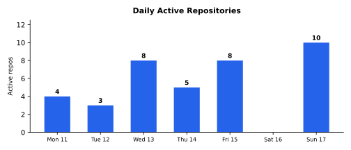

# Weekly Progress Report — 2026-05-11…17

> **Series restamp (2026-07-25):** Headline line stats now exclude `**/vendor/**` and `**/node_modules/**` (same rule as `gather.sh`). Figures below use remeasured excl-vendor totals from current default-branch history. Commits and effort estimates are unchanged. Excl-vendor landed lines: **+39,740/−15,973** (net **+23,767**).

## Executive Summary

Eighteen repositories saw activity across game engineering, health systems, library infrastructure, and tooling. **ge** adds a full IAP module across 🎯T65.1–🎯T65.7: `<ge/iap.h>` cross-platform surface, StoreKit 1 backend (`iap_apple.mm`), Play Billing 7+ backend (`iap_android.cpp` via `ge.IapBridge` JNI), debug-panel data layer, studio testing protocol doc, plus a tiltbuggy real-world consumer (catalogue + restore + visible chassis-colour and surface gates behind `owned("pro")`, BUY PRO button). **bullseye v0.28.0** removes the `kind` enum entirely — schema v5 retires verify-vs-work distinction, `verifies`/`rework` edges, `retry_budget`, `is_checkpoint`, tunnel detection, the `bullseye_tunnels` and `bullseye_rework` tools, with frontier ordering switched to `max unblocking fanout`; `bullseye_revert(id, reason)` handles failed retirements (524 added, 2583 removed across 18 files). **pigeon** lands 🎯T39 session machine end-to-end through the modern API (legacy `pigeon.Conn` deleted), then 🎯T32.2–T32.4 build the C SDK Listener (register/accept) and Connect entry points, then 🎯T40 migrates one-shot wire formats (stream_header, datagram_plaintext, relay_greeting) into protogen so every language target emits encoder/decoder helpers natively; libsodium vendored as submodule across Go/Swift/Kotlin/C consumers. **csp v0.14.0** ships 🎯T19/T20 buffered-channel move-before-commit fix plus 🎯T26/T27 main-loop busy-spin diagnosis (paper 22); a follow-on Phase A of 🎯T23 splits the dist amalgamation into per-protocol drop-in `.cpp` files (tls/http/http2/ws/quic/http3) backed by five DCE rules so the linker drops unreferenced TUs; paper 23 audits 🎯T3.4 ARM64 stack analysis and files five sub-targets; 🎯T3.4.1/T3.4.2 wire the stack analyser into spawn-time allocation and resolve PC-relative dispatch + vtables. **multimaze2** lands the door-physics + audio + bond-setup faithful port (static-when-at-rest `b2_staticBody` doors that flip to `b2_dynamic` only during transit, 9/47-cell pre-spread for bonded pairs, 12-WAV audio pool, atlas-based door-travel sprites), a wired-via-ge-v0.27.0 app icon from the original MultiMaze design SVG, a TopBar restart button unifying with the R keybind, render-test coverage expanded to 13 cases across all packs and artefact types, and 🎯T17 ball-strike volume calibration. **rustuml** rewrites every renderer through a new segment-based creole API so PlantUML's no-`<tspan>` output shape is reproduced exactly — bold sans-serif metrics for sizes 10–13 extracted from JVM (+172 strict passes; recovers the sequence regression), monospace metrics collapsed to four constants from a 95-entry table, six renderers (sequence/state/class/component/activity) routed through the new path. **mnemo** releases v0.34.0 and v0.35.0 with 🎯T52 path-exclusion registry that prevents ingest walkers from recursing into their own vault output (canonicalised subtree-skip list, hooked into docs/synthesis/workspace walkers), 🎯T46 freshness emission from `group_by=block`, and a `TestUsage*` time-rot fix on master/Windows. **den** returns with substantial planning: 14 verify-harness checkpoints filed (🎯T59–🎯T72), 🎯T23 acceptance fleshed out into multi-provider package management, 🎯T23.1 `PackageProvider` abstract interface drafted and retired, plus a T23 decomposition into six sub-targets. **sawmill** adds `find_by_concept` (🎯T35/T36) — AST-anchored concept search with extensible dictionary, ranked symbol search across name/path/body evidence, four MCP tools (`find_by_concept` / `teach_concept` / `list_concepts` / `delete_concept`), and a verify checkpoint asserting recall=1.0 plus precision@5 ≥ 0.8 across three audit-corpus queries. **sqldeep** vendors the deepparser submodule and lands full sqldeep grammar coverage on the `sqldeep-grammar` branch — 217 inputs parse cleanly, unblocking the 🎯T9 replacement of the hand-written parser. **jevons** continues the cleanup sweep with claudia v0.11 API migration, SQLite + Lua deletion (JSONL canonical), Grok zombie-session fix on disconnect, PTT keep-alive with manual commit + 30 s idle timeout, and an auto-growing chat textarea (🎯T21). **mcpbridge v0.8.0** narrows scope to session-continuity proxy — retires brew/github source backends and the polling scheduler (🎯T11), structured `data.backend.{name,url}` field on the -32001 envelope (🎯T10). **vellum v0.4.0** ships WeasyPrint as the default backend (Prince becomes opt-in), expands `convert.Style` into a 13-field customisation surface, adds a `config/` package reading `~/.config/vellum/config.yaml`. **claudia** opens up Grok with `SendSystemNote` + per-call modality selection. **bullseye v0.27.0** ships the showcase removal + submodule guard from last week. Commercial project detail: [private week 2026-05-17](https://github.com/marcelocantos/progress-reports-private/blob/master/reports/weekly-report-2026-05-17.md).

**142 commits** | **~+39,740 / ~−15,973** (excl. vendor) | **~3-5 person-days traditional equivalent** | **~25-50x multiplier**

### Major Achievements & Innovations

- **bullseye v0.28.0 schema v5 removes the `kind` enum entirely** ([marcelocantos/bullseye](https://github.com/marcelocantos/bullseye)) — every node is just a target with acceptance criteria and `depends_on` edges. With it goes `verifies` and `rework` edges, `retry_budget`, `retries`, `is_checkpoint`, `checkpoint_distance`, tunnel detection, the `bullseye_tunnels` and `bullseye_rework` MCP tools, distance-to-checkpoint frontier ordering, and tunnel-warning auto-emission on mutations. Frontier ordering becomes `max unblocking fanout`. Failed retirement gets `bullseye_revert(id, reason)`. Net: −2,059 lines across 18 files. Second major schema simplification in as many weeks (showcase was v3→v4; kind is v4→v5).
- **bullseye v0.27.0 showcase removal + submodule/detached-HEAD guard** ([marcelocantos/bullseye](https://github.com/marcelocantos/bullseye)) — released this week (preparing the ground for the v0.28.0 kind removal). The retire-and-release PRs (🎯T23/T24) ship the schema-3-to-4 migration plus the mutation refusal in submodule replicas or detached HEAD.
- **ge::iap cross-platform IAP module across 🎯T65.1–🎯T65.7** ([squz/ge](https://github.com/squz/ge)) — public surface at `<ge/iap.h>` (`setCatalogue` / `owned` / `products` / `buy` / `restore`, cached O(1) ownership), StoreKit 1 backend (Obj-C++ via `iap_apple.mm`, SKProductsRequest + SKPaymentQueue + GEStoreKitBroker, no Swift toolchain), Play Billing 7+ backend (JNI to `ge.IapBridge` Kotlin, BillingClient + PurchasesUpdatedListener, auto-acknowledge to prevent 3-day refund), pure-data `DebugPanel` overlay state, `docs/iap-testing.md` studio testing protocol, plus tiltbuggy as real-world consumer (BUY PRO button, chromed-cyan chassis + dirt/ice surfaces gated behind `owned("pro")`, sandbox-signed device demo loop). 14 doctest cases lock the surface. Default `GE_IAP_MODE=platform` on mobile, `stub` on macOS desktop.
- **mcpbridge v0.8.0 narrows to session-continuity proxy** ([marcelocantos/mcpbridge](https://github.com/marcelocantos/mcpbridge)) — retires the daemon's source backends (brew/github) and the polling scheduler (🎯T11), so upgrade detection now relies entirely on fsnotify firing on binary changes. The −32001 "upstream unreachable" envelope grows a structured `data.backend.{name,url}` field (🎯T10) so an agent knows which backend failed. Wrapper-only change; wire protocol unchanged. Docs refresh covers reload reasons and the new envelope shape.
- **vellum v0.4.0 WeasyPrint default + style customisation** ([marcelocantos/vellum](https://github.com/marcelocantos/vellum)) — new `convert.Backend` interface with two implementations (WeasyPrint BSD-3 as default, Prince opt-in via `backend: prince`), `convert.Style` expanded to 13 customisation fields (font_size / line_height / font_family / code_font_family / page_size / page_margin / page_first_top_margin / page_numbers / running_head / bookmarks / hyphenate / lang BCP-47 / pdfa), `config/` package reading `~/.config/vellum/config.yaml`, CLI gains `--backend` flag, MCP tools (`convert` / `convert_to_clipboard`) gain optional `style` and `backend` fields, relative-path image resolution via `--baseurl` / `--base-url`. Per-call > config > built-in default precedence. Homebrew formula updated to `depends_on "weasyprint"` so the open-source path works out of the box.
- **mnemo v0.34.0 + v0.35.0 path-exclusion registry + freshness from block path** ([marcelocantos/mnemo](https://github.com/marcelocantos/mnemo)) — 🎯T52 ships an in-memory registry of canonicalised path subtrees that ingest walkers must skip (`filepath.Abs` + `filepath.EvalSymlinks` canonicalisation with `Clean` fallback, is-under matching via `filepath.Rel`, lazy re-canonicalisation at check time, 11 tests including symlink resolution both ways), with `vault_path` registering itself at user init so mnemo's own generated output is never re-ingested. 🎯T46 fixes `usageByBlock` to surface `result.Freshness` so a broker calling `group_by="block"` can bound indexer lag — defeats a latent realtime-spend-signal contract bug. Plus a master/Windows CI green fix for `TestUsage*` time rot.
- **csp v0.14.0 buffered-channel move-before-commit + paper 22** ([marcelocantos/csp](https://github.com/marcelocantos/csp)) — the 🎯T19/T20 fix (non-owning `chan_op<T>::Mode::WriteRef` holding pointer to slot until winning arm completes) ships, plus paper 22 separating runtime main-loop busy-spin (🎯T27, clean fix recipe) from web_crawler-level HTTP-server-close deadlock (🎯T26). CI-fixes for missing `<csignal>` and `gtimeout`/`timeout` portability. Examples (`task_scheduler`, `web_crawler`) excluded from CI run with 60 s timeout wrappers.

### Significant Progress

- **HMS2 V1-fidelity patient view fan-out 🎯T6–T19** — detail in [private week 2026-05-17](https://github.com/marcelocantos/progress-reports-private/blob/master/reports/weekly-report-2026-05-17.md)
- **pigeon T39 + T32 + T40 — session machine, C SDK, protogen-driven wire formats** ([marcelocantos/pigeon](https://github.com/marcelocantos/pigeon)) — 🎯T39 drives session activation through the generated `SessionMachine` end-to-end and deletes the legacy `pigeon.Conn`. 🎯T32.1 implements the auth_request/auth_ok wire handshake in C mirroring Go's `activation.go` byte-for-byte (tag-0x01 auth_request with uvarint-prefixed device-id; tag-0x02 auth_ok with 0x01-accepted/0x00-rejected + uvarint reason); a tri-valued backend return distinguishes wire-decode failure from device-rejected. Three new Go tests lock byte-format parity against the Go reference. The protogen C generator's latent namespace collision (per-protocol enums sharing `PIGEON_<KIND>_<NAME>` prefix) is fixed by mechanical rename to `PIGEON_<PROTOCOL>_<KIND>_<NAME>` so `pairingceremony_gen.h` and `session_gen.h` coexist. 🎯T32.2 + T32.3 build the C SDK Listener and Connect entry points; 🎯T32.4 + T40 land live round-trips with protogen-driven wire formats (stream_header backend-prepended-clientTag vs client varint-prefixed, datagram_plaintext varint-channel-id + payload, relay_greeting colon-delimited register-mux union); the wire-format generator emits Go / C / Swift / Kotlin / TypeScript helpers from `wireformats.yaml`, deletes the hand-rolled `encodeStreamHeader` / `decode{Backend,Client}StreamHeader` / their C and Swift wrappers and the four-way relay-greeting `sprintf` branches; cross-language byte vectors verified identical. libsodium vendored as git submodule (1.0.22-RELEASE pinned, `MACOSX_DEPLOYMENT_TARGET=13.0` for Package.swift compatibility), dropping Homebrew dependency across Makefile / Package.swift / cwire / csdke2e / Android Gradle / CMakeLists / JNI build.
- **csp 🎯T23 Phase A per-protocol dist drop-in + 🎯T3.4 stack analysis** ([marcelocantos/csp](https://github.com/marcelocantos/csp)) — Phase A of 🎯T23 splits the dist amalgamation into per-protocol `.cpp` files: `dist/csp_tls.cpp` (PicoTLS, needs `CSP_TLS=1`), `dist/csp_http.cpp` (llhttp), `dist/csp_http2.cpp` (nghttp2), `dist/csp_ws.cpp` (wslay), `dist/csp_quic.cpp` (ngtcp2 + PicoTLS), `dist/csp_http3.cpp` (nghttp3 over QUIC). Linker DCE (`-ffunction-sections` + `--gc-sections` / `-dead_strip`) drops unreferenced TUs; `dist/csp.cpp` core emits zero references to any `csp::<proto>::` symbol (verified by grep). `scripts/amalgamate.py` drives all of this from a `protocol_specs` table — adding a new protocol is a one-line addition. Permanently retires the 🎯T22 monolithic-amalgamation approach. Captures the five DCE rules in `docs/design/per-protocol-dist.md` (no protocol enums in the front door, no protocol-specific methods on shared types, no static registration, no central virtual base, front-door TU references no protocol symbols). Separately, paper 23 audits the ARM64 stack analyser against 🎯T3.4 acceptance, identifies 8 hypotheses about precision loss, and decomposes into 🎯T3.4.1–T3.4.5; 🎯T3.4.1 wires the stack analyser into spawn-time allocation (it had no production caller); 🎯T3.4.2 resolves PC-relative dispatch + vtables.
- **rustuml segment-based creole + JVM-extracted font metrics** ([marcelocantos/rustuml](https://github.com/marcelocantos/rustuml)) — every renderer rewires through a new `creole::parse_segments` API that emits a sequence of uniformly-styled segments (bold, italic, monospace, color, font, size, sub/sup, links) plus a shared `text_render::emit_text` writer that produces PlantUML-shaped output: one `<text>` per segment at cumulative x offsets, styles lifted to attributes (not `<tspan>` wraps — PlantUML's golden corpus has zero `<tspan>` elements anywhere). 12 unit tests cover the segment patterns, 5 cover the emitter including a "no tspans anywhere" invariant. Six renderers (sequence/state/class/component/activity, plus a 51-pass activity baseline-geometry fix) route through. Bold sans-serif metrics for sizes 10–13 extracted from the JVM via `tools/SansBoldMetricsExtract.java` recover +172 strict passes (the sequence regression from earlier in the week). Monospace metrics collapse a 95-entry-per-(size,bold) table to four constants (width = size × 0.60205078125, ascent = size × 0.92822265625, descent = size × 0.23583984375, height = size × 1.1640625) — Monospaced on macOS is truly monospaced AND BOLD-equals-PLAIN in width. Deployment renderer rewritten to two-pass emission with storage/database/queue support, plus 12 strict-XML passes for arrow labels + dotted style, 41 for shapes-vs-connectors in activity, 66 for activity deprecation-warning band, 8 for hidden arrows + min SVG width. Workspace version bumped to 0.7.0 (release pending).
- **multimaze2 door physics + audio + bond setup faithful port** — detail in [private week 2026-05-17](https://github.com/marcelocantos/progress-reports-private/blob/master/reports/weekly-report-2026-05-17.md)
- **sawmill `find_by_concept` AST-anchored concept search** ([marcelocantos/sawmill](https://github.com/marcelocantos/sawmill)) — implements 🎯T35 v1: a concept-level code search that expands a free-text query through stored + built-in concept dictionaries (e.g. `swipe` → `swipe` / `gesture` / `fling` / `pan` / `UISwipeGestureRecognizer` / …) and ranks symbols by alias hits across name, path, and body evidence. Per-symbol evidence column (lowercased, space-padded token bag from identifier + path + body text) migrated into the symbols table and populated during indexing. Four MCP tools (`find_by_concept` / `teach_concept` / `list_concepts` / `delete_concept`); built-in seeds cover gestures, retry, auth, and logging; project-taught entries shadow built-ins of the same name. 22 new Go tests across `evidence_test.go` / `concept_test.go` / `concept_search.go` paths. 🎯T36 verify-checkpoint runs a hermetic in-memory corpus across three audit-corpus queries (swipe/gesture, BackBoard-style app-state plumbing, retry/backoff) with hand-curated ground-truth sets: recall = 1.0 across all three scenarios, precision@5 = 1.00 / 1.00 / 0.80, no documented distractors in top-5.
- **sqldeep deepparser submodule + full sqldeep grammar coverage** ([marcelocantos/sqldeep](https://github.com/marcelocantos/sqldeep)) — vendors `github.com/marcelocantos/deepparser` (fork of `sqliteai/liteparser`, a real SQL parser with a Lemon LALR(1) grammar and visitable AST) as `vendor/deepparser/`, building it into `build/libdeepparser.a` and linking it into the test binary so compile errors surface in `mk test`. The driving motivation: the hand-written parser does partial parsing of surrounding SQL while scanning for sqldeep triggers, producing latent bugs on plain-SQL forms it doesn't understand (most recently, plain CTEs trigger `unmatched ')'` per 🎯T5). The durable fix is a real SQL parser. Submodule tracks `sqldeep-grammar` branch with the long-running grammar extensions (avoids `--remote` falling back to upstream-aligned `main`). Three submodule bumps land trailing commas, qualified bare fields (`{ sm.repo }`), array-first JSON paths (`(data)[0]`), FROM-first restructured (clauses before SELECT), bare-SELECT as field value with `FIELD_COMMA` tokenization, backslash-escape in double-quoted identifiers — every input in `testdata/transpile.yaml` + `testdata/sqlite.yaml` now parses via deepparser (217 directly + 33 with `SELECT <expr>` wrapping; 21 are intentional error tests). 🎯T9 unblocked on the grammar front; the wiring of the SQLite backend onto `lp_parse_all` + AST walking is the next step. Licensing attribution corrected: deepparser is MIT throughout, not Apache 2.0.
- **den returns: 14 verify harnesses + 🎯T23 acceptance flesh-out + PackageProvider draft** ([marcelocantos/den](https://github.com/marcelocantos/den)) — after a month of dormancy, den lands a productive planning + scaffolding sprint. 🎯T59 ships a CI workflow that iterates the confirmed-SIMPLE subset (xz, gzip) and runs `den install --build-from-source <formula>` on macOS-14 and ubuntu-latest; the subset is documented in `tests/corpus/simple_install_subset.{txt,md}` with inclusion criteria, expansion instructions, and the depends-on-T58 unblocker for the cron schedule. 14 verify harnesses land for 🎯T59–🎯T72. 🎯T23 acceptance is fleshed out from `[TODO]` into multi-provider package management: `PackageProvider` abstract interface, Homebrew refactor through it, provider-resolution dispatch, manifest schema accommodation, environment-composition uniformity, seam test via a stubbed non-Homebrew provider. T23 is decomposed into six sub-targets (T23.1–T23.6) and 🎯T23.1 (`PackageProvider` interface — install/uninstall/list_installed/is_installed/binary_paths/provider_name/accepts) is drafted, with documented contracts for error semantics (throw `den::Error` subclasses), threading expectations (serial, not reentrant), and the provider/CLI responsibility boundary. `docs/targets.yaml` moves to `bullseye.yaml`. Plus a bullseye Makefile target for `/cv` standing invariants and a clang-format pass across `src/` and `tests/`.
- **jevons cleanup sweep continues** ([marcelocantos/jevons](https://github.com/marcelocantos/jevons)) — claudia v0.11 API bump (`OnEvent → SubscribeEvents`, `RunTask → Run`, `TaskStatus → Status`, `TaskName → Name`, `StopTask → Stop`, `TaskID → ID`, `TaskWorkDir → WorkDir`, `Registry.Start → Registry.Launch`); `AgentDef.DisallowTools` migrated from comma-string to `[]string`; `AgentDef.Parent` removed; tmux server moved to `~/.local/state/claudia/tmux.sock`. Browser resilience adds auto-reconnect with exponential backoff (50 ms → 5 s cap), heartbeat ping every 15 s, 25 s no-traffic watchdog, version-probe-driven reload on server-version mismatch, visibility/focus/online listeners forcing immediate reconnect, ping/pong frame handling that doesn't reach Claude, no-cache headers on every static asset, hot-reload reconnect that triggers `location.reload()` on first reconnect after a previous successful open. Voice push-to-talk lands hold-Ctrl with event.repeat guard, blur drop, Ctrl-chord cancellation; Grok session commit on PTT release; ManualCommit + CommitAndRespond + OnResponseDone for server-side; 30 s idle timer; mic capture decoupled from WS lifetime; local VAD dropped (user is the VAD). SQLite layer + legacy `jevons` Go package deleted (transcript/raw_log/kv tables had no real consumers — mnemo indexes the JSONL session files at `~/.claude/projects/*` directly; `jevons_claude_id` migrated to `claudia.Registry`'s `AgentDef.SessionID`; Lua scratchpad use removed in earlier commit). `mattn/go-sqlite3` dependency removed. Zombie Grok-session fix on client disconnect (bridge-owned context so commit-on-release doesn't race the request cancellation). Chat input swap from `<input>` to `<textarea>` with Enter submits / Shift-Enter newline (🎯T21 partial — Wispr Flow auto-punctuation half is unresolved, classifier appears to be app/URL whitelist-based). 🎯T18 phase 1a+1b adds Grok-as-overseer with async multi-agent delegation.

### Tough Challenges Overcome

- **Static-when-at-rest door bodies via b2Body_SetType, not Disable/Enable** — detail in [private week 2026-05-17](https://github.com/marcelocantos/progress-reports-private/blob/master/reports/weekly-report-2026-05-17.md)
- **Inline episode-detail tree under patient-detail kills the MDI tab** — detail in [private week 2026-05-17](https://github.com/marcelocantos/progress-reports-private/blob/master/reports/weekly-report-2026-05-17.md)
- **PlantUML's no-tspan output shape and the bold-sans-serif metric defect** (rustuml) — PlantUML emits styled text as separate `<text>` elements at calculated x offsets, one per uniform style run, with styles lifted to attributes on the text element — not `<tspan>` wraps. The previous `creole::to_svg_tspans` path always wrapped, which was why no renderer called it. The parallel segment-based path produces PlantUML-shaped output, but exposed a latent defect: `CHAR_WIDTHS_{10,11,12,13}_BOLD` were missing from the bold dispatch in `char_width_table`, so sequence diagrams (which emit bold at sizes 11 and 13 for autonumbers, group kind labels, guard labels, divider text) had been matching by accident because the literal `**...**` markers were emitted verbatim. Routing through `emit_text` stripped the markers and exposed the gap; extracting the bold tables via the JVM (same Graphics2D + FRACTIONALMETRICS_ON config as the mono extractor) recovered +172 strict passes.
- **Wire-format generator namespace collision across three protogen-emitted headers** (pigeon) — protogen's C generator had a latent namespace collision: per-protocol enums (msg, guard, action, event, command) all used a shared `PIGEON_<KIND>_<NAME>` prefix, so `pairingceremony_gen.h` and `session_gen.h` couldn't coexist in a single translation unit. 🎯T32.1 was the first consumer that needed both. Mechanical fix: prefix every enumerator with the protocol name → `PIGEON_<PROTOCOL>_<KIND>_<NAME>` (e.g. `PIGEON_SESSION_MSG_AUTH_REQUEST`). All three protogen-emitted headers regenerated; `c/src/pairing.c` and `c/test/test_pigeon.c` updated; `dist/pigeon.h` amalgamation appends both `session_gen` + activation header content under a separate `PIGEON_H_AMALGAMATED_EXTRAS` guard so re-inclusion stays idempotent.
- **Wire-format codegen across five languages from a single YAML** (pigeon T40) — `cmd/protogen --wireformats` consumes `protocol/wireformats.yaml` and emits encoder/decoder helpers in every language target (`wire_gen.go` root pkg, `c/{include,src}/wire_gen.{h,c}`, `Sources/Pigeon/WireGen.swift`, `android/pigeon/.../crypto/WireGen.kt`, `web/src/wireGen.ts`). Each language uses its own native primitives; Swift / Kotlin sides no longer hop through CPigeon / JNI for these helpers; TypeScript drops hand-rolled varint and stream-header copies. Three wire formats land (`stream_header` with backend/client variants, `datagram_plaintext`, `relay_greeting` as colon-delimited tagged union). The hand-rolled equivalents deleted: Go's `encodeStreamHeader` + `decode{Backend,Client}StreamHeader`, C's `pigeon_encode_stream_header` + `pigeon_decode_{backend,client}_stream_header`, Swift's `Wire.swift` wrapper, and four parallel relay-greeting `sprintf` branches across `transport.go` / `webtransport.go` / `quicserver.go` / `c/src/ngtcp2_transport.c`. Cross-language byte vectors verified identical on every fixture.
- **csp per-protocol DCE invariants** (csp 🎯T23) — making per-protocol drop-in `.cpp` files work under linker DCE requires five DCE rules that must all hold simultaneously: no protocol enums in the front door, no protocol-specific methods on shared types, no static registration, no central virtual base, and the front-door TU references no protocol symbols. Violating any one breaks the DCE. The discipline replaces the failed 🎯T22 monolithic-amalgamation approach permanently and is documented in `docs/design/per-protocol-dist.md` for future protocol additions.
- **DFM-tree extractor for V1-fidelity briefs** — detail in [private week 2026-05-17](https://github.com/marcelocantos/progress-reports-private/blob/master/reports/weekly-report-2026-05-17.md)
### Contributors

- Marcelo Cantos

---

## Game Projects

### [squz/ge](https://github.com/squz/ge) — IAP Module (18 commits)

Continued buildout of the engine after last week's eighteen-release canonical-2D/UI sprint. This week's headline addition is the cross-platform IAP module.

- **The biggest effort of the week.** **ge::iap floor + StoreKit + Play Billing**: 🎯T65.1 ships `<ge/iap.h>` with `setCatalogue`, cached-O(1) `owned`, `products`, `buy` (callback-style), `restore`, plus a `StubStore` for desktop. Threat model documented inline — modern frameworks return JWS-verified transactions, so server-side receipt validation is intentionally out of scope for v1. 9 doctest cases. 🎯T65.2 implements StoreKit 1 via `iap_apple.mm` (Obj-C compatible, no Swift toolchain dependency): `SKProductsRequest` fetches localised metadata, `SKPaymentQueue` + a `GEStoreKitBroker` observer drive buy/restore lifecycles with verified-transaction semantics. The `detail::Store` interface is lifted to `iap_internal.h`; `makePlatformStore()` is platform-defined (nullptr stub on macOS desktop). Default `GE_IAP_MODE` becomes `platform` on iOS/iPadOS/tvOS/watchOS/Android, `stub` on macOS desktop. 🎯T65.3 implements Play Billing 7+ via JNI to `ge.IapBridge` (Java): `BillingClient` + `PurchasesUpdatedListener` with `queryProductDetailsAsync`, `launchBillingFlow`, and `queryPurchasesAsync` driving the three lifecycles. One-time-products auto-acknowledge to prevent the 3-day refund. `PENDING` purchases surface as not-owned until confirmed. Android-fix follow-up self-bootstraps the JVM via `SDL_GetAndroidJNIEnv`.
- **DebugPanel + studio testing protocol**: 🎯T65 pure-data overlay state for toggling entitlements in dev builds (rows reflect live ownership; `onRowTap` flips via `testing::setOwned`; `onResetAll` wipes cache; `onForceRestore` exercises restore). `docs/iap-testing.md` covers the studio-wide sandbox + license-tester protocol: naming conventions, on-device setup, onboarding order, troubleshooting, credentials in shared password manager. 5 new doctest cases (142 total).
- **tiltbuggy real-world consumer**: 🎯T65.7 code prep registers `com.squz.tiltbuggy.pro` non-consumable + `powerboost10` consumable, runs `setCatalogue` + `restore` at startup, per-second tick log includes `pro=true/false`. Visible-gate follow-up turns the chassis chromed cyan when `ge::iap::owned("pro")`; surfaces gated behind pro reveal brown-dirt patch + blue icy pond when owned (visual only — Box2D physics shapes stay registered regardless); a yellow BUY PRO button (~85×27 pt scaled by `pixelsPerPt`, above Apple HIG's 44 pt minimum) appears top-left of the UI safe rect when not owned. `State::proPurchaseInFlight` debounces taps while the Apple sandbox modal is up. iOS-template patch (🎯T35) adds `iap.cpp` + `iap_apple.mm` + freetype/CoreText/StoreKit frameworks, plus `png.cpp` / `text.cpp` / `button.cpp` / `sdl_input.cpp` / `Attitude_apple.mm` to the hand-rolled iOS template's `GE_SOURCES` and bundled SDL_ttf/external/freetype headers — verified tiltbuggy builds clean for `iphoneos arm64` and deploys to Jevons (the development iPhone).
- **DirectRenderHost iOS gesture-zone clearance**: enforced in `uiSafeRect` so UI elements don't conflict with the home-indicator swipe region.
- **ge::input::fromSdl + sdlPointerEventConverter**: 🎯T59 SDL → `ge::PointerEvent` helpers; CMakeLists adds `button.cpp` + `sdl_input.cpp` to `GE_CORE_SOURCES`.

### [squz/multimaze2](https://github.com/squz/multimaze2) — Door Physics Faithful Port (13 commits)

*Detailed narrative for this commercial work is in the private sibling: [progress-reports-private — week ending 2026-05-17](https://github.com/marcelocantos/progress-reports-private/blob/master/reports/weekly-report-2026-05-17.md).*
## Health Management Systems

*Commercial detail for this section is in the private sibling: [week ending 2026-05-17](https://github.com/marcelocantos/progress-reports-private/blob/master/reports/weekly-report-2026-05-17.md).*

## Libraries & Infrastructure

### [marcelocantos/bullseye](https://github.com/marcelocantos/bullseye) — Schema v5 Kind Removal (4 commits)

Continuing last week's showcase removal: this week's release pair lands the second major schema simplification — the `kind` enum is gone entirely. The retire-and-release PRs for v0.27.0 (showcase removal + submodule guard) ship first, then v0.28.0 lands 🎯T25 schema v5.

- **The biggest effort of the week.** **v0.28.0 schema v5 — uniform target nodes**: as described in Major Achievements — the `kind` enum on `Target` is gone, with it the entire apparatus that grew up around `kind: verify` (`verifies` + `rework` edges, `retry_budget`, `retries`, `is_checkpoint`, `checkpoint_distance`, tunnel detection, `bullseye_tunnels` + `bullseye_rework` MCP tools, distance-to-checkpoint frontier ordering, tunnel-warning auto-emission on mutations). Frontier ordering is now `max unblocking fanout, then ID` — the frontier is the parallelisable set; agents fan out, not pick. Failed retirement is handled by `bullseye_revert(id, reason)`. Pre-v5 yaml loads unchanged (kind/verifies/rework/retry_budget/retries keys silently dropped on parse and stripped on next save). The conceptual shift: bullseye-the-tool should be a minimal substrate (like Make), with the leverage in bullseye-the-practice — graph-shaping discipline carried by the agent. Verify-kind targets had the same structural problem the retired showcase flag had: they encoded shape (validation moment) into node types when shape is a property of subgraphs, not nodes.
- **v0.27.0 release** (showcase removal + submodule guard from last week's PR, plus tag + STABILITY.md update for 🎯T24 submodule/detached-HEAD refusal).
- **Audit-log v0.27.0 entry**: records the /release invocation.

### [marcelocantos/pigeon](https://github.com/marcelocantos/pigeon) — Session Machine + C SDK + Wire Codegen (5 commits + 2 stash entries)

Three substantial PRs converge on a cross-language session-machine end-to-end with protogen-driven wire formats and a vendored libsodium.

- **The biggest effort of the week.** **🎯T39 + 🎯T32 + 🎯T40** as described in Significant Progress: session machine end-to-end (legacy `pigeon.Conn` deleted), C SDK Listener + Connect entry points with byte-for-byte auth-handshake parity (`auth_request` tag-0x01 + `auth_ok` tag-0x02 across the in-test loopback transport), protogen-driven wire formats across Go/C/Swift/Kotlin/TypeScript from `wireformats.yaml`, namespace-collision fix prefixing every generated enumerator with the protocol name, `PIGEON_H_AMALGAMATED_EXTRAS` guard in `dist/pigeon.h` for the merged session+activation header.
- **libsodium vendored as submodule**: `c/vendor/github.com/jedisct1/libsodium` pinned to `1.0.22-RELEASE`; `c/vendor/build.sh` builds `libsodium.a` + headers; every consumer (Makefile `test-c-only` / `test-c-asan` / `test-c-ngtcp2`, Package.swift `CPigeon`, `cwire/cwire.go`, `c/test/csdke2e`, `android/pigeon` `compileNativeLibrary`, `c/CMakeLists.txt`, `c/jni/pigeon_jni.c`) links the vendored static lib instead of pkg-config'ing Homebrew. `MACOSX_DEPLOYMENT_TARGET=13.0` on Darwin keeps Package.swift macOS-13 link-compatible.

### [marcelocantos/csp](https://github.com/marcelocantos/csp) — v0.14.0 + Per-Protocol Dist + Stack Analyser (16 commits)

v0.14.0 ships 🎯T19/T20 move-before-commit + paper 22 main-loop diagnosis. Phase A of 🎯T23 follows up with per-protocol dist drop-ins. Paper 23 + 🎯T3.4.1/T3.4.2 open up ARM64 stack-analysis work.

- **The biggest effort of the week.** **🎯T23 Phase A per-protocol dist drop-in**: as described in Significant Progress — six per-protocol `.cpp` files alongside `dist/csp.cpp` + `dist/csp_globals.cpp` core, linker DCE keeping the link minimal, `scripts/amalgamate.py` driven from a `protocol_specs` table, five DCE rules captured in `docs/design/per-protocol-dist.md`, 🎯T22 monolithic approach permanently retired. The C99 picotls adapter (`ngtcp2_crypto_picotls_minicrypto.c`) is copied verbatim since it's a separate-language TU.
- **🎯T3.4 stack analysis decomposition**: paper 23 audits the ARM64 instruction walker against acceptance criteria, identifies 8 hypotheses about precision loss, proposes 5 sub-targets (T3.4.1–T3.4.5). The unblocker: the analyser had no production caller. 🎯T3.4.1 wires it into spawn-time allocation. 🎯T3.4.2 resolves PC-relative dispatch + vtables.
- **v0.14.0 release**: 🎯T19/T20 buffered-channel move-before-commit fix (non-owning `chan_op<T>::Mode::WriteRef`) + paper 22 main-loop-busy-spin diagnosis (🎯T26, 🎯T27).
- **Paper 22**: separates two bugs found while investigating `web_crawler`'s flaky hang — runtime busy-spin in `Runtime::main_loop` when a CSP program reaches quiescent-but-not-done without a registered hook (🎯T27, clean fix recipe in paper §"Fix candidates") from the web_crawler-level deadlock where the HTTP server fails to close cleanly under certain conditions, leaving a worker imp suspended in `conn.input >> chunk` forever (🎯T26).
- **CI fixes**: missing `<csignal>` + non-portable timeout (use `gtimeout` when available); `task_scheduler` + `web_crawler` excluded from `run-examples-ci` with 60 s timeout wrappers; watchdog-rescue stall extended to 2 s for GHA macOS arm64 jitter.

### [marcelocantos/mnemo](https://github.com/marcelocantos/mnemo) — v0.34.0 + v0.35.0 + Path Exclusion (8 commits)

Releases v0.34.0 and v0.35.0 land 🎯T52 path-exclusion registry + 🎯T46 freshness from block path + a master/Windows CI green fix.

- **The biggest effort of the week.** **🎯T52 path-exclusion registry**: as described in Major Achievements — `internal/store/exclusions.go` with `filepath.Abs` + `filepath.EvalSymlinks` canonicalisation, lazy re-canonicalisation at check time, is-under matching via `filepath.Rel`, hooked into `internal/store/{docs,synthesis,workspace}.go` walkers; `vault_path` registered at user init in `internal/registry/registry.go` before any walker invocation; 11 tests including symlink resolution both ways, idempotent registration, sibling-not-matched, discoverRepos integration. Approach swaps the original fence-protocol sketch for path exclusion: simpler, robust against forgotten fences, non-markdown-friendly, single prefix-match per walk entry.
- **🎯T46 freshness from block path**: `usageByBlock` writes block rows but never sets `result.Freshness`, defeating the realtime-spend-signal contract for `group_by="block"`. Track latest message timestamp during per-message scan, surface as RFC3339Nano.
- **`TestUsage*` time rot + Windows vault-path fix**: green CI on master where misnamed `now()` helpers hardcoded an anchor that fell outside the rolling-30-day window once the calendar advanced.
- **🎯T61 Phase 1 backup primitive + pre-migration snapshot**: foundation for forward-migration safety on tag-bumped indexes.

### [marcelocantos/sawmill](https://github.com/marcelocantos/sawmill) — find_by_concept (4 commits)

Adds 🎯T35 + 🎯T36: concept search through stored + built-in dictionaries with an AST-anchored ranking model.

- **find_by_concept v1**: as described in Significant Progress — `evidence.go` token-bag extraction (lowercased + space-padded from identifier + path + body text), migrated into the symbols table and populated during indexing; concept search ranks symbols by alias hits across name/path/body. Four MCP tools (`find_by_concept` / `teach_concept` / `list_concepts` / `delete_concept`); built-in seeds (gestures, retry, auth, logging); project-taught entries shadow built-ins of the same name. 22 new Go tests across `evidence_test.go` / `concept_test.go` / `concept_search.go`.
- **🎯T36 verify against audit-corpus queries**: hermetic in-memory corpus exercising three queries (swipe/gesture, BackBoard-style app-state plumbing, retry/backoff) with hand-curated ground-truth sets; recall = 1.00 across all three, precision@5 = 1.00 / 1.00 / 0.80, no documented distractors in top-5. Methodology in `docs/find-by-concept-verification.md`.

### [marcelocantos/rustuml](https://github.com/marcelocantos/rustuml) — Segment-Based Creole + JVM Metrics (15 commits on master)

Workspace version bump to 0.7.0 (release pending). The week is dominated by a creole API redesign that produces PlantUML-shaped SVG output without `<tspan>` wraps, plus JVM-extracted font metrics that close the remaining bold-sans-serif gap.

- **The biggest effort of the week.** **Segment-based creole API + emit_text writer**: as described in Significant Progress — `creole::parse_segments(text) → Vec<Segment>` walks the same markup grammar but emits uniformly-styled segments; `creole::stripped_text(text) → String` is the unstyled measurement target; `text_render::emit_text(buf, content, base) → total_width` is the shared writer, one `<text>` per segment with cumulative x offsets and sans-serif width metrics. 12 unit tests for segment patterns, 5 for emit_text including a "no tspans anywhere" invariant. Six renderers (sequence/state/class/component/activity) routed through the new path.
- **JVM-extracted bold sans-serif metrics for sizes 10–13**: as described in Tough Challenges — recovers the +172 strict pass regression. Sans-bold tables via `tools/SansBoldMetricsExtract.java` with the same Graphics2D / FRACTIONALMETRICS_ON config as the mono extractor.
- **Monospace metrics collapsed to four constants**: as described in Major Achievements — Monospaced on macOS is truly monospaced AND BOLD-equals-PLAIN in width; the 95-entry table per (size,bold) collapses to width/ascent/descent/height as size-proportional ratios. Regression-tested against `mono activity` and `bold mono` goldens.
- **Deployment renderer two-pass emission**: rewrite produces a PlantUML DESCRIPTION envelope; adds storage / database / queue shapes; HALF_EVEN rounding for coordinate formatting; full-precision text_height for database/queue cylinders; entity/link IDs in source-line order.
- **State renderer hardening**: PlantUML-exact metrics + 4-decimal precision + oracle-driven ID allocation; Final/Initial stereotypes + skip fork/join from IDs; pre-declared-state + back-edge counter quirks; choice polygon + desc-box height + start-share quirk; entity/link IDs matching PlantUML's counter scheme.
- **Activity renderer**: parse arrow style brackets (+2 strict-XML passes); split shapes from connectors (+41 passes); lift deprecation warning into a separate band (+66 passes); fix baseline geometry (+51 passes); tighten if/else branch label placement; render `end` as crossed-out circle (+1 pass).
- **Class renderer**: route through creole + add guillemet metrics; fix visibility-icon Y offsets and polygon geometry; switch component renderer to PlantUML-exact metrics + oracle layout; route component renderer through creole.
- **Sequence renderer**: thread participant color through actor/boundary/control/entity/database/collections/queue shapes; correct activation-aware arrow-tip placement + destroy X; enforce multi-span widths via total-span (not per-pair); fix guillemet width + rectangle style + suppress UML2 icon.
- **Cross-cutting**: Latin-1 + CJK width fallback + numeric-entity XML escape; tabbed-folder cluster shape + child-aware cluster sizing; hidden arrows + min SVG width handling (+8 passes); ignore `golden_failure_names.txt`; `RUSTUML_DEBUG` env var for deterministic `%date()` in goldens; `GOLDEN_FILTER` env var for filtering goldens; package/cluster wrappers + qualified entity names.

### [marcelocantos/sqldeep](https://github.com/marcelocantos/sqldeep) — Deepparser Submodule + Grammar Coverage (8 commits)

Stage 1 of the AST-transformer rewrite: vendor deepparser, extend its grammar, prepare for the SQLite-backend cutover.

- **The biggest effort of the week.** **Vendor deepparser + grammar coverage**: as described in Significant Progress — vendor `github.com/marcelocantos/deepparser` (Lemon LALR(1) grammar + visitable AST, fork of `sqliteai/liteparser`) as `vendor/deepparser/`. Three submodule bumps converge on full sqldeep grammar coverage on the `sqldeep-grammar` branch: trailing commas, qualified bare fields, array-first JSON paths, FROM-first restructured (clauses before SELECT), bare-SELECT as field value with FIELD_COMMA tokenization, backslash-escape in double-quoted identifiers. 217 inputs parse via deepparser directly + 33 with `SELECT <expr>` wrapping; 21 are intentional error tests. 🎯T9 unblocked on the grammar front.
- **Track sqldeep-grammar branch**: `.gitmodules` gains `branch = sqldeep-grammar` so `git submodule update --remote` follows the long-running grammar branch instead of upstream `main` (which would silently revert every grammar extension).
- **Licensing attribution + CI + makefile fixes**: deepparser is MIT throughout (corrected from Apache 2.0 attribution); CI checks out submodules; `mkfile` uses `ar rcs` for static-lib portability on Linux.

### [marcelocantos/mcpbridge](https://github.com/marcelocantos/mcpbridge) — v0.8.0 Session-Continuity Proxy (3 commits)

- **Narrow scope to session-continuity proxy**: 🎯T10 + 🎯T11. The daemon retires brew/github source backends and the polling scheduler — upgrade detection relies entirely on the binary changing on disk (via brew upgrade, manual install, or any other tool); the fsnotify watcher fires a targeted reload; the wrapper keeps the agent's session alive across the child swap. Existing configs with `source`/`upgrade`/`check_interval` fields still load silently for backwards compatibility. The -32001 envelope grows a structured `data.backend.{name,url}` field for URL backends so an agent knows which backend failed (stdio + -32002 envelope unaffected). Wire protocol unchanged.
- **v0.8.0 docs refresh**: `wire-protocol.md` register section drops upgrade-polling mention; `reload.reason` known values trimmed to `binary_changed` / `manual` (older `brew_upgrade` / `github_release` noted as legacy); reconnect paragraph references fsnotify watcher rather than poll cycle. `agents-guide.md` step 3 reframes the daemon's config use from "upgrade source" to "name-based reload routing".

### [marcelocantos/vellum](https://github.com/marcelocantos/vellum) — v0.4.0 WeasyPrint Default (1 commit)

- **v0.4.0**: as described in Major Achievements — WeasyPrint default + Prince opt-in + 13-field `convert.Style` customisation + `config/` package + `--backend` CLI flag + `style`/`backend` MCP tool options + relative-path image resolution via `--baseurl` / `--base-url`. Homebrew formula `depends_on "weasyprint"`; caveats position WeasyPrint as installed default and Prince as documented opt-in.

### [marcelocantos/claudia](https://github.com/marcelocantos/claudia) — Grok API Expansion (2 commits)

- **SendSystemNote + per-call modality selection**: `SendSystemNote` inserts a system-role conversation item and triggers a response — for out-of-band-event notifications (worker completion, status change, external state) the conversation should react to (distinct from `InjectAssistantText`, which inserts an assistant-role item and asks the model to parrot it verbatim). `SendText` now takes `ResponseModalities` so callers can request text-only (no audio billed) or text+audio. `ModalitiesText` / `ModalitiesTextAudio` helpers cover the common cases.
- **PTT primitives**: `ManualCommit` suppresses the default `server_vad` block; `CommitAndRespond` combines `input_audio_buffer.commit` with explicit `response.create`; `OnResponseDone` surfaces `response.done` events to the caller for idle-timer reset / status updates / end-of-turn UX.

### [marcelocantos/jevons](https://github.com/marcelocantos/jevons) — Cleanup Sweep Continues (8 commits)

Continuation of last week's cleanup theme — claudia v0.11 migration, SQLite + Lua deletion, voice PTT keep-alive, web resilience.

- **The biggest effort of the week.** **Cleanup sweep + state-store collapse**: as described in Significant Progress — claudia v0.11 API migration; SQLite layer + legacy `jevons` Go package deleted (JSONL canonical via mnemo); zombie Grok-session fix; PTT keep-alive with ManualCommit + 30 s idle timer; chat textarea (🎯T21 partial — Wispr Flow auto-punctuation half deferred); 🎯T18 phase 1a+1b Grok-as-overseer with async multi-agent delegation; browser resilience (auto-reconnect with exponential backoff, heartbeat, no-traffic watchdog, version-probe reload, visibility/focus/online listeners, hot-reload auto-reload on jevonsd restart).

### [marcelocantos/den](https://github.com/marcelocantos/den) — Returns: T59–T72 Verify Harnesses + T23 Acceptance (8 commits on master)

After a month of dormancy, den ramps back up with extensive planning, verify harnesses, and the start of the multi-provider package-management work.

- **The biggest effort of the week.** **🎯T59–T72 verify harnesses** + **🎯T23 acceptance + decomposition + T23.1 draft**: as described in Significant Progress. The verify-harness PR ships GitHub Actions workflows iterating the confirmed-SIMPLE subset (xz, gzip) on macOS-14 + ubuntu-latest, with `tests/corpus/simple_install_subset.{txt,md}` documenting inclusion criteria and the T58 dependency for the cron schedule. 🎯T23 acceptance flesh-out names the infrastructure surface (PackageProvider abstract interface, Homebrew refactor, provider-resolution dispatch, manifest schema accommodation, environment-composition uniformity, stubbed-provider seam test) and concrete-provider implementations remain scoped to 🎯T38–T41 with end-to-end verification in 🎯T60. T23 decomposes into T23.1–T23.6; T23.1 PackageProvider draft lands with documented contracts (error semantics throw `den::Error` subclasses, threading expectations serial-not-reentrant, provider/CLI responsibility boundary, `InstallResult` capturing `resolved_version` and `auto_deps`).
- **`docs/targets.yaml` → `bullseye.yaml`**: standardise on the canonical bullseye name.
- **clang-format pass over src/ and tests/** + **CLAUDE.md refresh** reflecting C++/CMake reality; **bullseye Makefile target** for `/cv` standing invariants.

---

## Tooling & Workflow

### [marcelocantos/progress-reports](https://github.com/marcelocantos/progress-reports) — Metrics Table Compaction (6 commits)

This week's iteration on the README's per-week metrics table — fold five columns into one packed cell to reclaim space for the Highlights column, then iterate on glyphs and wrap-suppression to keep cells from line-breaking under GitHub's renderer.

- **Add weekly report 2026-05-04…10**: last week's main artefact.
- **Fold Metrics table columns into one + LoC roll-up**: per-row stats collapsed to `[period link] <icon>NNN +Aadd-Brmkloc / 👤🤖HHh 👤MMmo GG×`; lines-added/removed (raw git log totals, rounded to kloc) are new.
- **Wrap suppression iterations**: `&nbsp;` in Metrics stats cells; U+2060 word joiners after img/emoji; switch to letter-glyph labels (ℂ for commits — double-struck C; ☲ for kloc — trigram with broken middle; bold AI / H for actual-hours / single-generalist months); reorder bold markdown around ☲ in Totals.

### [marcelocantos/skills](https://github.com/marcelocantos/skills) — Sync (1 commit)

- **Update skills from `~/.claude/skills`**: routine sync push, 128/-418 lines.

### [marcelocantos/ytt](https://github.com/marcelocantos/ytt) — KB Index Formatting (1 commit)

- **Split channel + date · duration onto separate lines**: minor formatting tweak in the YouTube-transcript knowledge-base index.

---

## Other Team Work

Theme: budget/income-split reporting and report-agent infrastructure. Notable threads: `EpisodeIncomeSplitAmount` table redefinition + display widgets, Gov-Subsidy income calculation fix in the Service-Plan report, Quarterly-details auto-refresh on income-split-amount and rate edits, SaH Statement icon restoration, message-box flow polish for the Budgets tab, and a series of clean-up commits compressing report-agent code paths. Commercial project detail: [private week 2026-05-17](https://github.com/marcelocantos/progress-reports-private/blob/master/reports/weekly-report-2026-05-17.md).

**marcelocantos/mnemo** — Navnita shipped 5 commits, +6,309/-267, across two PRs. Theme: Obsidian/Logseq vault export. `mnemo_config` MCP tool with hot-reload of `vault_path` (3 commits including adversarial-review polish + a third-pass review fix); opt-in vault export reading `vault_path` from MCP config and emitting under canonical YAML frontmatter on every ingest.

---

## Metrics

*All metrics below reflect Marcelo Cantos's contributions only.*

### Aggregate

| Metric | Value |
|--------|-------|
| Repositories touched | 18 |
| Total commits | 142 |
| Total lines added | +39,740 |
| Total lines removed | −15,973 |
| Net new lines | +23,767 |
| File changes | 623 |
| New files created | ~310 |
| Languages | Go, C++, Svelte, C, Rust, JavaScript, TypeScript, C#, Python, Swift, Kotlin, Objective-C++, Java, Lua, TLA+, Markdown, YAML, SQL, shell |
| Contributors | 1 (Marcelo Cantos) |

### Per-Repository Breakdown

| Repo | Commits | Files changed | Lines added | Lines removed | Net |
|------|---------|---------------|-------------|---------------|-----|
| [Health-Management-Systems/hms](https://github.com/Health-Management-Systems/hms) | 21 | 108 | +5,326 | -1,636 | +3,690 |
| [squz/ge](https://github.com/squz/ge) | 18 | 42 | +2,657 | -120 | +2,537 |
| [marcelocantos/csp](https://github.com/marcelocantos/csp) | 16 | 40 | +6,676 | -888 | +5,788 |
| [marcelocantos/rustuml](https://github.com/marcelocantos/rustuml) | 15 | 35 | +3,116 | -652 | +2,464 |
| [squz/multimaze2](https://github.com/squz/multimaze2) | 13 | 57 | +6,185 | -600 | +5,585 |
| [marcelocantos/mnemo](https://github.com/marcelocantos/mnemo) | 8 | 28 | +1,123 | -223 | +900 |
| [marcelocantos/jevons](https://github.com/marcelocantos/jevons) | 8 | 47 | +979 | -3,331 | -2,352 |
| [marcelocantos/sqldeep](https://github.com/marcelocantos/sqldeep) | 8 | 15 | +97 | -15 | +82 |
| [marcelocantos/den](https://github.com/marcelocantos/den) | 8 | 79 | +11,186 | -203 | +10,983\* |
| [marcelocantos/progress-reports](https://github.com/marcelocantos/progress-reports) | 6 | 12 | +2,937 | -874 | +2,063 |
| [marcelocantos/pigeon](https://github.com/marcelocantos/pigeon) | 5 | 58 | +8,496 | -3,710 | +4,786\*\* |
| [marcelocantos/bullseye](https://github.com/marcelocantos/bullseye) | 4 | 25 | +703 | -2,594 | -1,891 |
| [marcelocantos/sawmill](https://github.com/marcelocantos/sawmill) | 4 | 18 | +2,322 | -30 | +2,292 |
| [marcelocantos/mcpbridge](https://github.com/marcelocantos/mcpbridge) | 3 | 29 | +431 | -2,404 | -1,973 |
| [marcelocantos/claudia](https://github.com/marcelocantos/claudia) | 2 | 2 | +122 | -12 | +110 |
| [marcelocantos/vellum](https://github.com/marcelocantos/vellum) | 1 | 23 | +1,300 | -241 | +1,059 |
| [marcelocantos/ytt](https://github.com/marcelocantos/ytt) | 1 | 1 | +3 | -3 | 0 |
| [marcelocantos/skills](https://github.com/marcelocantos/skills) | 1 | 4 | +128 | -418 | -290 |

\*den's +11,186 includes a vendored CMake/Catch2 setup; net code change is materially smaller. \*\*pigeon's +8,496 includes the libsodium submodule build harness plus generated wire-format code across five languages.

### Testing

| Repo | New tests | Notes |
|------|-----------|-------|
| [marcelocantos/csp](https://github.com/marcelocantos/csp) | ~30 | 2 new `TEST_CASE` for `ChanUtil---Buffer{NoMoveBeforeCommit,AltBothArmsReady}`; six runnable examples with timeout wrappers (csp_timeout). |
| [marcelocantos/sawmill](https://github.com/marcelocantos/sawmill) | 22 | `evidence_test.go` (7), `concept_test.go` (12+), `concept_search` integration; one `TestFindByConceptAgainstAuditCorpus` verify checkpoint. |
| [squz/multimaze2](https://github.com/squz/multimaze2) | 27 | `test_physics.cpp` regression tests for door-open delay / switch-rearm cap / bonded-ball pre-spread; render-test coverage expanded to 13 cases. |
| [marcelocantos/rustuml](https://github.com/marcelocantos/rustuml) | 24 | 12 segment-parser unit tests + 5 emit_text tests + 7 across renderer + metrics paths. |
| [marcelocantos/mnemo](https://github.com/marcelocantos/mnemo) | 16 | 11 `exclusions_test.go` (symlink resolution both ways, idempotent registration, sibling-not-matched, lazy re-canonicalisation, discoverRepos integration) + 5 freshness/usage tests. |
| [squz/ge](https://github.com/squz/ge) | 14 | 9 doctest cases for `ge::iap` floor + StubStore (catalogue, ownership, buy callback, restore, unknown-ID errors, consumable re-buyability); 5 for DebugPanel data layer. 142 ge tests total pass. |
| [marcelocantos/pigeon](https://github.com/marcelocantos/pigeon) | 4 | `TestActivation_KnownDevice`, `TestActivation_UnknownDevice`, `TestActivation_WireRoundtrip`, `TestSessionExecutorShowcase`. Plus 14 C-side test cases for stream_header / datagram_plaintext / relay_greeting across loopback transport. |
| [marcelocantos/mcpbridge](https://github.com/marcelocantos/mcpbridge) | 1 | T10 envelope `data.backend` structure assertion. |
| **Total** | **~138** | Across 8 repos. |

### Daily Activity

---

## Ideas & Innovations

### Schema v5: kind-as-property-of-subgraphs ([bullseye](https://github.com/marcelocantos/bullseye))

The `kind` enum on `Target` encoded the verify-vs-work distinction as a node type — but **shape is a property of subgraphs, not nodes**. Verify-kind targets had the same structural problem the retired showcase flag had: they baked in a particular validation moment (passing-CI, human-ack, smoke-test, design-review) as a node attribute when those moments are emergent properties of how the surrounding subgraph is structured. Removing kind cuts `verifies` and `rework` edges, `retry_budget`, `retries`, `is_checkpoint`, `checkpoint_distance`, tunnel detection, two MCP tools, and distance-to-checkpoint frontier ordering — replaced by `max unblocking fanout` ordering (the frontier is the parallelisable set) and `bullseye_revert(id, reason)` for failed retirements. The conceptual shift: **bullseye-the-tool should be a minimal substrate like Make, with the leverage in bullseye-the-practice** — graph-shaping discipline carried by the agent, not encoded as node types. The diff (524 added, 2583 removed) is what intentional substrate-minimisation looks like.

### Per-protocol drop-in TUs governed by five DCE rules ([csp](https://github.com/marcelocantos/csp))

The previous 🎯T22 attempted to amalgamate every protocol into a single `dist/csp_net.cpp`. Phase A of 🎯T23 abandons that approach for a per-protocol-TU model — `csp_tls.cpp` / `csp_http.cpp` / `csp_http2.cpp` / `csp_ws.cpp` / `csp_quic.cpp` / `csp_http3.cpp` — and **lets the linker handle protocol selection via dead-code elimination**. The model requires five DCE rules to hold simultaneously: no protocol enums in the front door, no protocol-specific methods on shared types, no static registration, no central virtual base, and the front-door TU references no protocol symbols. Violating any one breaks the model. The rules are documented in `docs/design/per-protocol-dist.md`. The insight: when a library has orthogonal protocol surfaces and a fast/slow linker, **encoding selection as DCE-friendly TU structure beats run-time enum dispatch and beats manual amalgamation toggles**. The amalgamate script becomes a one-line addition per new protocol.

### Wire-format codegen replacing four parallel sprintf branches ([pigeon](https://github.com/marcelocantos/pigeon))

Before T40, the `register-mux` greeting was constructed by four parallel `sprintf` branches across `transport.go` (Go), `webtransport.go` (Go), `quicserver.go` (Go), and `c/src/ngtcp2_transport.c` (C). Each was correct in isolation, but the **only way to verify they agreed on byte format was to read all four side by side**. T40 lifts the wire format into `protocol/wireformats.yaml` and codegens encoder/decoder helpers in every language target. The Go / C / Swift / Kotlin / TypeScript outputs use each language's native primitives — no JNI hops, no FFI helpers. The hand-rolled equivalents (Go's `encodeStreamHeader`, C's `pigeon_encode_stream_header`, Swift's `Wire.swift` wrapper, plus the four relay-greeting branches) all delete. Cross-language byte vectors stay green. The insight: **byte-format duplication across languages is a maintenance liability the moment there are more than two consumers**; codegen is the right primitive even when the format is simple.

### AST-anchored concept search via per-symbol evidence token bags ([sawmill](https://github.com/marcelocantos/sawmill))

The previous `find_references` and `find_symbol` tools are exact-identifier oriented. `find_by_concept` answers a different question: *where in this codebase is the concept of swipe / retry / auth handled?* The mechanism: **a per-symbol lowercased space-padded token bag from identifier + path + body text, populated during indexing**, plus a concept dictionary (built-in + project-taught) that expands a free-text query into aliases (e.g. `swipe` → `swipe` / `gesture` / `fling` / `pan` / `UISwipeGestureRecognizer`). Ranking sums alias hits across name / path / body evidence, weighted by where the hit lands. The verify checkpoint runs three audit-corpus queries with hand-curated ground-truth sets and asserts recall = 1.0 plus precision@5 ≥ 0.8 — concept search shouldn't miss anything relevant and shouldn't pad the top with distractors. The elegance: **the same AST index that powers exact-symbol queries also powers conceptual queries through one additional indexed column**.

### Static-when-at-rest body type swap ([multimaze2](https://github.com/squz/multimaze2))

*Detailed narrative for this commercial work is in the private sibling: [progress-reports-private — week ending 2026-05-17](https://github.com/marcelocantos/progress-reports-private/blob/master/reports/weekly-report-2026-05-17.md).*
### DFM-tree extractor for V1-fidelity briefs ([HMS2](https://github.com/Health-Management-Systems/hms))

*Detailed narrative for this commercial work is in the private sibling: [progress-reports-private — week ending 2026-05-17](https://github.com/marcelocantos/progress-reports-private/blob/master/reports/weekly-report-2026-05-17.md).*
### Path exclusion via canonicalised subtree-skip list ([mnemo](https://github.com/marcelocantos/mnemo))

The original sketch was a fence-protocol — file-level markers (e.g. `<!-- mnemo:start --> ... <!-- mnemo:end -->`) that ingest walkers would skip past. Several problems: forgettable, non-markdown-friendly, error-prone for arbitrary file types, requires per-file-format handling. **Path exclusion is structurally simpler**: an in-memory registry of canonicalised subtree roots (`filepath.Abs` + `filepath.EvalSymlinks`, with `Clean` fallback when paths don't exist yet), is-under matching via `filepath.Rel`, lazy re-canonicalisation at check time so symlinks created post-registration still resolve correctly. `vault_path` registers itself at user init in `internal/registry/registry.go` *before any walker is invoked*, so mnemo's own generated vault output is never re-ingested. The insight: **when a system needs to skip its own outputs, the prefix-match-once-per-walk model is robust against the failure modes of more sophisticated marker protocols**. Fence remains a deferred extension for mixed-content files where prefix-match isn't granular enough.

---

## Effort Estimate: Traditional vs. AI-Assisted

### Per-Project Estimates

| Project | Person-days | Why it's hard |
|---------|-------------|----------------|
| ge::iap module across 🎯T65.1–🎯T65.7 | 18-28 | StoreKit 1 transaction-state lifecycle semantics (SKPaymentQueue + SKProductsRequest + observer), Play Billing 7+ JNI bridge with `BillingClient` + `PurchasesUpdatedListener` + acknowledge semantics + PENDING-to-PURCHASED transition + auto-acknowledge prevention of 3-day refund, cross-platform public-surface design with cached-O(1) ownership, threat-model decisions (JWS-verified-transactions vs server-side receipt validation), iOS template `iap.cpp` + `iap_apple.mm` + freetype/CoreText/StoreKit framework integration, Android JVM self-bootstrap via `SDL_GetAndroidJNIEnv`, debug-panel data-layer separation from renderer, studio testing protocol covering sandbox + license-tester onboarding + credentials |
| HMS2 patient-view V1 fidelity 🎯T6–T19 | 15-25 | Delphi DFM ↔ Svelte 5 transcription preserving label-verbatim parity, `Tform_PatientsSummary.{pas,dfm}` shape match, `imglst_PanelIcons` index-to-symbol mapping, `THmsPanelFactory` plugin-contract mirroring in JSON, `caseStatusId` → status-badge constants (14/15/794/NULL → Current; 16 → Closed; 17 → Rejected), `EventTypeID` → 10-event-type history surface with direct table queries, `u_ServiceContacts` DNA/non-DNA aggregation, `THmsPanelFactory` route restructuring (episode-detail under patient-detail), `DynamicForm` custom-control resolution registry, AUTH_DISABLED env-var posture replacing `ASPNETCORE_ENVIRONMENT` coupling |
| pigeon T39 + T32 + T40 | 10-16 | Cross-language wire-byte parity (Go ↔ C ↔ Swift ↔ Kotlin ↔ TypeScript) over an in-test loopback transport, `auth_request`/`auth_ok` byte-for-byte handshake, `SessionMachine` end-to-end through the modern API with `pigeon.Conn` deletion, libsodium vendored across six build systems with `MACOSX_DEPLOYMENT_TARGET` compatibility, protogen-driven wire-format codegen across five languages with namespace-collision fix, `dist/pigeon.h` re-inclusion idempotence via `PIGEON_H_AMALGAMATED_EXTRAS` guard, register-mux + connect handshake variants on the ngtcp2 transport |
| multimaze2 door physics + audio + UI | 8-12 | Box2D body-type swap semantics (`b2_staticBody` ↔ `b2_dynamicBody`, joint-island transition via `SetType` not `Disable`/`Enable`), 2010-original code archaeology (`MultiMazeViewController.mm` reading, motor-vs-limit drift diagnosis, capsule-vs-box geometry decision), atlas-based door-travel sprite via 4×4 basis-vector transform with at-primary chirality flip, raw SDL3 audio pipeline with 12 WAVs + round-robin variant pool + mute persistence via `GameDb`, ge v0.27.0 app-icons pipeline integration with idempotent manifest edits, regression-test design for door-open delay + switch-rearm cap + bonded-ball pre-spread |
| rustuml segment-based creole + JVM metrics | 7-11 | PlantUML's exact SVG-output shape reverse-engineering (no `<tspan>` wraps, one `<text>` per uniform style run, cumulative x offsets, styles lifted to attributes), JVM-extracted bold sans-serif metrics for sizes 10-13 via Graphics2D + FRACTIONALMETRICS_ON, monospace-table 95-entry collapse to four size-proportional constants, deployment renderer two-pass rewrite + DESCRIPTION envelope, state renderer PlantUML-exact metrics + 4-decimal precision + oracle-driven ID allocation, six renderers routed through `emit_text`, +172 strict-pass regression recovery from `dbcd73b6` |
| csp Phase A per-protocol dist + T3.4 stack analysis | 6-9 | Linker DCE rule discipline (five rules must hold simultaneously across protocol TU surface — no protocol enums in the front door, no protocol-specific methods on shared types, no static registration, no central virtual base, no front-door references to protocol symbols), C99 picotls adapter copy-verbatim semantics, ARM64 instruction walker for PC-relative dispatch + vtables, spawn-time stack-allocation wiring, paper 23 8-hypothesis audit of precision-loss sources |
| bullseye v0.27.0 + v0.28.0 schema simplifications | 5-8 | Schema v3 → v4 → v5 with permissive deserialisation across two consecutive releases, end-to-end removal of two structural concepts (showcase, kind) including MCP tool retirement and frontier-ordering rewrite, `bullseye_revert(id, reason)` replacing retry_budget/retries machinery, post-deletion validation that pre-v5 yaml still loads silently |
| mnemo path-exclusion + freshness + CI fixes | 4-6 | Path canonicalisation with symlink resolution both ways + `Clean` fallback for non-existent paths, lazy re-canonicalisation at check time, walker integration across `docs`/`synthesis`/`workspace` subsystems, `vault_path` self-registration before any walker invocation, `TestUsage*` time-rot diagnosis + `nowAt` helper design, Windows vault-path assertion fix |
| sqldeep deepparser vendoring + grammar coverage | 5-8 | Lemon LALR(1) grammar extension on a vendored fork, trailing commas + qualified bare fields + array-first JSON paths + FROM-first restructured + bare-SELECT field values + double-quoted-identifier backslash-escape, submodule branch-tracking via `.gitmodules`, MIT vs Apache licensing rectification, AST-visitable canonical-unparser preservation through grammar additions |
| sawmill find_by_concept | 4-6 | Per-symbol evidence token bag indexing (lowercased + space-padded from identifier + path + body), concept-dictionary expansion with built-in + taught + shadowing rules, ranking model across name/path/body weighting, verify-checkpoint methodology with hand-curated ground-truth sets, recall/precision@5 measurement design |
| jevons cleanup sweep continues | 4-6 | claudia v0.11 API migration across 10 minor versions, SQLite + Lua removal preserving session continuity via JSONL canonical, Grok zombie-session race fix with bridge-owned context, PTT keep-alive design with ManualCommit + CommitAndRespond + OnResponseDone + 30 s idle timer + mic-capture-decoupled-from-WS, browser resilience with exponential-backoff reconnect + heartbeat + watchdog + version-probe reload + hot-reload first-reconnect-trigger |
| den verify harnesses + T23 acceptance + T23.1 | 4-6 | GitHub Actions matrix design for confirmed-SIMPLE formula install on macOS-14 + ubuntu-latest, PackageProvider abstract interface with documented error/threading/responsibility contracts, T23 decomposition into PR-sized sub-targets, 14 verify-harness checkpoints filed |
| mcpbridge v0.8.0 scope-narrow | 2-4 | Daemon-scope decision (delete brew/github source backends + polling scheduler), -32001 structured envelope design with `data.backend.{name,url}`, fsnotify-only upgrade detection preserving wrapper session-continuity across child swap, backwards-compatible config-field silent-drop |
| vellum v0.4.0 WeasyPrint default | 2-4 | `convert.Backend` interface design across two implementations, `convert.Style` 13-field customisation surface, `config/` package with XDG-config-home resolution, per-call vs config vs default precedence, relative-path image resolution via `--baseurl`/`--base-url`, Homebrew formula `depends_on "weasyprint"` switch with caveats rewrite |
| csp v0.14.0 release + paper 22 | 2-3 | Buffered-channel move-before-commit semantics with non-owning `chan_op<T>::Mode::WriteRef`, two-bug separation (main-loop busy-spin in T27 vs HTTP-server-close deadlock in T26) with clean-fix recipe for one and mitigation analysis for the other, CI portability fixes for `<csignal>` + `gtimeout`/`timeout` |
| claudia Grok API + smaller tasks | 1-2 | `SendSystemNote` (system-role) vs `InjectAssistantText` (assistant-role) semantics, `ResponseModalities` per-call selection with text-only / text+audio defaults, PTT primitives (`ManualCommit` + `CommitAndRespond` + `OnResponseDone`) layered cleanly on the existing Grok client |
| progress-reports metrics table compaction | 1-2 | GitHub-markdown wrap suppression (`&nbsp;`, U+2060 word joiner, letter-glyph substitution for emojis), column collapse with embedded ` ` formatting, LoC roll-up methodology |
| **Total** | **~98-164** | |

### The Diversity Tax

Specialisms exercised this week:

- **C++ engine engineering**: `ge::iap` public surface design with cached `owned()`, `chan_op<T>::Mode::WriteRef` template metaprogramming, `csp::dist` per-protocol DCE TU structure, Box2D `b2Body_SetType` joint-island transition semantics
- **iOS native APIs**: StoreKit 1 (`SKProductsRequest`, `SKPaymentQueue`, `GEStoreKitBroker` observer), Obj-C++ via `iap_apple.mm`, freetype + CoreText + StoreKit framework integration, iOS template `Info.plist` + `Assets.xcassets`
- **Android native APIs**: Play Billing 7+ via JNI (`BillingClient`, `PurchasesUpdatedListener`, acknowledge semantics, PENDING-to-PURCHASED, `queryProductDetailsAsync` / `launchBillingFlow` / `queryPurchasesAsync`), `SDL_GetAndroidJNIEnv` self-bootstrap, adaptive-icon manifest XMLs
- **Box2D / 2D physics**: body-type swap semantics, joint-island transitions, capsule-vs-offset-box geometry, `groupIndex=-1` wall/door collision exemption, `b2MakeOffsetBox`
- **Audio engineering**: raw SDL3 audio device, round-robin WAV variant pools, mute persistence via schema migration, `kSpeedFullScale` ball-strike calibration
- **Go systems**: cgo libsodium bridge across vendor/build/test paths, fsnotify-only upgrade detection, structured -32001 envelope design, MCP tool surface narrowing
- **C wire-format reverse-engineering**: `auth_request`/`auth_ok` byte-for-byte handshake parity against Go reference, varint + tag-prefixed framing, namespace-collision-fix prefix discipline across protogen-emitted headers
- **Rust systems**: workspace versioning, font-metric extraction tables, JVM-Graphics2D-equivalent text-render configuration, segment-based creole API design
- **Java/JVM tooling**: Graphics2D + FRACTIONALMETRICS_ON metric extraction across font weight × size matrices, monospace-table collapse to size-proportional constants
- **Svelte 5 / SvelteKit**: V1-fidelity-by-tree rebuild, dynamic-form custom-control resolver registry, route-tree git-mv preserving history, `$page.params` reframing, layout-vs-component state separation
- **C# / SvelteKit**: `AUTH_DISABLED` env-var posture replacing `ASPNETCORE_ENVIRONMENT` coupling, `/api` middleware filter conditional skip, `HttpContext.Items["User"]` admin injection
- **Delphi DFM parsing**: container-hierarchy tree extraction, line/name/class/caption emission, V1-fidelity brief design for layout-preserving rebuilds
- **Build systems**: per-protocol `.cpp` amalgamation script driven from protocol_specs table, linker DCE rule discipline, libsodium vendored submodule across six build systems
- **SQL parser engineering**: Lemon LALR(1) grammar extensions across trailing-commas + qualified-bare-fields + array-first-JSON-paths + FROM-first-restructured + bare-SELECT-as-field-value, AST-visitable canonical unparser preservation
- **Schema design**: bullseye schema v4 → v5 with permissive deserialisation, `kind` enum removal as substrate minimisation, `bullseye_revert(id, reason)` replacing retry_budget/retries machinery
- **Codegen**: `cmd/protogen --wireformats` across Go/C/Swift/Kotlin/TypeScript, native-primitive helpers per language target, hand-rolled `sprintf` branches retired
- **Concept search / IR**: per-symbol evidence token bag construction, concept dictionary with built-in + taught + shadowing semantics, ranking model across name/path/body weighting, recall/precision@5 measurement methodology
- **PlantUML SVG reverse-engineering**: no-`<tspan>` output shape, one-`<text>`-per-segment with cumulative x offsets, styles lifted to attributes, 4-decimal precision, oracle-driven ID allocation

No single person holds expert-level knowledge across this set. A coordinated team of specialists would burn substantial time in the meetings to keep the threads from cutting across each other.

### Actual Human Effort This Week

| Project | Human hours | The human work |
|---------|-------------|----------------|
| ge::iap rollout + tiltbuggy demo | 3-5 | Catalogue design (pro non-consumable + powerboost10 consumable), public-surface decisions (cached `owned()` vs query-on-demand, JWS-verified-transactions threat model vs server-side receipt validation), debug-panel data-layer-vs-renderer split, studio testing protocol direction, sandbox-signed device demo loop verification |
| HMS2 patient-view V1 fidelity | 2-4 | DFM-tree extractor framing (structure-vs-content briefs), AUTH_DISABLED posture-vs-environment-coupling decision, episode-detail-inline-vs-MDI-tab architectural decision, 10-event-type wiring decision (none stubbed), label-verbatim parity standard |
| bullseye v0.27.0 + v0.28.0 schema simplifications | 1-2 | Substrate-minimisation framing (bullseye-the-tool vs bullseye-the-practice), kind-as-property-of-subgraphs-not-nodes recognition, `bullseye_revert(id, reason)` design replacing retry_budget, frontier `max unblocking fanout` ordering decision |
| pigeon T39 + T32 + T40 | 1-2 | libsodium vendoring decision (drop Homebrew dependency across six build systems), wire-format-codegen scope (which formats survive hand-rolled, which move to protogen), C activation handshake byte-for-byte parity standard, namespace-collision-fix discipline |
| multimaze2 door physics + audio + UI | 1-2 | Static-when-at-rest body-type-swap architectural framing (vs all-dynamic motor tuning), 2010-original code archaeology direction, audio + mute UX direction, app-icon visual selection from design master |
| csp T23 Phase A + T3.4 stack analysis | 1-2 | Five-DCE-rules framing replacing 🎯T22 monolithic-amalgamation approach, paper-23-then-decompose-then-implement discipline for T3.4, T26-vs-T27 root-cause separation |
| rustuml segment creole + JVM metrics | 1-2 | No-tspan-output-shape recognition from PlantUML golden corpus, JVM-metric-extraction tooling direction, six-renderer-route-through-one-emit_text discipline |
| sqldeep + sawmill + mnemo + den + jevons + claudia | 2-4 | Deepparser-fork-on-sqldeep-grammar-branch tracking decision, concept-search-via-evidence-token-bags design, path-exclusion-vs-fence-protocol decision, den T23 decomposition into PR-sized sub-targets, jevons SQLite + Lua deletion verification, claudia SendSystemNote-vs-InjectAssistantText semantics |
| mcpbridge + vellum + smaller tasks | 1-2 | mcpbridge scope-narrow-to-session-continuity-proxy decision, vellum WeasyPrint-default-Prince-opt-in posture, vellum 13-field-Style customisation scope, progress-reports metrics-table-fold decision |
| **Total** | **~13-25 hours** | **~2-3 person-days** |

### What If It Were One Person?

| Approach | Days |
|----------|------|
| Specialist team (sum of per-project) | 98-164 person-days |
| Single talented generalist (with ramp-up across 18 specialisms) | 150-245 person-days (~7-11 months) |
| Context-switching tax across parallel ge::iap rollout + HMS2 patient-view fan-out + pigeon T39/T32/T40 + bullseye v0.27/v0.28 + csp Phase A + rustuml creole rewrite + sqldeep grammar extension + den return | +15-20% on the generalist line |

### Bottom Line

| | Estimate |
|---|---|
| Single talented generalist (traditional) | **~150-245 person-days (~7-11 months)** |
| Specialist team (traditional) | **~98-164 person-days (~4.5-7.5 person-months)** |
| Actual human effort this week | **~13-25 hours (~2-3 person-days)** |
| **Multiplier vs. generalist** | **~50-95x** |
| **Multiplier vs. specialist team** | **~30-65x** |

The multiplier is highest on the ge::iap module across 🎯T65.1–T65.7, where StoreKit 1 + Play Billing 7+ + cross-platform public-surface design + iOS-template integration + studio testing protocol all proceed in parallel rather than in series. The multiplier is lowest on the progress-reports metrics-table compaction and the small claudia + ytt commits, which are mostly small targeted adjustments. The human's contribution this week concentrates on **substrate minimisation** — the bullseye v0.28.0 kind-removal recognising that shape is a property of subgraphs not nodes; the csp 🎯T23 Phase A linker-DCE model abandoning the monolithic-amalgamation approach permanently; the mcpbridge scope-narrow to session-continuity proxy; the jevons SQLite + Lua deletion in favour of JSONL canonical; the sqldeep vendor-deepparser-and-extend-its-grammar abandoning the hand-written partial-SQL parser. Five of this week's most impactful moves were not new code but the recognition that a piece of existing infrastructure was load-bearing for the wrong reason.
