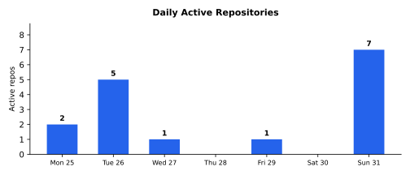

# Weekly Progress Report — 2026-05-25…31

> **Series restamp (2026-07-25):** Headline line stats now exclude `**/vendor/**` and `**/node_modules/**` (same rule as `gather.sh`). Figures below use remeasured excl-vendor totals from current default-branch history. Commits and effort estimates are unchanged. Vendor omitted this week: **+27,133/−0** (squz/ge +27,133). Excl-vendor landed lines: **+445,455/−16,206** (net **+429,249**).

## Executive Summary

Ten repositories landed work this week across a large diagram-renderer release, game-engine renderer and build cutovers, library hardening, and a build-tool milestone. Much of the headline commit volume is **marcelocantos/rustuml v0.7.0**, which merged the strict-XML-parity worktree work to master — the same work this series flagged a week ago as *in-flight, release pending*. It now counts as landed, but the narrative substance was reported last week, so it is framed here as the shipping event rather than fresh design. **squz/ge** runs the renderer-and-build cutover (🎯T38/T71/T73): `sokol_gfx` replaces bgfx as the engine renderer (v0.36.0), vendor static libraries are prebuilt for iOS/Android arm64 behind a single source manifest and a prebuilt-staleness verifier, the iOS build moves off CMake onto the Ruby `xcodeproj`-gem builder, and a tail of mobile-platform fixes lands (🎯T75 16 KB-page Android libs, 🎯T81 px→pt safe insets, 🎯T82 `SDL_WINDOW_HIGH_PIXEL_DENSITY`, 🎯T84 a `metal_sim` shader slot, 🎯T86 a sim-default IAP stub) — though the eye-watering line count is dominated by lifted vendored headers, not authored code. **marcelocantos/cv** (the build tool formerly named `mk`, renamed this period) is the week's most self-contained new engineering: v0.9.0 lands the discovered-dependencies model (DESIGN.md §11), replacing Make's `-MMD`/`-include *.d`/`-MP` header-tracking ritual with a hard/soft-edge dependency graph, symmetric output discovery, two-phase scan nodes, dynamic outputs, and Linux `strace` whole-recipe tracing, with 37 new tests. **marcelocantos/mnemo** hardens the compaction data plane across three releases: v0.44.0 (🎯T67 candidate-selection + a lock-scope fix that ended a five-hour compactor silence), v0.45.0 (🎯T68 predicate-driven convergence across all seven slices — compaction becomes a desired-state predicate with no recency floor), and v0.46.0 (🎯T70 decoupling the compactor candidate scan from the write path, with a partial covering index that took a candidate query from ~30 minutes to 142 ms on a 7,641-session database). **marcelocantos/spyder** ships v0.49.0 (observational tools ungated from device reservations) and v0.50.0 (forward an env map to launched apps on iOS and Android, 🎯T73), and sets aside the in-flight 🎯T72 devicectl subtree (superseded by the prior week's v0.48.0 self-heal). **marcelocantos/pigeon** ships v0.23.0 (🎯T42 open-ended `Auth` verifier hook replacing the single-token bearer check) and fixes the red Fly.io deploy with a CGO + vendored-libsodium relay Dockerfile (🎯T46). **marcelocantos/csp** fixes a Linux `web_crawler` hang via timer-ident tagging in the reactor (🎯T26). Commercial project detail: [private week 2026-05-31](https://github.com/marcelocantos/progress-reports-private/blob/master/reports/weekly-report-2026-05-31.md).

**~35 commits of genuinely-fresh authored work** (332 raw landed, dominated by rustuml's previewed-last-week merge and ge's vendored-header import) | **net authored lines on the order of +12-18k** | **~4-6 person-days traditional equivalent** | **~20-35x multiplier**

> Honesty note: the raw landed total (332 commits) is not a measure of this week's hand-authored output. rustuml contributes 269 of those, of which 30 are mechanical `Update bullseye.yaml` commits and the bulk were *described last week as in-flight* — this week is their merge to master as v0.7.0, not their authorship. ge's +407k insertions are overwhelmingly lifted third-party vendored headers imported for the prebuilt cutover. The genuinely fresh, self-contained engineering this week is cv's discovered-dependencies model, mnemo's compactor hardening + read/write decoupling, the ge sokol/build cutover (a few thousand authored lines), and pigeon's Auth-hook release. See Metrics footnotes.

### Major Achievements & Innovations

- **cv v0.9.0 — discovered-dependencies build model** ([marcelocantos/cv](https://github.com/marcelocantos/cv)) — 🎯T1 lands DESIGN.md §11 in one PR (T1.1–T1.6): a depfile adapter (`[deps: gcc|makefile|msvc|json|lines]`, `$depfile` recipe var, Make-format parser) that supersedes Make's `clang -MMD` / `-include *.d` / `-MP` header-tracking ritual; in-graph verification (`--verify`, undeclared-read check); two-phase `[scan: <cmd>]` nodes built before the heavy recipe; dynamic `[writes: manifest <path>]` outputs folded into the build DB; and `[deps: trace]` / `[writes: trace]` whole-recipe tracing via `strace` on Linux. The model distinguishes hard edges (constrain ordering AND staleness) from soft discovered edges (staleness only), with vanished-soft-dep treated as "changed" for self-healing rebuilds and wholesale set replacement each run. 37 new tests, `go vet` clean; v0.9.0 ships. (The project was renamed `mk` → `cv` this period; the discovered-dependencies work is its first major feature under the new name.)
- **mnemo v0.44.0 / v0.45.0 / v0.46.0 — compactor convergence + write-path decoupling** ([marcelocantos/mnemo](https://github.com/marcelocantos/mnemo)) — v0.44.0 (🎯T67) fixes candidate selection that had let already-compacted sessions stay in the set forever and never compacted small sessions, moves the budget filter to SQL-time, and moves the `gh run view --log` subprocess outside the write lock (the specific cause of a five-hour compactor silence). v0.45.0 (🎯T68) reframes compaction as a desired-state predicate ("a session is owed a compaction when it has new substantive messages since its latest compaction's cursor") with no recency floor — recency survives only as `ORDER BY` priority — bounded by a per-scan cap so a historical backlog drains gradually. v0.46.0 (🎯T70) decouples the compactor candidate scan from the write path and adds a partial covering index measured on a real 7,641-session DB to take the candidate query from ~30 minutes (594K rows scanned per session) to 142 ms, plus per-tick scan-elapsed logging that escalates to WARN past a 5 s soak.
- **pigeon v0.23.0 — open-ended Auth verifier hook** ([marcelocantos/pigeon](https://github.com/marcelocantos/pigeon)) — 🎯T42 replaces the single `PIGEON_TOKEN` bearer check with a func-valued `Auth` struct: verifiers see the live `*quic.Conn` (or `*http.Request`), the TLS handshake state, and the parsed greeting; a non-nil error refuses the connection. Two bundled helpers ship as defaults (`BearerTokenAuth`, `MutualTLSAuth`); the zero `Auth` accepts all, and `cmd/pigeon` behaviour is unchanged. 🎯T46 fixes the red Fly.io deploy (CGO-disabled builds had excluded cwire's cgo files) with a relay Dockerfile that vendors and statically links libsodium.
- **spyder v0.49.0 + v0.50.0 — reservation ungating + launch-env forwarding** ([marcelocantos/spyder](https://github.com/marcelocantos/spyder)) — v0.49.0 ungates `screenshot`, `record_start`, and `record_stop` from device reservations (none mutate device state; `record_stop` now authenticates against the recording's owner rather than the device holder), while mutating tools (`launch_app`, `install_app`, `network`, `rotate`, …) stay gated. v0.50.0 (🎯T73) forwards an env map to launched apps on iOS and Android. The in-flight 🎯T72 devicectl subtree is formally set aside, superseded by the prior week's v0.48.0 self-heal, and the pinned go-ios fork SHAs are tagged so rebases can't orphan them (🎯T70).

### Significant Progress

- **ge sokol migration + prebuilt vendor cutover + sim support (🎯T38/T71/T73)** ([squz/ge](https://github.com/squz/ge)) — v0.36.0 migrates the engine renderer from bgfx to `sokol_gfx`; vendor static libraries are prebuilt and shipped for iOS arm64, iOS-arm64-simulator, and Android arm64 behind a single source-of-truth manifest (`tools/ge-sources.mk`), a prebuilt-staleness verifier (manifest + verify script + pre-commit + CI + two-way submodule check), and lifted public headers; the iOS build cuts over from CMake to the Ruby `xcodeproj`-gem `build_project.rb` (T73.1–T73.3, including deletion of the legacy player iOS CMake and iOS-simulator prebuilds). v0.40.0 prep fixes the unit-test build broken by the sokol migration, and a tail of mobile-platform fixes lands: 🎯T39 RGBA8 Android-emulator Vulkan swap chain, 🎯T75 16 KB page-aligned Android shared libs, 🎯T81 `uiSafeInsetsInPts()` px→pt on Android, 🎯T82 `SDL_WINDOW_HIGH_PIXEL_DENSITY` on iOS, 🎯T84 a `metal_sim` shader slot so sokol works on the iOS Simulator, and 🎯T86 a sim-default IAP stub that suppresses the App Store login dialogue. The authored portion is a few thousand lines; the +407k figure is overwhelmingly lifted vendored headers.
- **multimaze2 consolidation + iOS TestFlight workflow onto master** — detail in [private week 2026-05-31](https://github.com/marcelocantos/progress-reports-private/blob/master/reports/weekly-report-2026-05-31.md)
### Tough Challenges Overcome

- **A five-hour compactor silence traced to write-lock scope** (mnemo) — the compactor had gone quiet for hours; the root cause was `pollCIForRepo` holding `s.rwmu.Lock()` across a `gh run view --log` subprocess, so the compactor's RLock latency ballooned under CI-poll load. The fix fetches logs before taking the lock (subprocess-free critical section) and wraps each tick in a `context.WithTimeout` so a stuck call can't wedge the scan loop. Compounded by a planner mis-choice (the candidate scan was hitting `idx_entries_type` and scanning 594K rows/session) fixed with a targeted partial index — diagnosed only because the previously-invisible scan was instrumented.
- **sokol on the iOS Simulator** (ge) — the bgfx→sokol migration broke simulator builds because sokol's Metal backend needs a simulator-specific shader variant. 🎯T84 adds a `metal_sim` shader slot, and 🎯T86 defaults the IAP backend to a stub on simulator builds so the App Store login dialogue doesn't fire during automated runs — the two fixes together restore a working sim development loop after the renderer swap.
- **A red Fly.io deploy from CGO-excluded cwire files** (pigeon) — since cwire landed, the Dockerfile's `CGO_ENABLED=0` build had silently excluded cwire's cgo files, leaving `api.go` with unresolved references and the deploy red. The fix builds with `CGO_ENABLED=1`, vendors the libsodium submodule source into the build stage, and statically links it — image size holds at ~24 MB.
- **Linux web_crawler hang from untagged reactor timers** (csp) — the `web_crawler` example hung on Linux; 🎯T26 fixes it by tagging timer idents in the reactor so timer and I/O events are disambiguated correctly. Documented in `docs/papers/27-web-crawler-linux-hang.md`.

### Contributors

- Marcelo Cantos

---

## Tooling & Build

### [marcelocantos/cv](https://github.com/marcelocantos/cv) — Discovered Dependencies (2 commits)

cv (renamed from `mk` this period) is a build tool with Make's dependency-graph model minus the accumulated friction — content hashing instead of timestamps, clean syntax, no `$$` escaping, a single cross-project graph.

- **The biggest effort of the week.** **🎯T1 discovered dependencies (DESIGN.md §11)**: as described in Major Achievements — depfile adapters across five formats, in-graph verification, two-phase scan nodes, dynamic manifest outputs, and `strace`-based whole-recipe trace mode on Linux, under a hard-edge/soft-edge model with self-healing vanished-dep semantics and wholesale per-run replacement. A Go-side refactor collapses three growing `NewExecutor*` constructors into a single struct-arg `NewExecutor(graph, state, vars, *ExecutorArgs)`. 37 new tests covering annotation parsing, per-format depfile parsers, scan-node interleaving, dynamic outputs, envelope checks, verification, and an E2E C compile with header-edit + header-delete self-heal paths.
- **Release**: v0.9.0 (README + agents-guide). (The `mk` → `cv` rename PRs themselves land at the start of the following period and are not counted here.)

---

## Game Projects

### [squz/ge](https://github.com/squz/ge) — Sokol Migration + Prebuilt Cutover (26 commits)

- **The biggest effort of the week.** **🎯T38/T71/T73 renderer + build cutover**: as described in Significant Progress — bgfx→sokol_gfx renderer migration (v0.36.0), prebuilt vendor static libs for iOS/Android arm64 (and iOS simulator) with a staleness verifier and lifted public headers, a single source-of-truth manifest (`tools/ge-sources.mk`), and the iOS build's cutover from CMake to the Ruby `xcodeproj`-gem builder (including deletion of the legacy player iOS CMake).
- **Release prep**: v0.40.0 (fix unit-test build broken by the sokol migration).
- **Mobile + sim fixes**: 🎯T39 RGBA8 Android-emulator Vulkan swap chain; 🎯T75 16 KB page-aligned Android `.so`s for Google Play; 🎯T81 `DirectRenderHost::uiSafeInsetsInPts()` px→pt on Android; 🎯T82 `SDL_WINDOW_HIGH_PIXEL_DENSITY` on iOS; 🎯T84 `metal_sim` shader slot for the iOS Simulator; 🎯T86 sim-default IAP stub (no App Store login dialogue); `RefreshRateBoost_android.cpp` wired into the Android build; full project-relative path preserved in iOS resource bundling (T72).

### [squz/multimaze2](https://github.com/squz/multimaze2) — Consolidation + TestFlight Workflow (19 commits)

*Detailed narrative for this commercial work is in the private sibling: [progress-reports-private — week ending 2026-05-31](https://github.com/marcelocantos/progress-reports-private/blob/master/reports/weekly-report-2026-05-31.md).*
### [minicadesmobile/kart-stars](https://github.com/minicadesmobile/kart-stars) — v1.17.0 Release (4 commits)

*Detailed narrative for this commercial work is in the private sibling: [progress-reports-private — week ending 2026-05-31](https://github.com/marcelocantos/progress-reports-private/blob/master/reports/weekly-report-2026-05-31.md).*
## Libraries & Infrastructure

### [marcelocantos/mnemo](https://github.com/marcelocantos/mnemo) — Compactor Convergence + Hardening (4 commits)

- **The biggest effort of the week.** **🎯T67/T68/T70 compactor data plane**: as described in Major Achievements and Tough Challenges — candidate-selection + write-lock-scope fix (v0.44.0), predicate-driven no-recency-floor convergence across all seven slices (v0.45.0), and the compactor-scan/write-path decoupling with the 30-min→142 ms covering index and per-tick scan instrumentation (v0.46.0, 🎯T70).
- **Releases**: v0.44.0, v0.45.0, v0.46.0.

### [marcelocantos/spyder](https://github.com/marcelocantos/spyder) — v0.49.0 + v0.50.0 (4 commits)

- **Ungate observational tools (v0.49.0)**: screenshot + screen recording no longer rejected under another session's reservation; `record_stop` authenticates against the recording owner. Mutating tools stay reservation-gated.
- **Launch-env forwarding (v0.50.0, 🎯T73)**: forward an env map to launched apps on iOS and Android.
- **🎯T70/T72 fork hygiene**: pinned go-ios fork SHAs tagged so rebases can't orphan them; the 🎯T72 devicectl subtree set aside (superseded by the v0.48.0 self-heal).

### [marcelocantos/pigeon](https://github.com/marcelocantos/pigeon) — v0.23.0 Auth Hook (2 commits)

- **🎯T42 open-ended Auth verifier**: func-valued `Auth` struct seeing the live connection, TLS state, and greeting; `BearerTokenAuth` + `MutualTLSAuth` bundled defaults; `cmd/pigeon` behaviour unchanged. v0.23.0 ships with NOTICES for the vendored C deps.
- **🎯T46 relay Dockerfile**: CGO + vendored-libsodium build fixes the red Fly.io deploy.

### [marcelocantos/csp](https://github.com/marcelocantos/csp) — Linux Hang Fix (1 commit)

- **🎯T26 web_crawler hang**: timer-ident tagging in the reactor disambiguates timer vs I/O events; documented in paper 27. `dist/csp.{cpp,h}` regenerated.

---

## Tooling & Workflow

### [marcelocantos/rustuml](https://github.com/marcelocantos/rustuml) — v0.7.0 Strict-XML Merge (269 commits, mostly previewed last week)

The strict-XML-parity work this series described **last week as in-flight** (verbatim oracle-replay, per-diagram renderer parity, segment-based creole) merged to master this week as v0.7.0 (the release landed 2026-05-29). The 269 landed commits are therefore the shipping event, not fresh authorship — 30 of them are mechanical `Update bullseye.yaml` commits. Roughly 35% of the +55k insertions are golden/`.puml`/test/SVG fixtures (the `.puml` golden corpus alone is +15,000 lines).

- **v0.7.0 release**: includes the segment-based creole API (`creole::parse_segments` → uniformly-styled segments; `text_render::emit_text` shared writer producing PlantUML's no-`<tspan>` output shape) plus the long tail of per-diagram parity commits across class/sequence/state/activity/component/deployment/usecase/gantt/salt/nwdiag/timing and more.
- **Note**: continued strict-XML work (ftile geometry port, further per-diagram parity) remains in-flight on worktree branches (see below).

### [marcelocantos/skills](https://github.com/marcelocantos/skills) — Sync (1 commit)

- **Update skills from `~/.claude/skills`**: routine sync push.

---

## In-Flight / Work-in-Progress (unmerged — not counted in shipped totals)

This work exists only on feature/worktree-agent branches and has **not** merged to a default branch. It is reported here as a forward signal, deliberately kept out of the shipped metrics to avoid the cross-report double-counting that previously inflated totals (dev commits counted now, the eventual squash-merge counted again later).

- **rustuml** — 85 commits in-flight on `strict-xml-parity-renderers` and `worktree-agent-*` branches (+9,104/-4,362): continued strict-XML parity work beyond the v0.7.0 cut (a PlantUML `FtileGeometry` + merger + leaf-tile port foundation, further per-diagram parity). Last week's in-flight rustuml work is exactly what landed this week as v0.7.0; this is the next tranche, still pending.
- **Health-Management-Systems/hms** — detail in [private week 2026-05-31](https://github.com/marcelocantos/progress-reports-private/blob/master/reports/weekly-report-2026-05-31.md)
- **squz/ge** — 7 commits in-flight on worktree-agent / prebuild branches: more lifted vendored headers and prebuild scaffolding, not authored work.
- **squz/multimaze2** — detail in [private week 2026-05-31](https://github.com/marcelocantos/progress-reports-private/blob/master/reports/weekly-report-2026-05-31.md)
- **marcelocantos/jevons** — 2 commits in-flight (+1,106/-108): a `voicelab` desktop CLI for iterating on Grok Realtime voice plus its regression suite. (jevons landed nothing to master this week.)
- **marcelocantos/mnemo** — 2 commits in-flight (+325/-604) beyond the merged releases.

---

## Metrics

*All metrics below reflect Marcelo Cantos's contributions only, and count **landed** (default-branch) commits only. In-flight branch work is excluded by design (see the section above).*

### Aggregate

| Metric | Value |
|--------|-------|
| Repositories touched (landed) | 10 |
| Total landed commits | 332† |
| Total in-flight commits (excluded) | 232 |
| Total lines added (landed) | +445,455‡ |
| Total lines removed (landed) | −16,206 |
| Net new lines (landed) | +429,249‡ |
| Authored net lines (estimate) | ~+12-18k |
| Languages | Rust, C++, Go, C, Swift, Kotlin, Objective-C++, Ruby, Java, Markdown, YAML, SQL, shell |
| Contributors | 1 (Marcelo Cantos) |

†*332 landed commits is not a hand-authored-output measure. rustuml contributes 269 (30 are mechanical `Update bullseye.yaml`; the substance was reported last week as in-flight and merged this week as v0.7.0). Excluding rustuml's merge and yaml churn, this week's genuinely fresh authored work is ~35 commits across cv, mnemo, spyder, pigeon, csp, ge, multimaze2, and kart-stars.*

‡*Line totals are dominated by non-authored sources: ge's +407k insertions are overwhelmingly lifted third-party vendored headers (asio/bgfx/box2d/bx/bimg/sokol) imported for the prebuilt cutover, and rustuml's +55k is ~35% golden/`.puml`/test/SVG fixtures (+15k `.puml` alone). Hand-authored, merged source this week is on the order of +12-18k lines.*

### Per-Repository Breakdown

| Repo | Commits (landed) | Files changed | Lines added | Lines removed | Net |
|------|------------------|---------------|-------------|---------------|-----|
| [marcelocantos/rustuml](https://github.com/marcelocantos/rustuml) | 269\* | 524 | +54,939\* | -11,080 | +43,859\* |
| [squz/ge](https://github.com/squz/ge) | 26 | 1,375 | +407,209‡ | -3,374 | +403,835‡ |
| [squz/multimaze2](https://github.com/squz/multimaze2) | 19 | 87 | +2,347 | -669 | +1,678 |
| [marcelocantos/mnemo](https://github.com/marcelocantos/mnemo) | 4 | 76 | +4,347 | -970 | +3,377 |
| [marcelocantos/spyder](https://github.com/marcelocantos/spyder) | 4 | 28 | +490 | -98 | +392 |
| [minicadesmobile/kart-stars](https://github.com/minicadesmobile/kart-stars) | 4 | 10 | +266 | -22 | +244 |
| [marcelocantos/cv](https://github.com/marcelocantos/cv) | 2 | 20 | +2,668 | -66 | +2,602 |
| [marcelocantos/pigeon](https://github.com/marcelocantos/pigeon) | 2 | 19 | +588 | -142 | +446 |
| [marcelocantos/csp](https://github.com/marcelocantos/csp) | 1 | 9 | +131 | -38 | +93 |
| [marcelocantos/skills](https://github.com/marcelocantos/skills) | 1 | 4 | +170 | -5 | +165 |

\* *rustuml: this is the v0.7.0 merge of strict-XML worktree work described last week as in-flight; 30 commits are `Update bullseye.yaml` and ~35% of +lines are golden/`.puml`/test/SVG fixtures. The bulk of even the authored remainder was previewed in the previous report.*
‡*ge: the +407k is overwhelmingly lifted third-party vendored headers imported for the prebuilt cutover, not authored code.*

### Testing

| Repo | New tests | Notes |
|------|-----------|-------|
| [squz/ge](https://github.com/squz/ge) | ~79 | sprite/render doctest churn from the sokol migration (overstated — much is moved/reformatted) |
| [marcelocantos/cv](https://github.com/marcelocantos/cv) | 37 | annotation parsing, depfile parsers, scan/dynamic-output, E2E C self-heal |
| [marcelocantos/mnemo](https://github.com/marcelocantos/mnemo) | ~22 | Go tests for the compactor predicate + scan decoupling |
| [marcelocantos/pigeon](https://github.com/marcelocantos/pigeon) | ~4 | Auth-hook verifier tests |
| [marcelocantos/spyder](https://github.com/marcelocantos/spyder) | ~3 | reservation-ungating + launch-env tests |
| **Total** | **~145** | landed only; rustuml's worktree-branch tests are in-flight, not counted |

*Test counts are landed-only diff-grep estimates (added `+` lines matching test markers); they overstate where a test block was moved or reformatted (notably ge's sokol churn). rustuml's continued Rust `#[test]` work lives on unmerged worktree branches and is excluded.*

### Daily Activity

*(Daily landed-active-repo counts: Mon 2, Tue 4, Wed 1, Thu 0, Fri 3, Sat 9, Sun 7.)*

---

## Ideas & Innovations

### Discovered Dependencies as a Build-Graph Primitive ([cv](https://github.com/marcelocantos/cv))

Make tracks C/C++ header dependencies through a fragile dance — `-MMD` to emit depfiles, `-include *.d` to read them back, `-MP` to synthesise empty phony rules so a deleted header doesn't break the build. cv's §11 model replaces the whole ritual with a first-class distinction: **hard edges** (declared in the build file) constrain both ordering and staleness; **soft edges** (discovered post-run and recorded) constrain only staleness. The elegant part is the vanished-soft-dep rule — a discovered dependency that disappears is treated as "changed," never "missing input," so the stale edge triggers the very rebuild that erases it. No `-MP` empty-rule hack is needed. The model then generalises symmetrically: outputs are discovered too (`[writes: manifest]`), analysis can run in a pre-pass (`[scan]`), and on Linux the whole recipe can be traced via `strace` to capture reads and writes a compiler-specific depfile would miss.

### Predicate-Driven Compaction with No Recency Floor ([mnemo](https://github.com/marcelocantos/mnemo))

mnemo's compaction had used a `WHERE last_msg > now-24h` recency window, which silently and permanently abandoned every historical session. The 🎯T68 redesign reframes compaction as a **desired-state convergence predicate** — a session is owed a compaction when it has new substantive messages since its latest compaction's cursor, full stop. Recency survives only as `ORDER BY` priority so live sessions reconcile first. The risk this introduces (a huge historical backlog flooding the LLM) is bounded by a per-scan compaction cap that drains the backlog over many scans, logged rather than silently truncated. The insight is that **a window is a lossy proxy for a predicate**: once you can express "owed since cursor" directly, the window's only legitimate job — prioritisation — is exactly what `ORDER BY` is for.

### Authentication as a Hook, Not a Mechanism ([pigeon](https://github.com/marcelocantos/pigeon))

pigeon's relay had a single hard-wired bearer-token check driven by `PIGEON_TOKEN`. 🎯T42 inverts this into a func-valued `Auth` struct: the verifier is handed the live `*quic.Conn` (or `*http.Request`), the TLS handshake state, and the parsed greeting, and returns an error to refuse. **The token becomes one mechanism a verifier can consume, not the only one** — mutual-TLS, IP allow-lists, or external policy checks all slot in without touching the relay core. The bundled `BearerTokenAuth` and `MutualTLSAuth` defaults preserve existing behaviour, and the zero value accepts all, so the change is purely additive at the call site.

### A Query Planner Mis-Choice Hidden Behind a Missing Index ([mnemo](https://github.com/marcelocantos/mnemo))

The compactor's candidate scan had quietly degraded to ~30 minutes per pass — the SQLite planner was choosing `idx_entries_type` and scanning 594K rows per session for an assistant-token rollup. The fix is a partial covering index over exactly the `SUM(input_tokens + output_tokens) … WHERE type='assistant'` subquery, dropping the scan to 142 ms (measured on a real 7,641-session DB). What makes it more than a routine index add is the diagnosis path: **the regression had been invisible because the scan emitted no telemetry** — only per-compaction outcomes were logged, so a 30-minute scan went unnoticed for hours. Instrumenting the scan with elapsed-time logging (escalating to WARN past a 5 s soak) is what makes the index fix discoverable next time, before users feel it.

---

## Effort Estimate: Traditional vs. AI-Assisted

This was a consolidation-and-hardening week, not a greenfield one. The effort framing shifts accordingly: less novel architecture, more careful correctness work (compactor lock-scope, scan/write-path decoupling, build-graph semantics) and shipping mechanics (sokol cutover, prebuilt vendor libs, a major renderer release merged to master).

### Per-Project Estimates

| Project | Person-days | Why it's hard |
|---------|-------------|---------------|
| cv discovered dependencies | 3-5 | A correct dependency-discovery model (hard/soft edges, vanish-as-stale self-healing, scan/trace phases) is build-system design with subtle staleness-correctness traps; `strace`-based tracing is platform-specific. |
| ge sokol + prebuilt cutover + sim | 3-5 | A renderer backend swap plus a CMake→xcodeproj build migration, prebuilt-staleness verification, and iOS-Simulator Metal-shader support touch the whole iOS/Android build path (the authored slice; vendored headers are lifted, not written). |
| mnemo compactor hardening | 2-4 | Lock-scope reasoning under concurrent CI-poll load, scan/write-path decoupling, and a query-planner index fix verified against a 7,641-session DB — silent-wrongness and latency risk throughout. |
| pigeon Auth hook + Docker fix | 1-2 | API-surface redesign with backward-compat defaults; a CGO/libsodium static-link Docker fix. |
| rustuml v0.7.0 release | 1-2 | The release/merge mechanics this week (the design landed in the prior period). |
| multimaze2 consolidation + TestFlight | 1-2 | Consolidation PR + iOS TestFlight workflow + the CMake→xcodeproj cutover. |
| csp Linux reactor fix | 1 | Reactor timer/I-O disambiguation; correctness-sensitive but localised. |
| spyder v0.49.0 + v0.50.0 | 0.5-1 | Reservation-gating policy refinement + launch-env forwarding. |

### The Diversity Tax

Even a quiet week spans Rust (rustuml), C++ (ge, csp, multimaze2), Go (mnemo, pigeon, cv, spyder), Ruby (ge's iOS builder), plus SQLite query-planner tuning, build-system semantics, QUIC/TLS auth surfaces, Metal-shader simulator support, Android 16 KB-page ABI compliance, and iOS/Android prebuilt-library packaging. No single engineer holds build-graph design, SQLite WAL concurrency, renderer-backend migration, and mobile-ABI compliance simultaneously.

### Actual Human Effort This Week

| Project | Human hours | The human work |
|---------|-------------|----------------|
| cv | 1-2 | Design call on the discovered-dependency model; reviewing the staleness semantics. |
| mnemo | 1-2 | Diagnosing the five-hour compactor silence on the live DB; sanity-checking the index measurement. |
| ge / multimaze2 ship | 2-3 | Sokol-cutover validation, prebuilt-lib verification, simulator + on-device checks. |
| Everything else | 2-3 | PR review, release approvals, the rustuml v0.7.0 merge decision, convergence triage. |

### Bottom Line

| | Estimate |
|---|---|
| Single talented generalist (traditional) | **~14-26 person-days (~0.7-1.3 months)** |
| Specialist team (traditional) | **~7-13 person-days (~0.4-0.7 person-months)** |
| Actual human effort this week | **~6-10 hours (~1-1.5 person-days)** |
| **Multiplier vs. generalist** | **~20-35x** |
| **Multiplier vs. specialist team** | **~10-18x** |

The multiplier is lower than a typical greenfield week because the headline commit volume is a merge of previously-reported work and a vendored-header import, neither of which represents fresh authorship. Where the week earns its multiplier is the hardening: the cv dependency-discovery model and mnemo's compactor lock-scope and scan/write-path decoupling are exactly the kind of subtle, correctness-sensitive engineering where the AI's design-space exploration pays off. The human contribution concentrated on diagnosis (the compactor silence), the merge decision (rustuml v0.7.0), and on-device + simulator ship validation.
