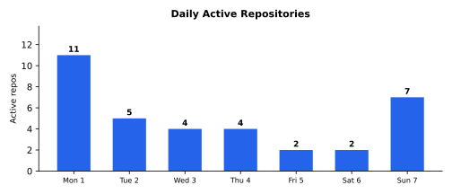

# Weekly Progress Report — 2026-06-01…07

> **Series restamp (2026-07-25):** Headline line stats now exclude `**/vendor/**` and `**/node_modules/**` (same rule as `gather.sh`). Figures below use remeasured excl-vendor totals from current default-branch history. Commits and effort estimates are unchanged. Excl-vendor landed lines: **+54,337/−11,410** (net **+42,927**).

## Executive Summary

Eleven repositories landed work this week, and unlike the prior consolidation-and-hardening fortnight this was a heavy *authoring* week dominated by one effort: **marcelocantos/rustuml** committed **377 commits** of fresh PlantUML layout-engine parity work directly to master (+33,137 Rust lines, −7,223, only ~2,200 lines of which are golden/`.puml`/SVG fixtures), porting PlantUML's activity-diagram geometry engine wholesale — the `klimt/compress` whole-diagram compression pass, `FtileIfLongHorizontal`/`FtileWhile`/`FtileSwitch`/`FtileRepeat` tile geometry, Teoz sequence layout, swimlane lane-width models, and the ArchiMate renderer rewritten onto the DESCRIPTION path (48/48 goldens) — with 173 new `#[test]` functions. This is genuinely new work, not last week's previewed merge; rustuml develops on master with no PR ceremony. **squz/ge** ran an eleven-release sprint (v0.45.0 → v0.55.0) that adds a whole diagnostic and channel layer to the engine: a flag-toggleable `ge::debug` render overlay (🎯T97/T101/T102 — points, discs, boxes, quality-based circles, an RAII `ge::Pass`), the app side of spyder's bidirectional MessagePack-RPC channel (🎯T92 `ge::appchannel`), `ge::ortho::tilt` presentation-tilt, several iOS-Simulator stability fixes (🎯T89 uncommitted-`MTLCommandBuffer`-per-frame leak, 🎯T91 simulator `RefreshRateBoost` no-op), and a production-robust **Android Vulkan-with-GLES-fallback** renderer backend selection (🎯T107) with a generated sokol dispatch table and a runtime Vulkan loader. **marcelocantos/spyder** ships v0.51.0–v0.53.0: `log_collect_*` (spyder as a per-session TCP log listener, port-per-session as the identity boundary) and the **bidirectional MessagePack-RPC channel** server (🎯T75, v0.52.0 — the counterpart to ge's `appchannel`, +3,113 Go lines, 32 new tests). **marcelocantos/mnemo** ships v0.47.0 (🎯T71 — the stuck-watcher heuristic now treats `last_tick_at` as a proof-of-life signal so a healthy daemon draining a large backlog stops tripping false "stuck" warnings). **marcelocantos/pigeon** lands T36 Phase 2 (a real-QUIC `JniKwikTransport` wrapping a Kwik `QuicConnection` with length-prefixed message framing and an E2E test pairing two Sessions over a self-signed QUIC link). Smaller landings: **marcelocantos/cv** completes the `mk` → `cv` rename (v0.10.0), **marcelocantos/csp** cuts v0.17.0, and **marcelocantos/den** lands bullseye plumbing (with a Docker-based Linux release-validation harness in-flight). Significant work also sits **in-flight, unmerged**, and is reported separately below: rustuml's next parity tranche (23 commits on worktree/feature branches), ge prebuild scaffolding, mnemo, pigeon, jevons' `voicelab`, and HMS2's transpiler corpus (which again landed *nothing* to master). Commercial project detail: [private week 2026-06-07](https://github.com/marcelocantos/progress-reports-private/blob/master/reports/weekly-report-2026-06-07.md).

**432 landed commits** | **+47,722 net lines (≈+44k authored, mostly rustuml Rust)** | **~22-38 person-days traditional equivalent** | **~25-45x multiplier**

> Honesty note: unlike the prior two weeks, this week's headline volume *is* mostly fresh authorship. rustuml's 377 landed commits are new work committed straight to master (only 9 are mechanical `Update bullseye.yaml`, ~2,200 of +33k lines are fixtures). The line total nonetheless carries some non-authored inflation: ge's `prebuilt/*.a` static libraries and multimaze2's `.png` sprites are committed binaries that distort `git`'s line accounting, and the progress-reports +4,718 is last week's report-publishing commit (this repo's own output). See Metrics footnotes.

### Major Achievements & Innovations

- **ge v0.45.0–v0.55.0 — debug overlay, app-channel, and Android Vulkan backend** ([squz/ge](https://github.com/squz/ge)) — eleven releases. The headline is a new diagnostic and dev-tooling layer: `ge::debug` (🎯T97) is an opt-in, env-gated (`GE_DEBUG_OVERLAY`) render overlay whose accumulation calls (`point`/`line`/`box`/`circle`/`mesh`/`text`) compile to cheap no-ops when disabled, so call sites stay unconditional and the public surface names no backend (plain `ge::la` vectors, `ge::Color`, points-not-pixels); 🎯T101 absorbs `begin/endFrame` into an RAII `ge::Pass`; 🎯T102 adds box/circle helpers with a quality-driven polygon-gap tolerance. 🎯T92 lands `ge::appchannel`, the app side of spyder's bidirectional MessagePack-RPC channel — a JSON-RPC-shaped envelope over length-prefixed MessagePack frames (encoded via the already-vendored `nlohmann::json`, no new dependency), entirely compiled out under `NDEBUG`. 🎯T107 adds **production-robust Android renderer-backend selection**: Vulkan where the device supports the descriptor-buffer + 1.3 feature set sokol needs, GLES3 as a guaranteed fallback, the decision made *before any backend code runs* via a runtime Vulkan loader and a generated sokol dispatch table (`tools/sokol-dispatch/gen.py`), device-validated.
- **spyder v0.51.0–v0.53.0 — log_collect listener + MessagePack-RPC channel** ([marcelocantos/spyder](https://github.com/marcelocantos/spyder)) — v0.51.0 adds `log_collect_*`: spyder opens a fresh kernel-assigned TCP port per session bound to `0.0.0.0:0` and accumulates newline-delimited lines from apps configured with `LOG_TARGET=<host>:<port>`, with **port-per-session as the identity boundary** — no in-band tagging, no per-line headers, no app cooperation beyond writing text. v0.52.0 (🎯T75) ships the bidirectional MessagePack-RPC channel server that ge's `appchannel` dials: a JSON-RPC-shaped envelope (request/response/push) over 16 MB-capped length-prefixed MessagePack frames, the full v1 method set, a hello-handshake capability exchange, and 32 new tests covering round-trips, oversized-frame rejection, malformed-MessagePack handling, port isolation, reconnect-into-session, and pending-call wakeups on close.
- **multimaze2 soft-shadow lighting + IAP launch surface** — detail in [private week 2026-06-07](https://github.com/marcelocantos/progress-reports-private/blob/master/reports/weekly-report-2026-06-07.md)
- **mnemo v0.47.0 — stuck-watcher proof-of-life heuristic** ([marcelocantos/mnemo](https://github.com/marcelocantos/mnemo)) — 🎯T71 fixes `mnemo_compactor_status` emitting "Watcher appears stuck" every cycle on a *healthy* daemon: a single scan returning a full batch (up to `MaxCompactionsPerScan` candidates, one LLM call per tick at `TickTimeout`) legitimately spends many minutes ticking before the next scan, which the old `last_scan_at > 2 × scan_interval` threshold misread as wedged — observed against v0.46.0's 7.7K-session backlog. The fix treats `last_tick_at` as a proof-of-life signal alongside `last_scan_at` and warns only when *both* are stale.

### Significant Progress

- **rustuml — PlantUML activity-geometry engine port (377 commits, on master)** ([marcelocantos/rustuml](https://github.com/marcelocantos/rustuml)) — the week's dominant effort: +33,137 Rust lines, −7,223, 173 new `#[test]`s, against the Java PlantUML reference. The centrepiece is a faithful port of PlantUML's activity-diagram layout engine — the `klimt/compress` whole-diagram compression pass (ON_X occupancy counting connector polygons/paths and inter-diamond arrowheads as a `SlotFinder` would), `FtileIfLongHorizontal` multi-branch if/elseif/else geometry, `FtileWhile` loop-back extents and exit corridors, `FtileSwitch`/`FtileRepeat` composite-tile translates, fork-branch height models and terminating-branch joins, and swimlane `getMinMax` lane widths. Alongside it: extensive Teoz sequence-diagram geometry (group frames, livebox constraints, activation bars, over-several notes), the ArchiMate renderer rewritten onto the DESCRIPTION path (48/48 goldens), and a long tail of per-diagram parity across sequence/state/class/component/deployment/gantt/salt/timing/mindmap. Develops directly on master (no squash-merge PRs); a further tranche remains in-flight on worktree branches.
- **stock-car-racing — null-ref-audit lifecycle hardening (T2.1–T2.7)** — detail in [private week 2026-06-07](https://github.com/marcelocantos/progress-reports-private/blob/master/reports/weekly-report-2026-06-07.md)
- **pigeon T36 Phase 2 — real-QUIC JNI transport** ([marcelocantos/pigeon](https://github.com/marcelocantos/pigeon)) — wraps a Kwik `QuicConnection` in a `JniQuicTransport`: peer-initiated streams and datagrams are queued through explicit intake hooks (`setPeerInitiatedStreamCallback` client-side, `acceptPeerInitiatedStream` server-side), and each pigeon message gets a 4-byte big-endian length prefix so QUIC's byte streams preserve message boundaries. A `JniKwikE2ETest` pairs two Sessions over a Kwik client↔server connection backed by a self-signed cert, covering single-stream, multi-stream, and datagram round-trips. Retires 🎯T36.

### Tough Challenges Overcome

- **An uncommitted MTLCommandBuffer leaked every frame on the iOS Simulator** (ge) — the simulator render loop was freezing; 🎯T89 traced it to a per-frame `MTLCommandBuffer` that was created but never committed, accumulating until the driver wedged. The fix (in the prebuilt engine source, with an 8-line `tiltbuggy` renderer touch) restores a working simulator render loop, complemented by 🎯T91 making `RefreshRateBoost` a no-op on the simulator (it had caused a click-to-abort crash).
- **A healthy compactor flagged "stuck" on every cycle** (mnemo) — the stuck-watcher fired a false positive every scan once the compactor began draining a 7.7K-session backlog, because a full-batch scan legitimately ticks for minutes before the next scan and the threshold only watched `last_scan_at`. The insight: scan cadence and tick cadence are *separate* liveness signals, and a daemon is only genuinely wedged when neither has advanced — so the watcher now requires both `last_scan_at` and `last_tick_at` to be stale before warning.
- **Production Vulkan that doesn't crash the device that can't run it** (ge) — sokol's Vulkan backend is not a one-flag swap from GLES: ge must own the instance/device/queue/swapchain and feed sokol handles every frame, and the vendored sokol actively uses `VK_EXT_descriptor_buffer` plus a 1.3 feature set. 🎯T107 separates the fixed integration contract from the portability *policy* — a per-device capability probe (via a runtime Vulkan loader and a generated dispatch table) decides Vulkan-vs-GLES3 *before any backend code runs*, so an unsupported device routes to the guaranteed GLES fallback without ever touching a Vulkan entry point.

### Contributors

- Marcelo Cantos

---

## Tooling & Workflow

### [marcelocantos/rustuml](https://github.com/marcelocantos/rustuml) — Activity-Geometry Engine Port (377 commits)

The biggest effort of the week, by a wide margin. rustuml continues its push toward byte-exact parity with the Java PlantUML reference, this week concentrating on the activity-diagram layout engine and Teoz sequence geometry.

- **The biggest effort of the week.** **Activity-diagram geometry port**: as described in Significant Progress — the `klimt/compress` whole-diagram compression engine wired into the activity renderer (ON_X occupancy from connector polygons/paths and inter-diamond arrowheads), `FtileIfLongHorizontal` / `FtileWhile` / `FtileSwitch` / `FtileRepeat` tile geometry, fork-branch height models, terminating-branch joins, swimlane `getMinMax` lane widths, and break-weld handling in while-loop flow.
- **Teoz sequence layout**: faithful Teoz group-frame geometry, livebox constraints, activation-bar ordering, over-several note spans, participant-box alignment, and note frame margins.
- **ArchiMate + per-diagram parity**: ArchiMate renderer rewritten onto the DESCRIPTION path (48/48 goldens); long tail of class/state/component/deployment/gantt/salt/timing/mindmap parity commits.
- **Metrics**: +33,137 Rust lines, −7,223; 173 new `#[test]`s; ~2,200 fixture lines. Develops on master with no PR ceremony.

### [marcelocantos/cv](https://github.com/marcelocantos/cv) — mk → cv Rename (2 commits)

- **🎯Rename complete**: the `mk` → `cv` project rename converges (PR #4 — `.mk` → `.cv` stdlib extensions, identifier sweep across `stdlib.go`/`trace_*.go`/`vars.go`) and a stray `mk` binary committed during the rename is removed (PR #5). v0.10.0 ships under the new name; the discovered-dependencies engineering itself was reported last week as v0.9.0.

### [marcelocantos/csp](https://github.com/marcelocantos/csp) — v0.17.0 Release (1 commit)

- **v0.17.0 release prep**: ships the 🎯T26 Linux `web_crawler` reactor fix described last week. (The next substantive work — pull-based `io::source` + `tls::stream` + `http::fetch` streaming body — landed the day *after* this period and will be covered next week.)

### [marcelocantos/den](https://github.com/marcelocantos/den) — Plumbing (1 commit)

- **bullseye.yaml update** lands on master; a Docker-based Linux release-candidate validation harness (🎯T73.1) sits in-flight on a feature branch.

### [marcelocantos/skills](https://github.com/marcelocantos/skills) — Report Tooling (1 commit)

- **progress-report gather.sh**: landed/in-flight commit counting and exact week-boundary handling (the methodology change this report series now runs on).

---

## Game Projects

### [squz/ge](https://github.com/squz/ge) — Debug Overlay + App-Channel + Vulkan Backend (17 commits, 11 releases)

- **The biggest effort of the week (this category).** **🎯T97/T101/T102 debug layer + 🎯T92 app-channel + 🎯T107 Android Vulkan**: as described in Major Achievements — the env-gated `ge::debug` overlay (no-op when disabled, backend-agnostic surface), the RAII `ge::Pass`, the `ge::appchannel` MessagePack-RPC app side (compiled out under `NDEBUG`), and production-robust Android Vulkan-with-GLES-fallback backend selection with a runtime Vulkan loader and a generated sokol dispatch table.
- **Tilt + simulator fixes**: 🎯T94/T95 `ge::ortho::tilt` + presentation-tilt (applied to `tiltbuggy`) with a `RefreshRateBoost` device-crash fix; 🎯T89 uncommitted-`MTLCommandBuffer`-per-frame leak fix; 🎯T91 simulator `RefreshRateBoost` no-op; 🎯T83/T88 `LOG_TARGET` dev-log TCP sink (bypassing `os_log`/logcat) + iOS background render pause.
- **Engine plumbing**: 🎯T103 pins the Android prebuild to consumer NDK r27 (fixes a libc++ exception-ABI link failure); debug points render as fixed-size discs; FPS in the debug overlay; faster prebuild refreshes; 🎯T101/T102 retired (shipped in v0.50.0).

### [squz/multimaze2](https://github.com/squz/multimaze2) — Soft-Shadow Lighting + IAP Launch (15 commits)

*Detailed narrative for this commercial work is in the private sibling: [progress-reports-private — week ending 2026-06-07](https://github.com/marcelocantos/progress-reports-private/blob/master/reports/weekly-report-2026-06-07.md).*
### [minicadesmobile/stock-car-racing](https://github.com/minicadesmobile/stock-car-racing) — Lifecycle Hardening (10 commits)

*Detailed narrative for this commercial work is in the private sibling: [progress-reports-private — week ending 2026-06-07](https://github.com/marcelocantos/progress-reports-private/blob/master/reports/weekly-report-2026-06-07.md).*
## Libraries & Infrastructure

### [marcelocantos/spyder](https://github.com/marcelocantos/spyder) — log_collect + MessagePack-RPC Channel (3 commits, 3 releases)

- **v0.51.0 log_collect_***: spyder as a per-session TCP log listener; port-per-session is the identity boundary; `log_collect_start/get/stop/list` mirror the `log_capture_*` family; `LANHosts()` advertises the laptop's non-loopback IPv4 candidates.
- **v0.52.0 MessagePack-RPC channel (🎯T75)**: the bidirectional channel server ge's `appchannel` dials — JSON-RPC envelope over 16 MB-capped length-prefixed MessagePack frames, full v1 method set, hello-handshake capability exchange, 32 new tests (+3,113 Go lines across `internal/appchannel` and `internal/mcp`). v0.53.0 follows with a flaky `log_collect` release-CI test fix (poll `List()[0].BufferLines` instead of the buffer-draining `Get()`).

### [marcelocantos/mnemo](https://github.com/marcelocantos/mnemo) — v0.47.0 Stuck-Watcher Fix (2 commits)

- **🎯T71 proof-of-life heuristic**: as described in Major Achievements and Tough Challenges — `last_tick_at` joins `last_scan_at` as a liveness signal so a healthy daemon draining a large backlog stops emitting false "stuck" warnings; `TestCompactorStatusStuckHeuristic` covers the regression, genuine-wedged, and startup-boundary cases.

### [marcelocantos/pigeon](https://github.com/marcelocantos/pigeon) — T36 Phase 2 JNI QUIC (1 commit)

- **🎯T36 real-QUIC JniKwikTransport**: as described in Significant Progress — a Kwik `QuicConnection` wrapped with explicit peer-initiated-stream/datagram intake hooks and 4-byte length-prefix message framing, plus an E2E test pairing two Sessions over a self-signed QUIC link (single-stream, multi-stream, datagram).

---

## In-Flight / Work-in-Progress (unmerged — not counted in shipped totals)

This work exists only on feature/worktree-agent branches and has **not** merged to a default branch. It is reported here as a forward signal, deliberately kept out of the shipped metrics to avoid cross-report double-counting.

- **rustuml** — 23 commits in-flight (+4,558/−485) on `swimlane-single-tree` and `worktree-agent-*` branches: the next parity tranche beyond this week's master work (further swimlane single-tree layout, additional sequence/activity goldens).
- **Health-Management-Systems/hms** — detail in [private week 2026-06-07](https://github.com/marcelocantos/progress-reports-private/blob/master/reports/weekly-report-2026-06-07.md)
- **squz/ge** — 3 commits in-flight (+474/−195) on prebuild/worktree branches.
- **marcelocantos/jevons** — 5 commits in-flight (+2,338/−63): continued `voicelab` desktop CLI work. (jevons landed nothing to master this week.)
- **marcelocantos/den** — 1 commit in-flight (+765/−1): the 🎯T73.1 Docker-based Linux release-validation harness.
- **marcelocantos/mnemo** — 6 commits in-flight (+1,778/−47) beyond the merged v0.47.0.
- **marcelocantos/pigeon** — 1 commit in-flight (+604/−789) beyond the merged T36 work.

---

## Metrics

*All metrics below reflect Marcelo Cantos's contributions only, and count **landed** (default-branch) commits only. In-flight branch work is excluded by design (see the section above).*

### Aggregate

| Metric | Value |
|--------|-------|
| Repositories touched (landed) | 11† |
| Total landed commits | 432 |
| Total in-flight commits (excluded) | 46 |
| Total lines added (landed) | +54,337‡ |
| Total lines removed (landed) | −11,410 |
| Net new lines (landed) | +42,927‡ |
| Authored net lines (estimate) | ~+42-45k (mostly rustuml Rust) |
| Languages | Rust, C++, Objective-C++, C, GLSL, Go, C#, Kotlin, Ruby, Python, Markdown, YAML, JSON, shell |
| Contributors | 1 (Marcelo Cantos) |

†*Counts the 11 repos with substantive landed work. Two further repos had trivial Marcelo-authored landings excluded from the narrative: `homebrew-tap` (1 formula-cleanup commit) and `progress-reports` (the report-publishing commit for the previous fortnight, +4,718).*

‡*Line totals carry some non-authored inflation: ge's `prebuilt/*.a` static libraries and multimaze2's `.png` sprite binaries are committed blobs that distort `git`'s line accounting, and the +4,718 from progress-reports is this repo's own report-publishing output. The genuinely hand-authored, merged source is on the order of +42-45k lines — overwhelmingly rustuml's +33k Rust, then ge/multimaze2/spyder authored C++/Go/GLSL.*

### Per-Repository Breakdown

| Repo | Commits (landed) | Files changed | Lines added | Lines removed | Net |
|------|------------------|---------------|-------------|---------------|-----|
| [marcelocantos/rustuml](https://github.com/marcelocantos/rustuml) | 377 | 64 | +33,345 | -7,258 | +26,087 |
| [squz/ge](https://github.com/squz/ge) | 17 | 81 | +8,454‡ | -1,180 | +7,274‡ |
| [squz/multimaze2](https://github.com/squz/multimaze2) | 15 | 118 | +6,934‡ | -2,039 | +4,895‡ |
| [marcelocantos/spyder](https://github.com/marcelocantos/spyder) | 3 | 18 | +4,122 | -41 | +4,081 |
| [minicadesmobile/stock-car-racing](https://github.com/minicadesmobile/stock-car-racing) | 10 | 22 | +899 | -101 | +798 |
| [marcelocantos/pigeon](https://github.com/marcelocantos/pigeon) | 1 | 5 | +443 | -5 | +438 |
| [marcelocantos/cv](https://github.com/marcelocantos/cv) | 2 | 36 | +310 | -297 | +13 |
| [marcelocantos/skills](https://github.com/marcelocantos/skills) | 1 | 1 | +149 | -37 | +112 |
| [marcelocantos/mnemo](https://github.com/marcelocantos/mnemo) | 2 | 4 | +126 | -6 | +120 |
| [marcelocantos/den](https://github.com/marcelocantos/den) | 1 | 1 | +122 | -0 | +122 |
| [marcelocantos/csp](https://github.com/marcelocantos/csp) | 1 | 2 | +4 | -4 | +0 |
| [marcelocantos/progress-reports](https://github.com/marcelocantos/progress-reports) | 1 | 8 | +4,718* | -889 | +3,829* |
| [marcelocantos/homebrew-tap](https://github.com/marcelocantos/homebrew-tap) | 1 | 1 | +0 | -47 | -47 |

\* *progress-reports: the report-publishing commit for the previous fortnight (this repo's own output), not development work.*
‡*ge / multimaze2: line counts include committed binary blobs (ge `prebuilt/*.a`, multimaze2 `.png` sprites) that distort `git`'s accounting.*

### Testing

| Repo | New tests | Notes |
|------|-----------|-------|
| [marcelocantos/rustuml](https://github.com/marcelocantos/rustuml) | 173 | `#[test]` goldens across activity/sequence/Teoz/ArchiMate parity |
| [marcelocantos/spyder](https://github.com/marcelocantos/spyder) | 32 | appchannel RPC + log_collect (round-trips, oversized/malformed frames, port isolation, reconnect, close-wakeup) |
| [squz/ge](https://github.com/squz/ge) | ~17 | doctest `TEST_CASE`s for debug overlay + appchannel |
| [minicadesmobile/stock-car-racing](https://github.com/minicadesmobile/stock-car-racing) | ~5 | convention + lifecycle EditMode tests |
| [marcelocantos/pigeon](https://github.com/marcelocantos/pigeon) | ~3 | JniKwik E2E (single/multi-stream + datagram) |
| [marcelocantos/mnemo](https://github.com/marcelocantos/mnemo) | ~1 | stuck-watcher heuristic regression test |
| **Total** | **~231** | landed only; rustuml's worktree-branch tests are in-flight, not counted |

*Test counts are landed-only diff-grep estimates (added `+` lines matching test markers).*

### Daily Activity

*(Daily landed-active-repo counts, Marcelo-authored on default branches: Mon 10, Tue 4, Wed 3, Thu 4, Fri 1, Sat 2, Sun 4. The embedded chart, generated from the all-repo timeline cache, runs marginally higher because it counts all authors and a broader repo set.)*

---

## Ideas & Innovations

### A Backend-Agnostic, Zero-Cost-When-Off Debug Overlay ([ge](https://github.com/squz/ge))

Most engine debug-draw layers either cost something on every call or force `#ifdef`-gated call sites that rot. ge's `ge::debug` (🎯T97) does neither: the overlay latches `GE_DEBUG_OVERLAY` on first query and, while disabled, **every accumulation call is a cheap no-op** — so call sites stay unconditional and flipping `setEnabled` at runtime lights the whole layer up without touching draw code. The "submit-mesh convention" lets you hand `mesh()` the same buffers you already draw with. The elegant part is that the public surface **names no rendering backend at all**: coordinates are plain `ge::la` vectors, colours are straight-alpha `ge::Color`, sizes are in points (device-independent, like text), and `flush()` draws into the active render pass exactly as `ge::Sprite::draw` does. The diagnostic layer is thus portable across Metal and the new Android Vulkan/GLES backends by construction.

### Port-Per-Session as the Log Identity Boundary ([spyder](https://github.com/marcelocantos/spyder))

Collecting logs from an app on a device usually means tagging each line (a header, a session id, a prefix) so the listener can demultiplex — which requires app-side cooperation and a parsing contract. spyder's `log_collect_*` (v0.51.0) sidesteps the whole problem: it opens a **fresh kernel-assigned TCP port per session** and hands that port to the app via `LOG_TARGET`. A connection arriving on a given port is then *unambiguously* from the app launched against it — **identity is the socket, not the payload**. No in-band tagging, no per-line headers, no app cooperation beyond writing newline-terminated text. The OS's port-allocation guarantee does the demultiplexing that a logging protocol would otherwise have to encode.

### A Lighting Algorithm Shared by Production and Its Own Ground-Truth Lab ([multimaze2](https://github.com/squz/multimaze2))

*Detailed narrative for this commercial work is in the private sibling: [progress-reports-private — week ending 2026-06-07](https://github.com/marcelocantos/progress-reports-private/blob/master/reports/weekly-report-2026-06-07.md).*
### Two Liveness Signals Beat One Threshold ([mnemo](https://github.com/marcelocantos/mnemo))

mnemo's compactor stuck-watcher had a single proxy for health — *has a scan happened recently?* — which broke the moment the compactor started doing real work: a full-batch scan draining a 7.7K-session backlog ticks for many minutes (one LLM call per candidate) before the next scan fires, so `last_scan_at` goes stale on a perfectly healthy daemon and the watcher cried wolf every cycle. The 🎯T71 fix recognises that **scan cadence and tick cadence are independent proofs of life**: the daemon is only genuinely wedged when *neither* `last_scan_at` *nor* `last_tick_at` has advanced. The lesson generalises — a liveness check built on one phase of a multi-phase loop will misfire whenever the system is legitimately busy in another phase; the robust signal is the disjunction of all the places progress can show up.

### Capability Probe Before Backend Load ([ge](https://github.com/squz/ge))

Adopting Vulkan on Android is a portability minefield: sokol's Vulkan backend needs ge to own the instance/device/queue/swapchain and uses `VK_EXT_descriptor_buffer` plus a 1.3 feature set that many shipping devices lack — and merely *initialising* an unsupported backend can crash. 🎯T107's design move is to **separate the fixed integration contract from the portability policy** and to run the policy decision *before any backend code executes*: a runtime Vulkan loader probes device capabilities, a generated sokol dispatch table routes calls, and a device that can't meet the requirements is steered to the guaranteed GLES3 fallback without ever touching a Vulkan entry point. The "decide before you load" discipline turns a class of init-time crashes into a clean, testable branch.

---

## Effort Estimate: Traditional vs. AI-Assisted

After two consolidation-and-hardening weeks, this was an authoring-heavy week: a very large faithful-port effort (rustuml's activity geometry), a multi-release engine feature run (ge's debug/channel/Vulkan layer), a new GPU lighting system (multimaze2), and a wire-protocol server/client pair (spyder ↔ ge MessagePack-RPC) — the kind of work where the AI multiplier runs high.

### Per-Project Estimates

| Project | Person-days | Why it's hard |
|---------|-------------|---------------|
| rustuml activity-geometry port | 8-14 | Byte-exact replication of PlantUML's `klimt` activity layout engine (compression passes, ftile geometry, swimlane min/max, Teoz sequence) against a Java reference — research-grade reverse-engineering of an undocumented layout algorithm, validated golden-by-golden. |
| ge debug/channel/Vulkan run | 4-7 | A backend-agnostic overlay, a MessagePack-RPC channel, an RAII pass abstraction, and production Android Vulkan-with-GLES-fallback selection (instance/device/swapchain ownership, descriptor-buffer feature probing, runtime loader, generated dispatch) — GPU-pipeline and platform-lifecycle depth. |
| multimaze2 soft-shadow + IAP | 3-5 | A 16-sample disc-visibility soft-shadow renderer with pooled offscreen buffers and a raytrace-ground-truth lab harness (GPU/GLSL work), plus StoreKit launch surface (padlocks, live prices, post-purchase teaser gating). |
| spyder log_collect + MessagePack channel | 2-4 | A concurrent bidirectional RPC server (frame parsing, oversized/malformed-frame handling, port isolation, reconnect-into-session, pending-call wakeups) — silent-wrongness risk across the wire and concurrency surfaces. |
| stock-car-racing lifecycle hardening | 2-3 | Null-ref-audit-driven Unity lifecycle surgery preserving exact init ordering, with convention-test enforcement and coroutine-leak elimination. |
| pigeon JNI QUIC | 1-2 | A real-QUIC JNI transport over Kwik with message framing and an E2E pairing test. |
| mnemo / cv / csp / den | 1-2 | A liveness-heuristic fix verified against a live backlog; a project rename; a release cut; release plumbing. |

### The Diversity Tax

This week alone spans Rust (rustuml's layout engine), C++ and GLSL (ge, multimaze2 lighting), Objective-C++ and Metal lifecycle (ge simulator fixes), C and Vulkan (ge Android backend), Go (spyder RPC, mnemo, cv), C# and Unity lifecycle (stock-car-racing), Kotlin/JNI and QUIC (pigeon), plus MessagePack wire-protocol design, StoreKit IAP, and PlantUML reverse-engineering. No single engineer holds PlantUML-layout reverse-engineering, GPU soft-shadow rendering, Android Vulkan bring-up, and concurrent RPC-server design simultaneously.

### Actual Human Effort This Week

| Project | Human hours | The human work |
|---------|-------------|----------------|
| rustuml | 3-5 | Steering the parity push, judging golden diffs, deciding which PlantUML behaviours to replicate vs. approximate. |
| ge / multimaze2 | 3-5 | On-device + simulator validation, Vulkan-vs-GLES device checks, play-testing the lighting and IAP feel. |
| spyder ↔ ge channel | 1-2 | Designing the wire envelope and the port-per-session identity model; reviewing the concurrency surface. |
| Everything else | 2-3 | PR review, release approvals (ge's eleven releases, spyder's three), lifecycle-audit triage, convergence triage. |

### Bottom Line

| | Estimate |
|---|---|
| Single talented generalist (traditional) | **~22-38 person-days (~1.1-1.9 months)** |
| Specialist team (traditional) | **~12-20 person-days (~0.6-1.0 person-months)** |
| Actual human effort this week | **~9-15 hours (~1.5-2.5 person-days)** |
| **Multiplier vs. generalist** | **~25-45x** |
| **Multiplier vs. specialist team** | **~12-22x** |

The multiplier rebounds from the prior fortnight's hardening weeks because the headline volume this time is genuine authorship, not a previewed merge or a vendored-header import. It runs highest on rustuml — faithfully reverse-engineering an undocumented Java layout engine into Rust, golden-by-golden, is exactly the design-space-exploration-and-cross-domain-recall task where the AI dominates — and on ge's Android Vulkan bring-up. It runs lowest on the rename/release/plumbing tail (cv, csp, den). The human contribution concentrated on judgement a spec can't reach: which PlantUML behaviours to replicate, the port-per-session identity model, the production-vs-lab lighting split, and on-device/simulator ship validation.
